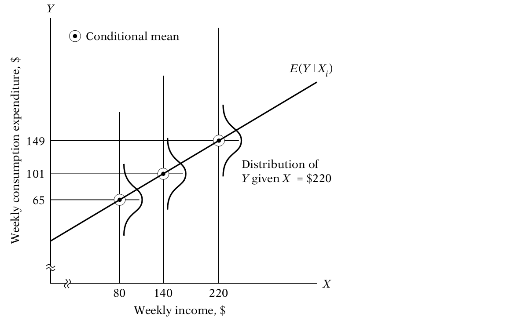
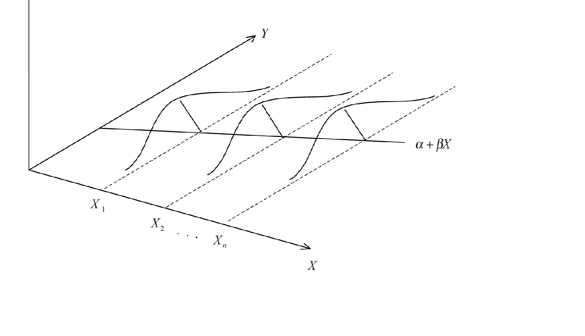
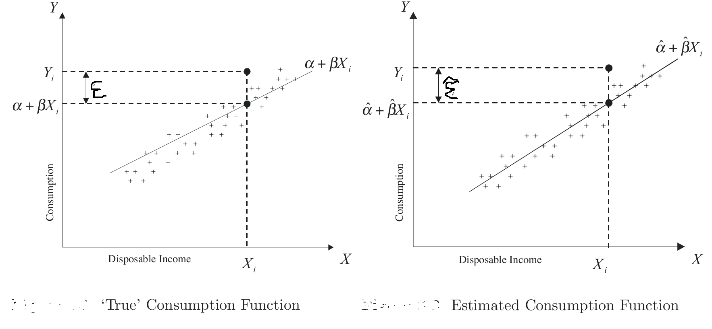
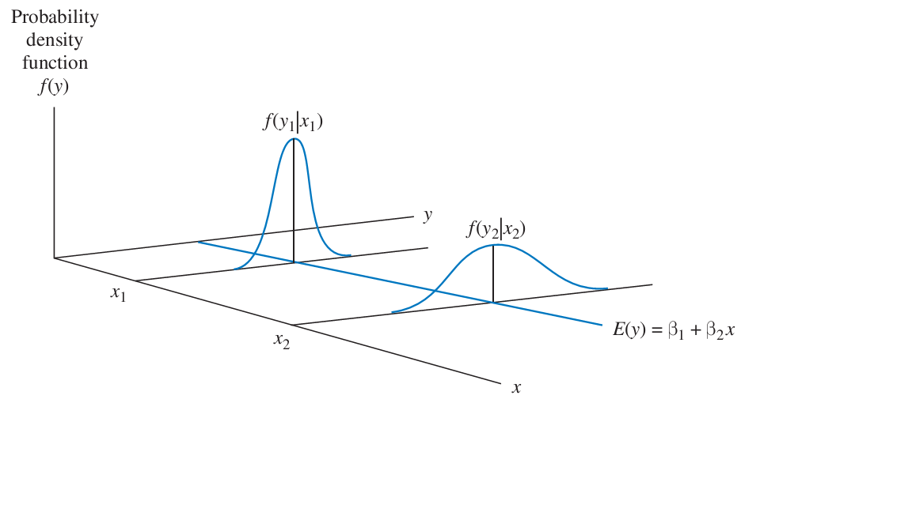

# Review of Regression and Problems in Econometrics

##  Simple linear regression


**Introduction**

Regression analysis is one of the most commonly used tools in econometric work. \

\underline{Definition:} Regression analysis is concerned with describing and evaluating the relationship 
between a given variable (often called the  \textbf{dependent variable}) and one or more variables 
which are assumed to influence the given variable (often called  \textbf{independent} or  \textbf{explanatory
	variables}). \

Regression analysis is the method to discover the relationship between one
or more response variables (also called dependent variables, explained variables, predicted variables, or regressands, usually denoted by y) and the predictors (also called independent variables, explanatory variables, control variables, or regressors, usually denoted by $x_1,x_2,...,x_k$).\

### Population Regression Function

```{r,echo=TRUE}
demo1<-read.csv("PRF.csv",header = T,sep = ",")
demo2<-read.csv("demo2.csv",header = T,sep = ",")
```


```{r,echo=FALSE,include=TRUE}
knitr::kable(
  demo1,
  caption = "Weekly Family Income X", booktabs=TRUE
)
```

The data in table1 refers to a total population of 60 families in a hypothetical community and their weekly income (X)(columns) and weekly consumption expenditure (Y)(first 7 rows), both in dollars. The 60 families are divided into 10 income groups (from $80 to $260) and the weekly expenditures of each family in the various groups are as shown in the table(or read `demo2.csv`). Therefore, we have 10 fixed values of X and the corresponding Y values against each of the X values; so to speak, there are 10 Y sub populations.


There is considerable variation in weekly consumption expenditure in
each income group, which can be seen clearly from Figure 1. Despite the variability of weekly consumption expenditure within each income group, on the average, weekly consumption expenditure increases as income increases. corresponding to the weekly income level of $\$80$, the mean consumption expenditure is $\$65$, while corresponding to the income level of $\$200$, it is $\$137$. \

```{r,echo=FALSE,out.width	=	'80%', fig.cap="Conditional distribution of expenditure for various levels of income"}
fit<-lm(y~x,data=demo2)
plot(demo2$x,demo2$y,pch=19,xlab = "x=weekly income in $",ylab="y=weekly consumption expenditure in $")
points(demo2$x,fitted(fit),type="l",lwd=3)
abline(h=mean(demo2$y[demo2$x==80]),col=2,lwd=1)
abline(h=mean(demo2$y[demo2$x==100]),col=4,lwd=1)
abline(h=mean(demo2$y[demo2$x==120]),col=2,lwd=1)
abline(h=mean(demo2$y[demo2$x==140]),col=4,lwd=1)
abline(h=mean(demo2$y[demo2$x==160]),col=2,lwd=1)
abline(h=mean(demo2$y[demo2$x==180]),col=4,lwd=1)
abline(h=mean(demo2$y[demo2$x==200]),col=2,lwd=1)
abline(h=mean(demo2$y[demo2$x==220]),col=4,lwd=1)
abline(h=mean(demo2$y[demo2$x==240]),col=2,lwd=1)
abline(h=mean(demo2$y[demo2$x==260]),col=4,lwd=1)

text(90,150,expression(paste("E(Y","|","X)")))
text(120,mean(demo2$y[demo2$x==80]),expression(paste(bar(Y),"_1")))
text(120,mean(demo2$y[demo2$x==100]),expression(paste(bar(Y),"_2")))
text(120,mean(demo2$y[demo2$x==120]),expression(paste(bar(Y),"_3")))
text(120,mean(demo2$y[demo2$x==140]),expression(paste(bar(Y),"_4")))
text(120,mean(demo2$y[demo2$x==160]),expression(paste(bar(Y),"_5")))
text(120,mean(demo2$y[demo2$x==180]),expression(paste(bar(Y),"_6")))
text(120,mean(demo2$y[demo2$x==200]),expression(paste(bar(Y),"_7")))
text(120,mean(demo2$y[demo2$x==220]),expression(paste(bar(Y),"_8")))
text(120,mean(demo2$y[demo2$x==240]),expression(paste(bar(Y),"_9")))
text(120,mean(demo2$y[demo2$x==260]),expression(paste(bar(Y),"_10")))
```


In all we have 10 mean values for the 10 sub populations of Y. We call these mean values **conditional expected values**,as they depend on the **given values** of the (conditioning) variable X. Symbolically, we denote them as $E(Y|X)$, which is read as the expected value of Y given the value of X.\
**Unconditional expected value** of weekly consumption expenditure, E(Y), is obtained adding  the weekly consumption expenditures for all the 60 families in the population and dividing this number by 60 ($7272/60=121.2$), we get the number $\$$121.20.\

When we ask the question, “What is the expected value of weekly
consumption expenditure of a family,” we get the answer $\$121.20$ (the unconditional mean). But if we ask the question, “What is the expected value of weekly consumption expenditure of a family whose monthly income is,say, $\$140$,” we get the answer $\$101$ (the conditional mean).

```{r ,echo=TRUE}
mean(demo2$y[demo2$x==140])
```


A population regression curve(**population regression line (PRL)**) is simply the locus of the conditional means of the dependent variable for the fixed values of the explanatory variable(s). More simply, it is the curve connecting the means of the sub populations of Y corresponding to the given values of the regressor X. It can be depicted as in Figure 2.

```{r , echo=FALSE,	out.width='80%',	fig.align='center',	fig.cap='Population regression line'}

```


This figure shows that for each X(i.e., income level) there is a population of Y values (weekly consumption expenditures) that are spread around the (conditional) mean of those Y values. For simplicity, we are assuming that these Y values are distributed symmetrically around their respective (conditional) mean values. And the regression line (or curve) passes through these (conditional) mean values.

#### The concept of population regression function(PRF)

From the preceding discussions , it is clear that each conditional mean $E(Y|X_i)$ is a function of $X_i$, where $X_i$
  is a given value of X.
Symbolically,
\begin{align*}
E(Y|X_i)=f(X_i).........................................(2.1.1)
\end{align*}


where $f(X_i)$ denotes some function of the explanatory variable X.
Equation (2.1.1) is known as the conditional expectation function (CEF)or **population regression function** (PRF) or population regression (PR)for short. It states merely that the expected value of the distribution of Y given $X_i$ is functionally related to $X_i$.
In simple terms, it tells how the mean or average response of Y varies with X.\

**What form does the function $f(X_i)$ assume?** This is an important question because in real situations we do not have the entire population avail-able for examination. The functional form of the PRF is therefore an **empirical question**.\
we may assume that the **PRF E(Y|Xi)** is a linear function of $X_i$,say, of type

\begin{align*}
E(Y|X_i)=\alpha+\beta X_i.........................................(2.1.2)
\end{align*}
where $\alpha~and~\beta$ are **unknown but fixed** parameters known as the regression coefficients.\
In regression analysis our interest is in estimating the **PRFs** like (2.1.2),that is, estimating the values of the unknowns $\alpha~and~\beta$ on the basis of observations on Y and X.

#### Stochastic specfication of PRF

It is clear from Figure 2.1 that, as family income increases, family consumption expenditure on the average increases, too. 

Given the income level of $X_i$, an individual family’s consumption expenditure is clustered around the average consumption of all families
at that $X_i$, that is, around its conditional expectation. Therefore, we can express the deviation of an individual $Y_i$ around its expected value as follows:
  
  \begin{align*}
\mathcal{E}_i=Y_i-E(Y|X_i)~~~~~~~~~~~~~~~~~~~~~~~~~~~~~~~~~~~~~~~~~~\\
\Longrightarrow Y_i=E(Y|X_i)+\mathcal{E}_i...................................(2.1.3)
\end{align*}

where the deviation $\mathcal{E}_i$ is an **unobservable random variable** taking positive or negative values. Technically, $\mathcal{E}_i$ is known as the stochastic disturbance or stochastic error term.\
Given the income level,We can say that the expenditure of an individual family can be expressed as the sum of two
components: \

* 1)$E(Y|X_i)$, which is simply the mean consumption expenditure of all the families with the same level of income. This component is known as the **systematic,or deterministic** component, and \
* 2)$\mathcal{E}_i$, which is the random, or non systematic component.\

If $E(Y|X_i)$ is assumed to be linear in $X_i$, as in (2.1.2), equation (2.1.3) may be written as
\begin{align*}
Y_i&=E(Y|X_i)+\mathcal{E}_i\\
&=\alpha+\beta X_i+\mathcal{E}_i.............................(2.1.4)
\end{align*}

The above equation shows that the consumption expenditure of a family is linearly related to its income plus the disturbance term.\

Thus, the individual consumption expenditures, given $X=\$80$(see Table 1), can be expressed as

\begin{align*}
Y_1=55=\alpha+\beta (80)+\mathcal{E}_1\\
Y_2=60=\alpha+\beta (80)+\mathcal{E}_2\\
Y_3=65=\alpha+\beta (80)+\mathcal{E}_3\\
Y_4=70=\alpha+\beta (80)+\mathcal{E}_4\\
Y_5=75=\alpha+\beta (80)+\mathcal{E}_5
\end{align*}

Now if we take the expected value of (2.1.3) on both sides, we obtain
\begin{align*}
E(Y_i|X_i)&=E(E(Y|X_i))+E(\mathcal{E}_i|X_i)\\
&=E(Y|X_i)+E(\mathcal{E}_i|X_i).............................(2.1.5)\\
&\Longrightarrow E(Y_i|X_i)-E(Y|X_i)=E(\mathcal{E}_i|X_i)\\
&\Longrightarrow E(\mathcal{E}_i|X_i)=0
\end{align*}

Thus, the assumption that the regression line passes through the conditional means of Y(see Figure 2.2) implies that the conditional mean values of $\mathcal{E}_i$ (conditional upon the given X’s) are zero.


**Example:** Suppose the relationship between consumption (Y)  and income (X) of households is 
expressed as:\
\begin{align*}
Y_i=0.6X_i+120
\end{align*}
where $Y_i$=consumption of $i^{th}$ household and $X_i$=income of $i^{th}$ household

Here, on the basis of income, we can predict consumption. For instance, if the income of a certain household is 1500 Birr, then the estimated consumption will be:\
\begin{center}
consumption = 0.6(1500) + 120 = 1020 Birr \
\end{center} 
Note that since consumption is estimated on the basis of income, consumption is the dependent 
variable and income is the independent variable. \

\textbf{The error term} \
Consider the above model: Y = 0.6X + 120. This functional relationship is  deterministic or
exact, that is, given income we can determine the exact  consumption of a household. But in 
reality this rarely happens: different households with the same income are not expected to consume equal amount and this may be due to difference in real wealth or varying tastes, or unforeseen events that induce households to consume more or less.

Thus, we should express the regression model as equation (2.1.4). \
Generally the reasons for including the error term include: \
1. **Omitted variables:** a model is a simplification of reality. It is not always possible to 
include all relevant variables in a functional form . For instance, \

- the omission of relevant factors that could
influence consumption, other than income, like real wealth or varying tastes, or unforseen events that induce households
to consume more or less.\
- we may construct a 
model relating demand and price of a commodity. But demand is influenced not only by 
own price: income of consumers, price of substitutes and several other variables also 
influence it. \
The omission of these variables from the model introduces an error.\
2. **Measurement error:** inaccuracy in collection and measurement of sample data.\

- households may not report their consumption or income accurately\
3. **Sampling error:** Consider a model relating consumption (Y) with income (X) of 
households. The sample we randomly choose to examine the relationship may turn out 
to be predominantly poor households. In such cases,our estimation of $\alpha$ and $\beta$ from 
this sample may not be as good as that from a balanced sample group.\
4. **wrong choice of a linear relationship** between consumption and income, when the **true** relationship may be **nonlinear**.\

Note that the size of the error $\mathcal{E}_i$ is not fixed: it is  \textbf{non-deterministic} or  \textbf{stochastic} or 
\textbf{probabilistic}  in nature. This in turn implies that $Y_i$ is also probabilistic in nature. Thus, the 
probability distribution of $Y_i$ and its characteristics are determined by the values of $X_i$ and by 
the probability distribution of $\mathcal{E}_i$. \
Thus, a full specification of a regression model should include a specification of the probability 
distribution of the disturbance (error) term. This information is given by what we call basic 
assumptions or assumptions of the classical linear regression model (CLRM).\


Consider the model:\
\begin{align*}
Y_i=\alpha+\beta X_i+\mathcal{E}_i~~~~~~~~i=1,2,...,n.
\end{align*}
Here the subscript i refers to the $i^{th}$
  observation. In the CLRM, $Y_i$ and $X_i$ are observable while $\mathcal{E}_i$ is not. If i refers to some point or period of time, then we speak of time series data. On the 
other hand, if i refers to the $i^{th}$ individual, object, geographical region, etc., then we speak of 
cross-sectional data.\

#### Assumptions of the classical linear regression model

\begin{align*}
Y_i=\alpha+\beta X_i+\mathcal{E}_i~~~~~~~~i=1,2,...,n.
\end{align*}
$Y~and~X$ is observable, but not $\mathcal{E}$
  
  - **A1:** The true model is:$Y_i=\alpha+\beta X_i+\mathcal{E}_i$\
* the relationship between $Y_i$ and $X_i$ is **linear**, which is linear in the parameters and
* the deterministic component ($\alpha+\beta X_i$) and the stochastic component ($\mathcal{E}_i$) are \textbf{additive}. \
- **A2:** The error terms have \textbf{zero mean}:E($\mathcal{E}_i$)=0.\
* this assumption tells us that the mean of the $Y_i$ is:$$ E(Y_i)=\alpha+\beta X_i $$ ,which is **non-stochastic**.\ 
* is needed to insure that **on the average** we are on the **true line**.

- **A3: **\textbf{Homoscedasticity}(error terms have constant variance): $Var(\mathcal{E}_i)=E( \mathcal{E}_i^2)=\sigma^2$ for all i \
- This assumption tells us that**every disturbance** has the **same variance**
  $\sigma^2$ whose value is **unknown**, that is, regardless of whether the $X_i$ are **large or small**, the dispersion of the 
disturbances is the **same**.  For example, the variation in consumption level of low income 
households is the same as that of high income households.\
- This insures that every observation is **equally reliable**.


- **A4: **\textbf{No error autocorrelation}(the error terms $\mathcal{E}_i$ are statistically independent of each 
                                            other):  cov($\mathcal{E}_i,\mathcal{E}_j$)=E($\mathcal{E}_i\mathcal{E}_j$)=0 $for~ i\neq j$.\ 

* It states that the disturbances are uncorrelated. \
* Knowing the $i^th$ disturbance does not tell us anything about the $j^th$ disturbance.\
* For example,\
1) In the consumption case, the **unforseen** disturbance which caused the $i^th$ household to                **consume more**, (like **a visit of a relative**), has **nothing** to do with the unforseen   disturbances of any other household. However, this achieves in random sample of households\
2) the fact that output is higher than expected today should not lead to a higher (or lower) than expected output tomorrow.\

- **A5:** $X_i$ are \textbf{deterministic}(non-stochastic):$X_i$ and $\mathcal{E}_i$ are independent for all i, j \
* It states that $X_i$ are **not random variables**, and **hence** the probability 
distribution of $\mathcal{E}_i$ is in no way affected by the $X_i$.\
* $\Longrightarrow\sum \mathcal{E}_ix_i=0$\
* Fixed in repeated sampling\
- **A6: ** \textbf{Normality:} $\mathcal{E}_i$ are normally distributed with mean zero and variance $\sigma^2$ for all i (often 
                                                                                                                          written as: $\mathcal{E}_i\sim$ N( 0,$\sigma^2$)).\
We need this assumption  for parameter estimation purposes and also to make inferences on the basis of the normal (t and F) distribution.\


```{r,echo=FALSE,	out.width='95%',	fig.align='center',	fig.cap='Random Disturbances Around the Regression'}

```

### The ordinary least squares (OLS) method of Estimation

- Least Square method is one of the paramater estimation method which minimizes the **SS of Residuals**
  
  - Sample Regression Line given by:
  \begin{align*}
\hat{Y_i}=\hat{\alpha}+\hat{\beta}X_i~~~~~~~~~~~,i=1,2,...,n.
\end{align*}
where $\alpha$ and $\beta$ are estimated by $\hat{\alpha}$ and $\hat{\beta}$, respectively, and $\hat{Y}$ is the estimated value of Y.\
- Residual is the deviation b/n observed and estimated y.
\begin{align*}
\hat{\mathcal{E}_i}=Y_i-\hat{Y_i}~~~~~~~~,i=1,2,...,n.
\end{align*}
-  a **good fit**  minimizes the error between the **estimated points on the line** and the **actual observed points** , and hence we search which line is?
  
  **Residuals**\

```{r,	out.width='95%',	fig.align='center',	fig.cap='True Regression Line and Estimated Line'}

```


**The sum of squares of the errors (SSE)**\

\begin{align*}
SSE=\sum{\hat{\mathcal{E}_i^2}}=\sum(Y_i-\hat{Y_i})^2=\sum(Y_i-\hat{\alpha}-\hat{\beta}X_i)^2
\end{align*}
- By partial diff of the SSE wrt $\hat{\alpha}$ and $\hat{\beta}$ and equating to zero 
\begin{align*}
\frac{\partial SSE}{\partial \hat{\alpha}}&=-2\sum(Y_i-\hat{\alpha}-\hat{\beta}X_i)=0\\
\frac{\partial SSE}{\partial \hat{\beta}}&=-2\sum X_i(Y_i-\hat{\alpha}-\hat{\beta}X_i)=0
\end{align*}
-  normal equations:
  \begin{align*}
\sum{Y_i}~~~&=n\hat{\alpha}+\hat{\beta}\sum{X_i}\\
\sum{X_iY_i}&=\hat{\alpha}\sum{X_i}+\hat{\beta}\sum{X_i^2}
\end{align*}
- Thus,  2 equations with 2 unknowns $\hat{\alpha}$ and $\hat{\beta}$. Solving for  $\hat{\alpha}$ and $\hat{\beta}$
  \begin{align*}
\hat{\beta}=\frac{n\sum{X_iY_i}-(\sum{X_i})(\sum{Y_i})}{n{\sum{X_i^2}}-(\sum{X_i})^2}=\frac{\sum{X_iY_i}-n\bar{X}\bar{Y}}{\sum{X_i^2}-n\bar{X}^2}\\
\hat{\alpha}=\bar{Y}-\hat{\beta}\bar{X}~~~~~~~~~~~~~~~~
  \end{align*}


\begin{align*}
\hat{\beta}=\frac{n\sum{X_iY_i}-(\sum{X_i})(\sum{Y_i})}{n{\sum{X_i^2}}-(\sum{X_i})^2}=\frac{\sum{X_iY_i}-n\bar{X}\bar{Y}}{\sum{X_i^2}-n\bar{X}^2}\\
\hat{\alpha}=\bar{Y}-\hat{\beta}\bar{X}~~~~~~~~~~~~~~~~
  \end{align*}
where  $\bar{X}=\frac{1}{n}\sum{X_i}$ and $\bar{Y}=\frac{1}{n}\sum{Y_i}$\
- Hence,$\hat{\alpha}$ and $\hat{\beta}$ are   \textbf{ordinary least-squares (OLS) estimators} of $\alpha$ and $\beta$.\
- The line $\hat{Y}=\hat{\alpha}+\hat{\beta}X$ is called the  \underline{\textbf{least squares line}} or the  \underline{\textbf{estimated
  regression line}} of Y on X.\


**Model in deviations form**\

\begin{align}
Y_i=\alpha+\beta X_i+u_i
\end{align}
Applying summation & dividing by n to both sides:
  \begin{align}
\sum_{i=1}^{n}{\frac{Y_i}{n}}=\sum_{i=1}^{n}{\frac{\alpha}{n}}+\sum_{i=1}^{n}{\frac{\beta X_i}{n}}+\sum_{i=1}^{n}{\frac{u_i}{n}}\nonumber\\
\Rightarrow\bar{Y}=\alpha+\beta\bar{X}+\bar{u}
\end{align}
Subtracting equation (2) from (1) we get:\
\begin{align}
Y_i-\bar{Y}=\beta(X_i-\bar{X})+(u_i-\bar{u})
\end{align}


Letting $x_i=X_i-\bar{X}$,$y_i=Y_i-\bar{Y}$ and $\mathcal{E}_i=(u_i-\bar{u})$, eq(3) as:
  \begin{align}
y_i=\beta x_i+\mathcal{E}_i
\end{align}
Eq (4) is the  simple  linear regression model in **deviations form**. 
- The OLS estimator of $\beta$ from equation (4) is given by:\
\begin{align}
\hat{\beta}=\frac{\sum{x_iy_i}}{\sum{x_i^2}}\nonumber
\end{align}

**The Gauss-Markov Theorem**\

- Under assumptions (1) – (5) of the **CLRM**, the OLS estimators $\hat{\alpha}$ and $\hat{\beta}$ are **Best Linear Unbiased Estimators (BLUE)**.\
- The theorem tells us that of all estimators of $\alpha$ and $\beta$ \textbf{which are linear and which are unbiased}, the estimators resulting from OLS have the  \textbf{minimum variance}, that is, $\hat{\alpha}$ and $\hat{\beta}$ are the best (most efficient) linear unbiased estimators (BLUE) of $\alpha$ and $\beta$.\

\begin{flushleft}
\underline{Note:} If some of the assumptions stated above do not hold, then OLS estimators are  \textbf{no more 
  BLUE!!!} 
\end{flushleft}


Here we will prove that $\hat{\beta}$ is the BLUE of $\beta$. The proof for $\hat{\alpha}$ can be done similarly\

\textbf{a) To show that $\hat{\beta}$ is a linear estimator} \
The OLS estimator of $\beta$ can be expressed as:\
\begin{align}
\hat{\beta}=\frac{\sum{x_iy_i}}{\sum{x_i^2}}=\sum{a_iy_i}\nonumber
\end{align} 
where $a_i=\frac{x_i}{\sum{x_i^2}}$,$x_i=X_i-\bar{X}$ and $y_i=Y_i-\bar{Y}$.\
- Thus, we can see that $\hat{\beta}$ is **a linear 
estimator** as it can be written as a **weighted average** of the individual observations on Y.\


\textbf{b) To show that $\hat{\beta}$ is an unbiased estimator of $\beta$}\
\underline{Note:} An estimator $\hat{\theta}$ of $\theta$ is said to be \textbf{unbiasedif}: $E(\hat{\theta})=\theta$.\
Consider the model in deviations form: $y_i=\beta x_i+\mathcal{E}_i$.\
\begin{align*}
\hat{\beta}=\frac{\sum{x_iy_i}}{\sum{x_i^2}}=\frac{\sum{x_i(\beta x_i+\mathcal{E}_i)}}{\sum{x_i^2}}=\frac{\beta\sum{x_i^2}+\sum{x_i\mathcal{E}_i}}{\sum{x_i^2}}=\beta+\frac{\sum{x_i\mathcal{E}_i}}{\sum{x_i^2}}~~~~~~~~~~~~(*)
\end{align*}
Now we have:\
- E($\beta$)=$\beta$ (since $\beta$ is a constant) \
- E($\sum{x_i\mathcal{E}_i}$)=$\sum{x_iE(\mathcal{E}_i)}$= $\sum{x_i(0)}$=0 (since $x_i$ is non-stochastic (A5),and $E(\mathcal{E}_i)=0$ (A2))


Thus:\
\begin{align*}
E(\hat{\beta})=\beta+E(\frac{\sum{x_i\mathcal{E}_i}}{\sum{x_i^2}})=\beta+\frac{\sum{x_iE(\mathcal{E}_i)}}{\sum{x_i^2}}=\beta+0=\beta
\end{align*}
$\Rightarrow \hat{\beta}$ is an unbiased estimator of  $\beta$.\
$\Rightarrow \hat{\beta}$ is an unbiased estimator of  $\beta$.\

\textbf{c) To show that $\hat{\beta}$ has the smallest variance out of all linear unbiased estimators of $\beta$}\
\underline{Note:}\
1. The OLS estimators $\hat{\alpha}$ and $\hat{\beta}$ are calculated from a **specific sample** of observations of
the dependent and independent variables. If we consider a **different sample **of
observations for Y and X, we get different values for $\hat{\alpha}$ and $\hat{\beta}$. This means that the
values of $\hat{\alpha}$ and $\hat{\beta}$ **may vary from one sample to another**, and hence, are  **random 
variables**.\
2. The \textbf{variance} an estimator (a random variable) $\hat{\theta}$ of $\theta$ is given by:\
\begin{align*}
Var(\hat{\theta})=E(\hat{\theta}-\theta)^2
\end{align*}
3. The expression: $\left( \sum_{i=1}^{n}{x_i}\right)^2$ can be written in expanded form as:\
\begin{align*}
\left( \sum_{i=1}^{n}{x_i}\right)^2=\sum_{i=1}^{n}{x_i}^2+\sum_{i\neq j}^{n}{x_ix_j}
\end{align*}


This is simply the sum of squares ($x_i^2$)  plus the sum of cross-product terms ($x_ix_j$ for $i\neq j$).\

From equation (*) we have:
  \begin{align*}
\hat{\beta}-\beta=\frac{\sum{x_i\mathcal{E}_i}}{\sum{x_i^2}}
\end{align*}
The variance of $\hat{\beta}$ is thus given by:
  
  
  \begin{align*}
Var(\hat{\beta})=E(\hat{\beta}-\beta)^2&=E\left(\frac{\sum{x_i\mathcal{E}_i}}{\sum{x_i^2}}\right)^2 \\
&=\frac{1}{(\sum x_i^2)^2}E\left(\sum_{i=1}^{n}{x_i^2\mathcal{E}_i^2}+\sum_{i\neq j}^{n}{x_i\mathcal{E}_ix_j\mathcal{E}_j} \right)\\
&=\frac{1}{(\sum x_i^2)^2}\left(\sum_{i=1}^{n}{x_i^2E(\mathcal{E}_i^2)}+\sum_{i\neq j}^{n}{x_ix_jE(\mathcal{E}_i\mathcal{E}_j)} \right)\\
&=\frac{1}{(\sum x_i^2)^2}\left(\sum_{i=1}^{n}{x_i^2(\sigma^2)}+\sum_{i\neq j}^{n}{x_ix_j(0)} \right)~~~.......(**)\\
&=\frac{1}{(\sum x_i^2)^2}\left(\sigma^2\sum_{i=1}^{n}{x_i^2} \right)=\frac{\sigma^2}{\sum x_i^2}
\end{align*}
Note that (**) follows from A(3)and(4),that is, $var(\mathcal{E}_i)=E(\mathcal{E}_i^2)=\sigma^2$ for all i and $cov( \mathcal{E}_i,\mathcal{E}_j)=(\mathcal{E}_i\mathcal{E}_j)=0~for~ i\neq j$.\

Thus,\begin{align*}
Var(\hat{\beta})=\frac{\sigma^2}{\sum{X_i^2}}
\end{align*} 
We have seen above (in proof (a)) that the OLS estimator of $\beta$ can be expressed as:
  
  \begin{align*}
\hat{\beta}=\frac{\sum{x_iy_i}}{\sum{x_i^2}}=\sum{a_iy_i}
\end{align*}
where $a_i=\frac{x_i}{\sum{x_i^2}}$. \
Now let $\beta$* be another linear unbiased estimator of $\beta$ given by:
  \begin{align*}
\beta^*=\sum{c_iy_i}
\end{align*}
where $c_i=\frac{x_i}{\sum{x_i^2}}+d_i$ and $d_i$ are arbitrary constants (real numbers). 


$\beta$* can be written as:
  \begin{align*}
\beta^*&=\sum{c_iy_i}=\sum{\left( \frac{x_i}{\sum{x_i^2}}+d_i\right) (\beta x_i+\mathcal{E}_i)}~~~~(since~ y_i=\beta x_i+\mathcal{E}_i)\\
&=\beta\frac{\sum{x_i^2}}{\sum{x_i^2}}+\beta\sum{d_ix_i}+\frac{\sum{x_i\mathcal{E}_i}}{\sum{x_i^2}}+\sum{d_i\mathcal{E}_i}
\end{align*}
Taking expectations we have:
  \begin{align*}
E(\beta^*)&=E\left(\beta+\beta\sum{d_ix_i}+\frac{\sum{x_i\mathcal{E}_i}}{\sum{x_i^2}}+\sum{d_i\mathcal{E}_i} \right)\\
&=\beta+\beta\sum{d_ix_i}~~~(since  ~E(x_i\mathcal{E}_i)=x_iE(\mathcal{E}_i)=0,E(d_i\mathcal{E}_i)=d_iE(\mathcal{E}_i)=0)
\end{align*}

Thus, for $\beta$* to be unbiased (that is, for E($\beta$*)=$\beta$ to hold) we should have:\

\begin{align*}
\sum{d_ix_i}=0~~~~.......(***)
\end{align*}
The variance of $\beta$* is given by:
  \begin{align*}
Var(\beta^*)&=E(\beta^*-\beta)^2=E(\sum{c_i\mathcal{E}_i})^2\\
&=E\left( \sum{c_i^2\mathcal{E}_i^2}+\sum_{i\neq j}{c_ic_j\mathcal{E}_i\mathcal{E}_j}\right)= \sum{c_i^2E(\mathcal{E}_i^2)}+\sum_{i\neq j}{c_ic_jE(\mathcal{E}_i\mathcal{E}_j)}\\
&= \sum{c_i^2\sigma^2}+\sum_{i\neq j}{c_ic_j(0)}= \sigma^2\sum{c_i^2}\\
&=\sigma^2\sum{\left( \frac{x_i}{\sum{x_i^2}}+d_i\right) ^2}=\sigma^2\sum{\left( \frac{x_i^2}{\sum{(x_i^2)^2}}+\frac{2x_id_i}{\sum{x_i^2}}+d_i^2\right)}\\
&=\sigma^2\frac{\sum{x_i^2}}{\sum{(x_i^2)^2}}+\sigma^2\frac{2\sum{x_id_i}}{\sum{x_i^2}}+\sigma^2\sum{d_i^2}~~(but~\sum{d_ix_i}=0~from(***))\\
&=\frac{\sigma^2}{\sum{x_i^2}}+\sigma^2\sum{d_i^2}=Var(\hat{\beta})+\sigma^2\sum{d_i^2}
\end{align*}

Thus, we have shown that:\
\begin{align*}
Var(\beta^*)=Var(\hat{\beta})+\sigma^2\sum{d_i^2}
\end{align*}
Since $\sum{d_i^2}$ (which is a sum of squares of real numbers) is always greater than or equal to
zero, we have:\
\begin{align*}
Var(\beta^*)\geq Var(\hat{\beta})
\end{align*}
This implies that the  \textbf{variance of} $\hat{\beta}~$\textbf{is the smallest}  as compared to the variance of any other 
linear unbiased estimator of $\beta$.\
\textbf{ Hence, we conclude that $\hat{\beta}$ is the BLUE of $\beta$}\


### Maximum likelihood (ML) method of estimation

\textbf{Probability distribution of error terms}\
The OLS estimators $\hat{\alpha}$ and $\hat{\beta}$ are both linear functions of the error term, which is random by 
assumption. For example:
  \begin{align*}
\hat{\beta}=\beta+\frac{\sum{x_i\mathcal{E}_i}}{\sum{x_i^2}}=\beta+\sum{a_j\mathcal{E}_i}
\end{align*}
where $a_i=\frac{x_i}{\sum{x_i^2}}$ and $x_i=X_i-\bar{X}$.\

Therefore, the probability distributions of the OLS estimators will depend upon the 
assumptions made about the probability distribution of the error term. The nature of the 
probability distribution of the error term is important for hypothesis testing (or for making 
                                                                                inferences about $\alpha$ and $\beta$) and also for estimation purposes.\

\begin{flushleft}
In regression analysis, it is usually assumed that the error terms follow the normal distribution with mean 0 and variance $\sigma^2$.\
\end{flushleft}
Since $\mathcal{E}_i=Y_i-\alpha-\beta X_i$, the probability distribution of $\mathcal{E}_i$ would be:\
\begin{align*}
p(\mathcal{E}_i)&=\frac{1}{\sqrt{2\Pi\sigma^2}}exp\left\lbrace -\frac{1}{2}\left( \frac{\mathcal{E}_i-E(\mathcal{E}_i)}{sd(\mathcal{E}_i)}\right)^2 \right\rbrace \\
&=\frac{1}{\sqrt{2\Pi\sigma^2}}exp\left\lbrace -\frac{1}{2}\left( \frac{\mathcal{E}_i-(0)}{sd(\sigma)}\right)^2 \right\rbrace\\
&=\frac{1}{\sqrt{2\Pi\sigma^2}}exp\left\lbrace -\frac{1}{2\sigma^2}\left(Y_i-\alpha-\beta X_i\right)^2 \right\rbrace...................................(2.1.6)
\end{align*}
Here $sd(\mathcal{E}_i)$ is the standard deviation of $\mathcal{E}_i$, that is, $sd(\mathcal{E}_i)=\sqrt{Var(\mathcal{E}_i)}=\sigma$\

Consider the linear model: $Y_i=\alpha+\beta X_i+\mathcal{E}_i$. Under the assumption that the error terms $\mathcal{E}_i$ follow the normal distribution with mean 0 and variance $\sigma^2$,$Y_i$ \textbf{is also normally 
  distributed} with:\
\begin{align*}
Mean=E(Y_i)=E(\alpha+\beta X_i+\mathcal{E}_i)=\alpha+\beta X_i\\
Variance=Var(Y_i)=Var(\alpha+\beta X_i+\mathcal{E}_i)=Var(\mathcal{E}_i)=\sigma^2
\end{align*}
Thus, the probability distribution of $Y_i$ can be written as:\\
\begin{align*}
p(Y_i)&=\frac{1}{\sqrt{2\Pi\sigma^2}}exp\left\lbrace -\frac{1}{2}\left( \frac{Y_i-E(Y_i)}{sd(Y_i)}\right)^2 \right\rbrace\\
&=\frac{1}{\sqrt{2\Pi\sigma^2}}exp\left\lbrace -\frac{1}{2\sigma^2}\left(Y_i-\alpha-\beta X_i\right)^2 \right\rbrace
\end{align*}
ML estimation focuses on the fact that different populations generate different samples, and any one sample being scrutinized is more likely to have come from some population than from others.\

The ML estimator of a parameter $\beta$ is the value of $\hat{\beta}$ which would most likely generate the 
observed sample observations $Y_1,~ Y_2,~ . . .,~ Y_n$ . The ML estimator maximizes the likelihood function L which is the  product of the individual probabilities(since $Y_1,~ Y_2,~ . . .,~ Y_n$ are randomly selected implying independence) taken over all n observations given by:\
\begin{align*}
L(Y_1 , Y_2 , . . ., Y_n,\alpha,\beta,\sigma^2)&=P(Y_1)P(Y_2)...P(Y_n)\\
&=\frac{1}{(\sqrt{2\Pi\sigma^2})^n}exp\left\lbrace -\frac{1}{2\sigma^2}\sum_{i=1}^{n}\left(Y_i-\alpha-\beta X_i\right)^2 \right\rbrace
\end{align*}
Our aim is to maximize this likelihood function L with respect to the parameters $\alpha$,$\beta$ and $\sigma^2$. 
To do this, it is more convenient to work with the natural logarithm of L (called \textbf{the  log-likelihood function}) given by:\
\begin{align*}
\log L=-\frac{n}{2}\log(\sigma^2)-\frac{n}{2}\log(2\pi)-\frac{1}{2\sigma^2}\sum_{i=1}^{n}\left(Y_i-\alpha-\beta X_i\right)^2
\end{align*}
Taking partial derivatives of log L with respect to $\alpha$,$\beta$ \& $\sigma^2$ and equating to zero, we get the ML estimators. \
By partial differentiation of the log L with respect to $\alpha$ and $\beta$ and equating the results to zero we get:\
\begin{align*}
\frac{\partial\log L}{\partial\beta}=-\frac{1}{2\sigma^2}\sum\left(Y_i-\alpha-\beta X_i\right)(-X_i)=0\\
\frac{\partial\log L}{\partial\beta}=-\frac{1}{2\sigma^2}\sum\left(Y_i-\alpha-\beta X_i\right)(-1)=0
\end{align*}
Re-arranging the two equations, and replacing $\beta$ by 
$\beta_{ML}$ and $\alpha$ by $\alpha_{ML}$, we get:\
\begin{align*}
\beta_{ML}=\dfrac{n\sum{X_iY_i}-(\sum X_i)(\sum Y_i)}{n\sum{X^2_i}-(\sum X_i)^2}=\dfrac{\sum{X_iY_i}-n\bar{X}\bar{Y}}{\sum{X^2_i}-n\bar{X^2}}=\hat{\beta}\\
\alpha_{ML}=\bar{Y}-\beta_{ML}\bar{X}=\hat{\alpha}
\end{align*}
By partial differentiation of the log L with respect to $\sigma^2$ and equating to zero we get:
  \begin{align*}
\frac{\partial\log L}{\partial\sigma^2}=-\frac{n}{2}\left( \frac{1}{\sigma^2}\right)-\frac{1}{2}\sum\left(Y_i-\alpha-\beta X_i\right)\left( \frac{-1}{(\sigma^2)^2}\right) =0
\end{align*}
Replacing $\sigma^2$ by $\sigma^2_{ML}$ and simplifying, we get:\
\begin{align*}
\sigma^2_{ML}=\frac{1}{n}\sum_{i=1}^{n}(Y_i-\alpha_{ML}-\beta_{ML} X_i)^2=\frac{1}{n}\sum_{i=1}^{n}(Y_i-\hat{\alpha}-\hat{\beta} X_i)^2=\frac{1}{n}\sum_{i=1}^{n}\hat{\mathcal{E}^2_i}
\end{align*}
\underline{\textbf{Note}}\
1) The ML estimators $\hat{\alpha}_{ML}$ and $\hat{\beta}_{ML}$ are identical to the OLS estimators, and are thus best 
linear unbiased estimators (BLUE) of $\alpha$ and $\beta$, respectively.\
2) The ML estimator $\hat{\sigma}^2_{ML}$ of $\sigma^2$ is biased.\

\underline{Proof}\
\begin{align*}
\hat{\mathcal{E}_i}=Y_i-\hat{Y_i}&=Y_i-(\hat{\alpha}-\hat{\beta}X_i)\\
&=(\alpha+\beta X_i+\mathcal{E}_i)-(\hat{\alpha}-\hat{\beta}X_i)=(\alpha-\hat{\alpha})+(\beta-\hat{\beta})X_i+\mathcal{E}_i.....................................(2.1.7)\\
Y_i=\alpha+\beta X_i+\mathcal{E}_i\\
\Rightarrow&\bar{Y}=\alpha+\beta \bar{X}+\bar{\mathcal{E}}\\
\Rightarrow&\alpha=\bar{Y}-\beta \bar{X}-\bar{\mathcal{E}}.....................................(2.1.8)
\end{align*}
We know that the OLS estimator of $\alpha$ is given by:
  \begin{align*}
\hat{\alpha}=\bar{Y}-\hat{\beta}\bar{X}.....................................(2.1.9)
\end{align*}
Subtracting (2.1.9) from (2.1.8) we get:
  \begin{align*}
(\alpha-\hat{\alpha})=(\hat{\beta}-\beta)\bar{X}-\bar{\mathcal{E}}=-(\beta-\hat{\beta})\bar{X}-\bar{\mathcal{E}}.....................................(2.1.20)
\end{align*}
Substituting relation (2.1.20) in (2.1.7) we get:
  \begin{align*}
\hat{\mathcal{E}_i}=-(\beta-\hat{\beta})\bar{X}-\bar{\mathcal{E}}+(\beta-\hat{\beta})X_i-\mathcal{E}_i&=(\beta-\hat{\beta})(X_i-\bar{X})+(\mathcal{E}_i-\bar{\mathcal{E}})\\
&=(\beta-\hat{\beta})x_i+e_i
\end{align*}
where $x_i=X_i-\bar{X}$ and $e_i=\mathcal{E}_i-\bar{\mathcal{E}}$. Squaring both sides and taking summations we have:\
\begin{align*}
\sum_{i=1}^{n}{\hat{\mathcal{E}_i^2}}=(\beta-\hat{\beta})^2\sum_{i=1}^{n}{x_i^2}+2(\beta-\hat{\beta})\sum_{i=1}^{n}{x_ie_i}+\sum_{i=1}^{n}{e_i^2}.....................................(2.1.21)
\end{align*}
From the two-variable model in deviations form we have:
  \begin{align*}
\hat{\beta}-\beta=\frac{\sum{x_i\mathcal{E}_i}}{\sum{x_i^2}}=\frac{\sum{x_i(\mathcal{E}_i-\bar{\mathcal{E}})}}{\sum{x_i^2}}=\frac{\sum{x_ie_i}}{\sum{x_i^2}}~~~~~~~~(since~\frac{\sum{x_i\bar{\mathcal{E}}}}{\sum{x_i^2}}=\frac{\bar{\mathcal{E}}\sum{x_i}}{\sum{x_i^2}}=\frac{\bar{\mathcal{E}}(0)}{\sum{x_i^2}}=0)\\
\Rightarrow\sum{x_ie_i}=(\hat{\beta}-\beta)\sum{x_i^2}=-(\beta-\hat{\beta})\sum{x_i^2}.....................................(2.1.22)
\end{align*}
Substituting (2.1.22) in (2.1.21) we have:
  \begin{align*}
\sum_{i=1}^{n}{\hat{\mathcal{E}_i^2}}&=(\beta-\hat{\beta})^2\sum_{i=1}^{n}{x^2_i}-2(\beta-\hat{\beta})^2\sum_{i=1}^{n}{x^2_i}+\sum_{i=1}^{n}{e^2_i}=-(\beta-\hat{\beta})^2\sum_{i=1}^{n}{x^2_i}+\sum_{i=1}^{n}{e^2_i}\\
\bullet E\left( -(\beta-\hat{\beta})^2\sum_{i=1}^{n}{x^2_i}\right)&=-\sum_{i=1}^{n}{x^2_i}E\left[ (\beta-\hat{\beta})^2\right]=-\sum_{i=1}^{n}{x^2_i}Var(\hat{\beta})=-\sum_{i=1}^{n}{x^2_i}\left[ \frac{\sigma^2}{\sum_{i=1}^{n}{x^2_i}}\right]=-\sigma^2\\
\bullet~~~~~~~~~~~ E\left( \sum_{i=1}^{n}{e^2_i}\right)~~&=E\left( \sum_{i=1}^{2}{(\mathcal{E}_i-\bar{\mathcal{E}})^2}\right)=E\left(\sum_{i=1}^{2}{\mathcal{E}^2_i-n\bar{\mathcal{E}}^2} \right) \\
&=\sum_{i=1}^{2}{E(\mathcal{E}^2_i)-nE(\bar{\mathcal{E}}^2)}=n\sigma^2-n\left( \frac{\sigma^2}{n}\right)=n\sigma^2-\sigma^2=(n-1)\sigma^2
\end{align*}
Then it follows that:
  \begin{align*}
E\left( \sum_{i=1}^{n}{\hat{\mathcal{E}^2_i}}\right)=E\left( -(\beta-\hat{\beta})^2\sum_{i=1}^{n}{x^2_i}\right)+E\left(\sum_{i=1}^{n}{e^2_i}\right)=-\sigma^2+(n-1)\sigma^2=(n-2)\sigma^2
\end{align*}
Thus,\
\begin{align*}
E(\sigma^2_{ML})=E\left( \frac{1}{n}\sum_{i=1}^{n}{\hat{\mathcal{E}^2_i}}\right)=\frac{1}{n}E\left( \sum_{i=1}^{n}{\hat{\mathcal{E}^2_i}}\right)=\left(\dfrac{n-2}{n} \right)\sigma^2 \neq \sigma^2
\end{align*}
From the above result it follows that an unbiased estimator of $\sigma^2$ is:\
\begin{align*}
\hat{\sigma^2}=\frac{1}{n-2}\sum_{i=1}^{n}{\hat{\mathcal{E}^2_i}}
\end{align*}

### Statistical inference in simple linear regression model
\textbf{Estimation of standard error}\
To make statistical inferences about the true (population) regression coefficient $\beta$, we make 
use of the estimator $\hat{\beta}$ and its variance $Var(\hat{\beta})$. We have already seen that:\
\begin{align*}
Var(\hat{\beta})=\frac{\sigma^2}{\sum{x^2_i}}
\end{align*}
where $x_i=X_i-\bar{X}$. Since this variance depends on the unknown parameter $\sigma^2$, we have to estimate $\sigma^2$. As shown above, an unbiased estimator of $\sigma^2$ is given by:\
\begin{align*}
\hat{\sigma^2}=\frac{1}{n-2}{\sum_{i=1}^{n}{(Y_i-\hat{\alpha}-\hat{\beta}X_i)^2}}=\frac{1}{n-2}\sum_{i=1}^{n}{\hat{\mathcal{E}^2_i}}
\end{align*} 
Thus, an unbiased estimator of $Var(\hat{\beta})$ is given by:\
\begin{align*}
\hat{Var}(\hat{\beta})=\frac{\hat{\sigma^2}}{\sum{x^2_i}}=\frac{\sum{\hat{\mathcal{E}^2_i}}}{(n-2)\sum{x^2_i}}
\end{align*}
The square root of $\hat{Var}(\hat{\beta})$ is called the standard error of $\hat{\beta}$, that is,\
\begin{align*}
s.e.(\hat{\beta})=\sqrt{\hat{Var}(\hat{\beta})}=\sqrt{\frac{\hat{\sigma^2}}{\sum{x^2_i}}}
\end{align*}
\textbf{Tests of significance of regression coefficients}\

Consider the simple linear regression model:
  \begin{align*}
Y_i=\alpha+\beta X_i+\mathcal{E}_i
\end{align*}
If there is no relationship between X and Y, then this is equivalent to saying $\beta$= 0 ($\beta$ is not significantly different from zero). Thus, the null hypothesis of no relationship between X and Y 
is expressed as:\
\begin{center}
H:$\beta$=0\
\end{center}
The alternative hypothesis is that there is a significant relationship between X and Y, that is,\
\begin{center}
H:$\beta\neq0$\
\end{center}
In order to reject or not reject the null hypothesis, we calculate the \textbf{test statistic} given by:\
\begin{align*}
t=\frac{\hat{\beta}-\beta_0}{s.e.(\hat{\beta})}=\frac{\hat{\beta}-0}{s.e.(\hat{\beta})}=\frac{\hat{\beta}}{s.e.(\hat{\beta})}
\end{align*}
and compare this figure with the value from the student’s t distribution with (n-2) degrees of freedom for a given significance level $\alpha$.\

\underline{Decision rule:} If $|t|>t_{\frac{\alpha}{2}}(n-2)$ then we \textbf{reject the null hypothesis}, and conclude that there is a significant relationship between X and Y.\

\textbf{Confidence interval for $\beta$}\
Confidence interval provides a range of values which are likely to contain the true regression 
parameter. With every confidence interval, we associate a level of statistical significance ($\alpha$). 
The confidence intervals are constructed in such a way that the probability of the interval to 
contain the true parameter is (1 -$\alpha$). Symbolically,

\begin{align*}
P[-t_{\frac{\alpha}{2}(n-2)}<t<t_{\frac{\alpha}{2}(n-2)}]=1-\alpha\\
\Rightarrow P[ -t_{\frac{\alpha}{2}(n-2)}<\dfrac{\hat{\beta}-\beta_0}{s.e(\hat{\beta})}<t_{\frac{\alpha}{2}(n-2)}]\\
\Rightarrow P[\hat{\beta}-t_{\frac{\alpha}{2}(n-2)}*s.e(\hat{\beta})<\beta_0<\hat{\beta}+t_{\frac{\alpha}{2}(n-2)}*s.e(\hat{\beta})]=1-\alpha
\end{align*}

Thus, a$(1-\alpha)100\%$ confidence interval for $\beta$ is given by: 
  \begin{align*}
\hat{\beta}\pm t_{\frac{\alpha}{2}(n-2)}*s.e(\hat{\beta})
\end{align*}

** Test of model adequacy**\
Is the estimated equation a useful one? To answer this, an objective measure of some sort is desirable.\
The \textbf{total variation} in the dependent variable Y is given by: 
  \begin{align*}
Variation(Y)=\sum(Y_i-\bar{Y})^2
\end{align*}
Our goal is to partition this variation into two: one that accounts for variation due to the regression equation (explained portion) and another that is associated with the unexplained portion of the model.\
We can write $Y_i-\bar{Y}$ as:
  \begin{align*}
Y_i-\bar{Y}=(Y_i-\hat{Y}_i)+(\hat{Y}_i-\bar{Y})
\end{align*}
Squaring both sides and taking summations we have: 
  
  \begin{align*}
\sum_{i=1}^{n}(Y_i-\bar{Y})^2=\sum_{i=1}^{n}(\hat{Y}_i-\bar{Y})^2+2\sum_{i=1}^{n}(Y_i-\hat{Y}_i)(\hat{Y}_i-\bar{Y}).....(*)
\end{align*}

\textbf{Remark 1:}\
$\sum_{i=1}^{n}\hat{\mathcal{E}}_i=0$  where $\hat{\mathcal{E}}_i=Y_i-\hat{Y}_i=Y_i-\hat{\alpha}-\hat{\beta}X_i$ \

\textbf{Proof:}
\begin{align*}
\sum_{i=1}^{n}(Y_i-\hat{\alpha}-\hat{\beta}X_i)&=\sum Y_i-\sum\hat{\alpha}-\hat{\beta}\sum Y_i\\
&=n\bar{Y}-n\hat{\alpha}-n\hat{\beta}\bar{X}\\
&=n[(\bar{Y}-\hat{\beta})-\hat{\alpha}]=n(\hat{\alpha}-\hat{\alpha})
\end{align*}

\textbf{Remark 2:}\
$\sum_{i=1}^{n}\hat{\mathcal{E}}_iX_i=0$\
\textbf{Proof:}\
\begin{align*}
\sum_{i=1}^{n}\hat{\mathcal{E}}_iX_i&=\sum(Y_i-\hat{\alpha}-\hat{\beta}X_i)X_i\\
&=\sum Y_iX_i-\sum\hat{\alpha}X_i-\sum\hat{\beta}X^2_i\\
&=\sum Y_iX_i-\sum\hat{\alpha}X_i-\sum\hat{\beta}X^2_i\\
&=\sum Y_iX_i-n\hat{\alpha}\bar{X}-\sum\hat{\beta}X^2_i\\
&=\sum Y_iX_i-n(\bar{Y}-\hat{\beta}\bar{X})\bar{X}-\sum\hat{\beta}X^2_i\\
&=\sum Y_iX_i-n\bar{X}\bar{Y}-\hat{\beta}[\sum X^2_i-n\bar{X}^2]\\
&=\sum Y_iX_i-n\bar{X}\bar{Y}-\dfrac{\sum Y_iX_i-n\bar{X}\bar{Y}}{\sum X^2_i-n\bar{X}^2}[\sum X^2_i-n\bar{X}^2]=0
\end{align*}
From remarks 1 and 2 it follows that: 
  \begin{align*}
\sum(Y_i-\hat{Y}_i)(\hat{Y}_i-\bar{Y})&=\sum\hat{\mathcal{E}}_i\hat{Y}_i-\sum\hat{\mathcal{E}}_i\bar{Y}\\
&=\sum\hat{\mathcal{E}}_i(\hat{\alpha}+\hat{\beta}X_i)-\bar{Y}\underbrace{\sum\hat{\mathcal{E}}_i}=\hat{\alpha}\underbrace{\sum\hat{\mathcal{E}}_i}+\hat{\beta}\underbrace{\sum\hat{\mathcal{E}}_iX_i}=0\\
\end{align*}
Thus, the cross product term in equation (*) vanishes, and we are left with: 
  \begin{align*}
\sum_{i=1}^{n}(Y_i-\bar{Y})^2=\sum_{i=1}^{n}(Y_i-\hat{Y}_i)^2+\sum_{i=1}^{n}(\hat{Y}-\bar{Y})^2\\
Variation~ in~ Y~~~~~~ Residual variation ~~~~~~~Explained variation\\
~~~~~~TSS~~~~~~~~~=~~~~~~~~ESS~~~~~~~~~~~~~+~~~~~~RSS~~~~~~~~~~~~~~~\\
\end{align*}
In other words, the total sum of squares (TSS) is decomposed into regression (explained) sum of squares (RSS) and error (residual or unexplained) sum of squares (ESS). \
\textbf{Computational formulas:}\
$\bullet$The total sum of squares (TSS) is a measure of dispersion of the observed values of Y about their mean. This is computed as:
  \begin{align*}TSS=\sum_{i=1}^{n}(Y_i-\bar{Y})^2=\sum_{i=1}^{n}y_i
\end{align*}
$\bullet$The regression (explained) sum of squares (RSS) measures the amount of the total variability in the observed values of Y that is accounted for by the linear relationship between the observed values of X and Y. This is computed as:
  \begin{align*}RSS=\sum(\hat{Y}_i-\bar{Y})^2=\hat{\beta}^2[\sum_{i=1}^{n}(X_i-\bar{X})^2]=\hat{\beta}^2\sum_{i=1}^{n}x^2_i
\end{align*}
$\bullet$The error (residual or unexplained) sum of squares (ESS) is a measure of the dispersion of the observed values of Y about the regression line. This is computed as:
  \begin{align*}
ESS=\sum(Y_i-\hat{Y})^2=TSS-RSS
\end{align*}
If a regression equation does a good job of describing the relationship between two variables, the explained sum of squares should constitute a large proportion of the total sum of squares. 
Thus, it would be of interest to determine the magnitude of this proportion by computing the ratio of the explained sum of squares to the total sum of squares. This proportion is called the 
sample $\textbf{coefficient of determination}~R^2$. That is: \
Coefficient of determination $=R^2=\dfrac{RSS}{TSS}=1-\dfrac{ESS}{TSS}$\
The coefficient of determination can also be computed as: 
\begin{align*}R^2=\dfrac{\hat{\beta}\sum x_iy_i}{\sum y^2_i}~~ where~xi=Xi-\bar{X}~and~yi=Y_i-\bar{Y}
\end{align*}

\textbf{Tests for the coefficient of determination ($R^2$)}\
The largest value that $R^2$ can assume is 1 (in which case all observations fall on the regression line), and the smallest it can assume is zero. A low value of $R^2$ is an indication that: \
$\bullet$ X is a poor explanatory variable in the sense that variation in X leaves Y unaffected, or\
$\bullet$ while X is a relevant variable, its influence on Y is weak as compared to some other variables that are omitted from the regression equation, or\
$\bullet$ the regression equation is misspecified (for example, an exponential relationship might be more appropriate.\


**Note**\
1) The proportion of total variation in the dependent variable (Y) that is explained by changes in the independent variable (X) or by the regression line is equal to:$R^2*100\%$.\
2) The proportion of total variation in the dependent variable (Y) that is due to factors other than X (for example, due to excluded variables, chance, etc) is equal to:$(1-R^2)100\%$\

Thus, a small value of $R^2$ casts doubt about the usefulness of the regression equation. We do not, however, pass final judgment on the equation until it has been subjected to an objective statistical test. Such a test is accomplished by means of analysis of variance (ANOVA) which enables us to test the significance of $R^2$ (i.e., the adequacy of the linear regression model). \

The ANOVA table for simple linear regression is given below: \
\textbf{ANOVA table}
\begin{center}
\begin{tabular}{cccccccc}
\hline
Source of variation  & Sum of squares & Degrees of freedom & Mean square &Variance ratio\\
\hline
Regression & RSS &1 &RSS/1 &$F_{cal}=\frac{RSS/1}{ESS/(n-2)}$ \\
Residual  &ESS &n-2   &$\frac{ESS}{(n-2)}$ \\
\hline
Total     &TSS &n-1    &         \\
\hline
\end{tabular}
\end{center}

To test for the significance of $R^2$, we compare the variance ratio with the critical value from the F distribution with 1 and (n-2) degrees of freedom in the numerator and denominator, respectively, for a given significance level $\alpha$.
**Decision:**  If the calculated variance ratio exceeds the tabulated value, that is, 
if $F_{cal}>F_{\alpha(1,n-2)}$ , we then conclude that $R^2$ is significant (or that the linear regression model is adequate).\ 

**Note:** The F test is designed to test the significance of all variables or a set of variables in a regression model. In the two-variable model, however, it is used to test the explanatory power of a single variable (X), and at the same time, is equivalent to the test of significance of $R^2$.\
**Example**\
Consider the following data on the percentage rate of change in electricity consumption (millions KWH) (Y) and the rate of change in the price of electricity (Birr/KWH) (X) for the years 1979 – 1994. Use **chp1.csv**.

```{r,echo=TRUE,error=TRUE}
#electricity consumption 
ele_cons=read.csv("ele_cons.csv",header = T,sep = ",")
(n<-length(ele_cons))
x_i<-ele_cons$X-mean(ele_cons$X)
y_i<-ele_cons$Y-mean(ele_cons$Y)
(x_bar<-mean(ele_cons$X))
(y_bar<-mean(ele_cons$Y))
(sum_x_i_sq<-sum(x_i^2)) # sum of square of deviation of x
(sum_y_i_sq<-sum(y_i^2)) # sum of square of deviation of y
(sum_xy<-sum(x_i*y_i)) #Sum of cross product of x*y
(b_hat<-sum_xy/sum_x_i_sq) # Slop using deviation form
(a_hat<-y_bar-b_hat*x_bar)
```


Therefore, the estimated regression equation is:\
$\hat{Y}=\hat{\alpha}+\hat{\beta}X\Leftrightarrow\hat{Y}=`r round(a_hat,3)`+`r round(b_hat,3)`X$\ 
$\textbf{Test of model adequacy:}$\
$TSS=\sum y_i^2$\


```{r,echo=TRUE}
tss=sum(y_i^2)
```
       
\begin{align*}
TSS=\sum y_i^2=`r round(tss,2)`
\end{align*}
\begin{align*}
RSS=\hat{\beta}^2\sum x^2_i
\end{align*}
```{r,echo=TRUE}
(rss<-b_hat^2*sum(x_i^2)) # Regression Sum of Square
(ess<-tss-rss) # Error sum of square
                                                   
(r_sq<-rss/tss) # Coeffient of determination
# Mean square Error(EMS)=ESS/(n-k) 
ems<-ess/(nrow(ele_cons)-2)
# Mean square of Regression(RMS)=RSS/(k-1)
rms<-rss/1
(f_cal=rms/ems)
```
\begin{align*}
RSS=\hat{\beta}^2\sum x^2_i=`r round(rss,2)`
\end{align*}
\begin{align*}
\Rightarrow R^2=\dfrac{RSS}{TSS}=`r round(rss,2)`/`r round(tss,2) `=`r round(r_sq,4)`
\end{align*}
Thus, we can conclude that: \
About $50\%$ of the variation in electricity consumption is due to changes in the price of electricity.\
The remaining $50\%$ of the variation in electricity consumption is not due to changes in the price of electricity, but instead due to chance and other factors not included in the model.\
\textbf{ANOVA table}
\begin{center}
\begin{tabular}{cccccccc}
\hline
Source of variation  & Sum of squares & Degrees of freedom & Mean square &Variance ratio\\
\hline
Regression &`r round(rss,2)` &1 &`r round(rms,2)` &`r f_cal` \\
Residual  &`r round(ess,2)` &`r nrow(ele_cons)`-2=14    &`r round(ems,2) ` \\
\hline
Total     &`r round(tss,2) ` &`r nrow(ele_cons)`-1=15    &         \\
\hline
\end{tabular} 
\end{center}


For $\alpha=0.05$, the critical value from the F-distribution is: 
$$F_{\alpha(1,n-2)}=F_{0.05(1,14)}$$
```{r,echo=TRUE}
(qf(p=0.05,df1=1,df2=14,lower.tail = F)) # Tabulated F-value
 #Or p-value
(pf(f_cal,df1=1,df2=14,lower.tail = F)) # T
```
**Decision:** Since the calculated variance ratio exceeds the critical value, we reject the null 
hypothesis of no linear relationship between price and consumption of electricity at the $5\%$
level of significance. 
Thus, we then conclude that $R^2$is significant, that is, the linear  regression model is adequate and is useful for prediction purposes.
                                                   
**Estimation of the standard error of the coeffiecents and test of its significance**\
An unbiased estimator of the error variance 
\begin{align*}
\hat{\sigma}^2=\dfrac{1}{n-2}\sum_{i=1}^{16}\hat{\mathcal{E}}^2_i=\dfrac{1}{n-2}\sum_{i=1}^{16}(Y_i-\hat{Y})^2=\dfrac{ESS}{n-2}
 \end{align*}

```{r,echo=TRUE,error=TRUE}
y_hat<-a_hat+b_hat*ele_cons$X # Fitted values
e_hat<-ele_cons$Y-y_hat # Residuals
(sigma_hat_sq<-sum(e_hat^2)/(nrow(ele_cons)-2))
# Or
(sigma_hat_sq<-ess/(nrow(ele_cons)-2))
```

Thus, an unbiased estimator of $Var(\hat{\beta})$ is given by
$$\hat{Var(\hat{\beta})}=\dfrac{\hat{\sigma}^2}{\sum x^2_i} $$

```{r,echo=TRUE}
(var_b_hat<-sigma_hat_sq/sum_x_i_sq)
```

$$\hat{Var(\hat{\beta})}=\dfrac{\hat{\sigma}^2}{\sum x^2_i} =`r sigma_hat_sq`/`r sum_x_i_sq`=`r var_b_hat`  $$

```{r,echo=TRUE}
s.e_b_hat<-sqrt(var_b_hat)
```


The standard error of $\hat{\beta}$  is:\
$$s.e(\hat{\beta})=\sqrt{\hat{Var(\hat{\beta})}}=\sqrt{`r round(var_b_hat,3)`}=`r round(s.e_b_hat,4)` $$
The hypothesis of interest is: 
$H_0:\beta=0$ VS $H_1: \beta\ne0$
 We calculate the test statistic: \
 
```{r,echo=TRUE}
(t_cal<-(b_hat-0)/s.e_b_hat)
```

 For  $\alpha=0.05$, the critical value from the student’s $t distribution$ with (n-2) degrees of freedom is:
 
```{r,echo=TRUE}
(qt(p=0.05/2,df=nrow(ele_cons)-2,lower.tail = F))
#Or using p-value
 (pt(t_cal,df=nrow(ele_cons)-2,lower.tail = T))
```

**Decision:** Since $|t|>t_{\dfrac{\alpha}{2}(n-2)}$ , we reject the null hypothesis, and conclude that $\beta$ is significantly different from zero. In other words, the price of electricity significantly and negatively affects electricity consumption.\
The interpretation of the estimated regression coefficient $\hat{\beta}$=`r round(b_hat,3)` is that for a one percent drop (increase) in the growth rate of price of electricity, there is an 8.45 percent increase (decrease) in the growth rate of electricity consumption. 


##  Multiple Linear Regressions
                                                   
### Introduction
                                                   
So far we have seen the basic statistical tools and  procedures for analyzing relationships 
between two variables. But in practice, economic models generally contain one dependent 
variable and two or more independent variables. Such models are called   **multiple regression models**.
                                                   
Economic relationships usually include more than one regressor. For example, a demand equation for a product will usually include real price of that product($\hat{Y_i}$) in addition to real income as well as real price of a competitive product and the advertising expenditures on the product. In this case the sales of the product is modelled as
$$\hat{Y}=\hat{\beta_1}+\hat{\beta_2}X_2+\hat{\beta_3}X_3$$
where $Y_i$ denotes the $i^{th}$ observation on the dependent variable Y, in this case the sales of this product. own price($X_1$), the competitor’s price($X_2$) and advertising expenditures($X_3$)
                                                   
**Example: a)**In demand studies we study the relationship between the demand for a good (Y) and price 
of the good ($X_2$), prices of substitute goods ($X_3$) and the consumer’s income ($X_4$ ). Here, Y is the dependent variable and $X_2$, $X_3$ and $X_4$ are the explanatory (independent) 
variables. The relationship is estimated by a multiple  linear regression equation (model) of 
the form:
  $$\hat{Y}=\hat{\beta_1}+\hat{\beta_2}X_2+\hat{\beta_3}X_3+\hat{\beta_4}X_4$$
  where $\hat{\beta_1}$ , $\hat{\beta_2}$ , $\hat{\beta_3}$ and $\hat{\beta_4 }$ are estimated regression coefficients.

b)  In a study of the amount of output (product), we are interested to establish a relationship 
between output (Q) and labour input (L) '&' capital input (K).  The equations are often 
estimated in log-linear form as:\
$$
  \log{(\hat{Q})}=\hat{\beta_1}+\hat{\beta_2}\log{(L)}+\hat{\beta_3}\log{(K)}
$$
  c)  In a study of the determinants of the number of children born per woman (Y), the possible 
explanatory variables include years of schooling of the woman ($X_2$), woman's (or 
husband’s) earning at marriage ($X_3$), age of woman at marriage ($X_4$) and survival 
probability of children at age five ($X_5$). The relationship can thus be expressed as:
$$\hat{Y}=\hat{\beta_1}+\hat{\beta_2}X_2+\hat{\beta_3}X_3+\hat{\beta_4}X_4+\hat{\beta_5}X_5$$

**Model assumptions**\

Dependent variable: Y of size nx1

Independent (explanatory) variables:  $X_2 , X_3 , . . ., X_k$ each of size nx1 

**Assumptions**\

1. The true model is:
 $Y_i=\beta_1+\beta_2X_{2i}+\beta_3X_{3i}+...+\beta_kX_{ki}+\mathcal{E}_i$.
2. The error terms have **zero mean**: $E(\mathcal{E}_i)$.
3. **Homoscedasticity:** $var(\mathcal{E}_i)=E(\mathcal{E}_i^2)=\sigma^2$ for all i.
4. **No error autocorrelation:** $cov(\mathcal{E}_i,\mathcal{E}_j)=E(\mathcal{E}_i\mathcal{E}_j)=0$ for $i\neq j$.
5. Each of the explanatory variables $X_2 , X_3 , . . ., X_k$ is **non-stochastic**.
6. **No multicollinearity:** No exact linear relationship exists between any of the explanatory 
variables.
7. **Normality:** $\mathcal{E}_i$ are normally distributed with mean zero and variance $\sigma^2$ for all i ($\mathcal{E}_i\sim N(0,\sigma^2)$).

The only additional assumption here is that there is no multicollinearity, meaning that there is 
no linear dependence between the regress or variables $X_2 , X_3 , . . ., X_k$.

Under the above assumptions, ordinary least squares (OLS) yields  best linear unbiased 
estimators(BLUE) of $\beta_1,\beta_2,...,\beta_k$.

###  Estimation of parameters and standard errors

**Example:** Consider the following model (K = 3):

\begin{align*}
Y_i=\beta_1+\beta_2X_{2i}+\beta_3X_{3i}+\mathcal{E}_i............................ (A1)\\
\dfrac{\sum Y_i}{n}=\beta_1+\beta_2\dfrac{\sum X_{2i}}{n}+\dfrac{\mathcal{E}_i}{n}+\beta_3\dfrac{\sum X_{3i}}{n}\\
\bar{y}=\beta_1+\beta_2\bar{x}_{2i}+\beta_3\bar{x}_{3i}+\bar{\mathcal{E}}............................ (A2)\\
Equation~(A1)-(A2)~~~~~~~~~~~~~~~~~~~~~~~~~~~~~~~~~~\\
Y_i-\bar{y}=\beta_1-\beta_1+\beta_2(X_{2i}-\bar{X_{2}})+\beta_3(X_{3i}-\bar{X_{3}})+(\mathcal{E}_i-\bar{\mathcal{E}})\\
Hence~ the~ model ~in ~deviation~form:\\
y_i=\beta_2x_{2i}+\beta_3x_{3i}+e_i ~~where~e_i=\mathcal{E}_i-\bar{\mathcal{E}}
\end{align*}

OLS estimator of $\beta_2~and~\beta_3$  is an estimator which minimizes the sum square of error(ESS) in the deviation form as follows:
\begin{align*}
ESS=\sum_{i=1}^{n}e^2_i=\sum_{i=1}^{n}(y_i-\beta_2x_{2i}-\beta_3x_{3i})^2\\
\end{align*}


The error sum of squares (ESS) is:

$$
ESS=\sum\mathcal{E}_i^2=\sum(y_i-\beta_2X_{2i}-\beta_3X_{3i})^2
$$
Partially differentiating the ESS with respect to $\beta_2$ and $\beta_3$, equating to zero and simplifying, 
we get:

\begin{align*}
\frac{\partial ESS}{\partial\beta_2}=0 \Rightarrow 2\sum(y_i-\beta_2x_{2i}-\beta_3x_{3i})(-x_{2i})=0\\
\Rightarrow \sum y_ix_{2i}-\beta_2\sum x^2_{2i}-\beta_3\sum x_{3i}x_{2i}=0\\
\sum y_ix_{2i}=\beta_2\sum x^2_{2i}+\beta_3\sum x_{3i}x_{2i}....................(B1))\\
\frac{\partial ESS}{\partial\beta_3}=0 \Rightarrow 2\sum(y_i-\beta_2x_{2i}-\beta_3x_{3i})(-x_{3i})=0\\
\Rightarrow \sum y_ix_{3i}-\beta_2\sum x_{2i}x_{3i}-\beta_3\sum x^2_{3i}=0\\
\sum y_ix_{3i}=\beta_2\sum x_{2i}x_{3i}+\beta_3\sum x^2_{3i}........................(B2))\\
Using ~NE~(*):~~~\beta_2=\dfrac{\sum y_ix_{2i}-\beta_3\sum x_{3i}x_{2i}}{\sum x^2_{2i}}..................................(B3)\\
Substituting~value ~of ~\beta_2~in ~normal~equation(B2):\\
\sum y_ix_{3i}= (\dfrac{\sum y_ix_{2i}-\beta_3\sum x_{3i}x_{2i}}{\sum x^2_{2i}})\sum x_{2i}x_{3i}+\beta_3\sum x^2_{3i}\\
\end{align*}


\begin{align*}
\Rightarrow \hat{\beta_3}=\frac{[\sum x_{3i}y_i][\sum x_{2i}^2]-[\sum x_{2i}y_i][\sum x_{2i}x_{3i}]}{[\sum x_{2i}^2][\sum x_{3i}^2]-[\sum x_{2i}x_{3i}]^2}........................(B4)\\
Substituting ~value~of~ \hat{\beta_3}~in~equation~(B3)\\
\hat{\beta_2}=\frac{[\sum x_{2i}y_i][\sum x_{3i}^2]-[\sum x_{3i}y_i][\sum x_{2i}x_{3i}]}{[\sum x_{2i}^2][\sum x_{3i}^2]-[\sum x_{2i}x_{3i}]^2}\\
\end{align*}


An estimator of $\beta_1$ is also obtained from the non-deviation form:\
\begin{align*}
\dfrac{\partial ESS}{\partial \beta_1}=0\Longrightarrow\dfrac{\partial \sum \mathcal{E}^2_i}{\partial \beta_1}=2\sum(Y_i-\beta_1-\beta_2X_{2i}-\beta_3X_{3i})(-1)=0\\
\sum Y_i=n\beta_1+\beta_2\sum X_{2i}+\beta_3\sum X_{3i}\\
Dividing~by~n~both~sides:\\
\Rightarrow \hat{\beta}=\bar{Y}-\hat{\beta_2}\bar{X}_2-\hat{\beta_3}\bar{X}_3
\end{align*}


#### Variances of estimated regression coefficients

- First we have to determine the **unbiased estimator of the variance of the errors** $\sigma^2$  given by:
\begin{align*}
\hat{\sigma}^2=\dfrac{\sum_{i=1}^{n}{\hat{\mathcal{E}_i}^2}}{n-k}=\frac{\sum_{i=1}^{n}{\hat{\mathcal{E}_i}^2}}{n-3}=\frac{\sum_{i=1}^{n}{(Y_i-{\hat{Y_i}})^2}}{n-3}
\end{align*}
where $\hat{Y_i}=\hat{\beta_1}+\hat{\beta_2}X_{2i}+\hat{\beta_3}X_{3i}$
-  $\hat{\beta}_2$,the OLS estimator of $\beta_2$, the **partial derivative** of $Y_i$ with respect to $X_{2i}$
- we can interpret $\hat{\beta}_2$ as a simple linear regression coefficient.

**Steps for**\

1. Run the regression of X2 **on all the other X’s** , and obtain the residuals $\hat{v}_2$,i.e., $X_{2i}=\hat{X}_{2i}+\hat{v}_2$\
2. Run the simple regression of Y on $\hat{v}_2$, the resulting estimate of the slope coefficient is $\hat{\beta}_2$


- The first regression essentially **cleans out the effect of the other X’s from X2**, leaving the variation **unique to X2** in $\hat{v}_2$\
 
 - Then 
 $var(\hat{\beta}_2)=\sigma^2/\sum_{i=1}^{n}\hat{v}^2_{2i}$\
-  Let $R^2_2$ be the $R^2$ for the **regression of X2 on all the other X’s**, then $R^2_2=1-\frac{ESS}{TSS}=1-\dfrac{\sum_{i=1}^{n}\hat{v}^2_{2i}}{\sum_{i=1}^{n}x^2_{2i}}\Rightarrow \sum_{i=1}^{n}\hat{v}^2_{2i}= \sum_{i=1}^{n}x^2_{2i}(1-R^2_2)$\
- $Var(\hat{\beta}_2)=\dfrac{\sigma^2}{\sum_{i=1}^{n}\hat{v}^2_{2i}}=\dfrac{\sigma^2}{\sum_{i=1}^{n}x^2_{2i}(1-R^2_2)}$


Only when k=3\
- The variances of estimated regression coefficients $\hat{\beta_2}$ and $\hat{\beta_3}$ are estimated, respectively, as:
\begin{align*}
\hat{V}(\hat{\beta_2})=\frac{\hat{\sigma}^2}{(1-r_{23}^2)\sum X_{2i}^{2}} \\
and~~~ \hat{V}(\hat{\beta_3})=\frac{\hat{\sigma}^2}{(1-r_{23}^2)\sum X_{3i}^{2}}
\end{align*} 
where $r_{23}$ is the coefficient of correlation between $X_2$ and $X_3$, that is:


\begin{align*}
r_{23}=\frac{\sum x_{2i}x_{3i}}{\sqrt{(\sum x_{2i}^2(\sum x_{3i}^2))}}
\end{align*}
Taking the square roots, we obtain the standard errors of $\hat{\beta_2}$ and $\hat{\beta_3}$:
s.e.($\hat{\beta_2}$)=$\sqrt{\hat{V}(\hat{\beta_2})}$, s.e.($\hat{\beta_3}$)=$\sqrt{\hat{V}(\hat{\beta_3})}$.


### The coefficient of determination and test of model adequacy

The coefficient of determination ($ R^2 $) can be calculated as usual as:
\begin{align*}
R^2=\frac{RSS}{TSS}=\frac{\sum_{i=1}^{n}{(\hat{Y_i}-\bar{Y})^2}}{\sum_{i=1}^{n}{(Y_i-\bar{Y})^2}}=1-\dfrac{\sum_{i=1}^{n}{{\hat{\mathcal{E}_i}^2}}}{\sum_{i=1}^{n}{{Y_i}^2}}
\end{align*}
$R^2$ measures the proportion of variation in the dependent variable Y that is explained by the 
explanatory variables (or by the multiple linear regression model). It is a  **goodness-of-fit 
statistic**. A test for the significance of $R^2$ or a test of model adequacy is accomplished by 
testing the hypotheses:
\begin{center}
$ H_0:\beta_2=\beta_3=0 $\\
$ H_A : H_0 $ is not true\\
\end{center}
The test statistic is given by:\
\begin{align*}
F_{cal}=\frac{RSS/(k-1)}{TSS/(n-k)}=\frac{RSS/(3-1)}{TSS/(n-3)}
\end{align*}
where K is the number of parameters estimated from the sample data (K = 3 in our case since 
we estimate $\beta_1$ ,$\beta_2$ and $\beta_3$) and n is the sample size. We say that the linear model is adequate 
in explaining the relationship between the dependent variable and one or more of the 
independent variables if:\
\begin{align*}
F_{cal}=F_\alpha(k-1,n-k)
\end{align*}


- Since **OLS minimizes** the residual sums of squares, **adding one or more variables to the regression cannot increase** this residual sums of squares
- Makes $\sum \hat{\mathcal{E}}^2$ non-increasing and $R^2$ non-decreasing, since $R^2=1-\dfrac{\sum \hat{\mathcal{E}}^2}{\sum y^2_i}$\
- $\bar{R}^2=1-[\frac{\sum \hat{\mathcal{E}}^2/(n-k)}{\sum y^2_i/(n-1)}]$ adjusted by their degrees of freedom

- this variable will increase $\bar{R}^2$
**only if the reduction** in $\sum \hat{\mathcal{E}}^2$
**outweighs this loss**
- \begin{align*}
\bar{R^2 }=1-(1-R^2)\frac{n-1}{n-k}
\end{align*}
Unlike $R^2,\bar{R^2 }$ may increase or decrease when new variables are added into the model. \


### Tests on the regression coefficients

To test whether each of the coefficients are significant or not, the null and alternative 
hypotheses are given by:\
\begin{center}
$ H_0:\beta_j=0 $\\
$ H_A:\beta_j\neq0 $\\
\end{center}
for j = 2, 3. The test statistic is:\\
\begin{align*}
t_j=\dfrac{\hat{\beta_j}}{s.e.(\hat{\beta_j})},j 2, 3
\end{align*}
**Decision rule:**\
If $|t_j|> t_{\alpha/2}(n-3)$, we reject $H_0$ and conclude that $\beta_j$ is significant, that is, the regress or 
variable $X_j$, j=2, 3 significantly affects the dependent variable Y.\

**Example**\
Consider the following data on per capita food consumption (Y), price of food ($X_2$) and per 
capita income ($X_3$) for the years 1927-1941 in the United States. Retail price of food and per 
capita disposable income are deflated by the Consumer Price Index and the data is stored as `food_cons.csv`. Fit a multiple linear regression model: \

```{r,echo=TRUE}
food_cons<-read.csv("food_cons.csv",header = T,sep=",")
```

```{r,echo=FALSE}
knitr::kable(
head(food_cons),
caption = "Food Consumption", booktabs=TRUE)
```
\begin{align*}
Y_i=\beta_1+\beta_2X_{2i}+\beta_3X_{3i}+\mathcal{E}_i ,i=1,2,....,15
\end{align*}
To simplify the calculations, it is better to work with deviations:
$y_i=Y_i+\bar{Y}$, $x_{2i}=X_{2i}+\bar{X_2}$ and $x_{3i}=X_{3i}+\bar{X_3}$.\

```{r,echo=TRUE}
#Writing in Deviation form(yi,x2i,x3i)
food_cons$x2i=food_cons$X2-mean(food_cons$X2)
food_cons$x3i=food_cons$X3-mean(food_cons$X3)
food_cons$yi=food_cons$Y-mean(food_cons$Y)
```


```{r,echo=FALSE}
knitr::kable(
head(food_cons[,-c(1,2,3,4)]),
caption = "In deviation form", booktabs=TRUE)
```


The estimated model is:\

```{r,echo=TRUE}
###################################
# Total
fit=lm(Y~X2+X3,data=food_cons)
#summary(fit)$coef
```

```{r,echo=FALSE}
knitr::kable(
  summary(fit)$coef,
  caption = "Estiamted Coefficents",booktabs=TRUE
)
```


\begin{align*}
\hat{Y}=`r round(summary(fit)$coef[1],4)`~`r round(summary(fit)$coef[2],4)`X_2
~+~`r round(summary(fit)$coef[3],4)`X_3
\end{align*}

```{r,echo=TRUE}
## Var(b3_hat)
rsdl<-resid(fit)
(sigma_hat<-sum(rsdl^2)/(nrow(food_cons)-3)) #k=3

```


The estimated errors (residuals) are:\
\begin{align*}
\hat{\mathcal{E}_i}=y_i-\hat{Y}=y_i-`r round(summary(fit)$coef[1],4)`-`r round(summary(fit)$coef[2],4)`X_2
~-~`r round(summary(fit)$coef[3],4)`X_3
\end{align*}
The error sum of squares (ESS) =$\sum\hat{\mathcal{E}_i^2}=`r sum(rsdl^2)`$\
An estimator of the error variance $\sigma^2$ is:\
\begin{align*}
\hat{\sigma^2}=\frac{\sum\hat{\mathcal{E}_i}^2}{n-3}=\frac{`r sum(rsdl^2)`}{`r nrow(food_cons)-3`}=`r sum(rsdl^2)/(nrow(food_cons)-3)`
\end{align*}


The coefficient of determination is:\
```{r,echo=TRUE}
summary(fit)$r.squared
```

\begin{align*}
R^2=`r round(summary(fit)$r.squared,3)` 
\end{align*}
1. $R^2$= 0.914 indicates that 91.4\% of the variation (change) in food consumption is 
attributed to the effect of food price and consumer income.\
2. $1-R^2$= 0.086. This indicates that 8.6\% of the variation in food consumption is due to 
factors (variables) not included in our specification.\

**Tests of model adequacy**\
A test of model adequacy is accomplished by testing the null hypothesis:\
\begin{center}
	$ H_0:\beta_2=\beta_3=0 $\\
	$ H_A: H_0 $ is not true\\
\end{center}
The test statistic for this test is given by: \
 \begin{align*}
 F_{cal}=\frac{RSS/(k-1)}{ESS/(n-k)}=\frac{91.362 /(3-1)}{8.567271/(15-3)}=63.98448
 \end{align*}
 
 
 
 
 

We compare this F-ratio with  $F_{\alpha}(K-1,n-K)=F_{\alpha}(2,12)$ for some significance level $\alpha$.\
- For $\alpha$=0.01, $F_{\alpha}(K-1,n-K)=F_{0.01}(2,12)$=6.93\
- For $\alpha$= 0.05, $F_{\alpha}(K-1,n-K)=F_{0.05}(2,12)$=3.89\

Since the test statistic is greater than both tabulated values, the above ratio is significant at the 
conventional levels of significance (1\% and 5\%). Thus, we reject the null hypothesis and 
conclude that the model is adequate, that is, variation (change) in per capita food consumption 
is **significantly attributed to** the effect of food price and/or per capita disposable income.\


**Estimation of standard errors of estimated coefficients**\

The standard errors of estimated regression coefficients for $\hat{\beta_2}$ is estimated as:\

First regress X2 on the others X's, and obtain the correlation

```{r,echo=TRUE}
############################
fit_x2<-lm(X2~X3,data = food_cons)
#The R_s for regressing X2 on the other X's is given by:
#R2=1-ESS/TSS
#k=2
# Residual for regressing X3 on other X's(, that is in this case X2)
v2<-resid(fit_x2)
#R2=1-(ESS/TSS)
(R_sq_2<-1-(sum(v2^2)/sum(food_cons$x2i^2)))
#var_b2=sigma_hat/()
var_b2=sigma_hat/sum(v2^2)
(s.e_b2=sqrt(var_b2))
#OR sum(v2^2)=ESS(1-R_sq)
var_b2=sigma_hat/(sum(food_cons$x2i^2)*(1-R_sq_2))
(s.e_b2=sqrt(var_b2))
```

$$s.e.(\hat{\beta_2})=`r s.e_b2`$$
  
  The standard errors of estimated regression coefficients for $\hat{\beta_3}$ is estimated as:\

First regress $X_3$ on the others X's, and obtain the correlation

```{r,echo=TRUE}
fit_x3<-lm(X3~X2,data = food_cons)
#The R_s for regressing X3 on the other X's is given by:
  #R2=1-ESS/TSS
  #k=2
  # Residual for regressing X3 on other X's(, that is in this case X2)
  v3<-resid(fit_x3)
#R2=1-(ESS/TSS)
R_sq_3<-1-(sum(v3^2)/sum(food_cons$x3i^2))
#var_b3=sigma_hat/()
var_b3=sigma_hat/sum(v3^2)
(s.e_b3=sqrt(var_b3))
#OR sum(v3^2)=ESS(1-R_sq)
var_b3=sigma_hat/(sum(food_cons$x3i^2)*(1-R_sq_3))
(s.e_b3=sqrt(var_b3))
```

$$s.e.(\hat{\beta_3})=`r s.e_b3`$$
  
  
  **Tests of significance of regression coefficients**\

a) Does food price significantly affect per capita food consumption?\
The hypothesis to be tested is:\
\begin{center}
$ H_0:\beta_2=0 $\\
$  H_A=\beta_2\neq0 $\\
\end{center}
The test statistic is calculated as:\
\begin{align*}
t_2=\dfrac{\hat{\beta_2}}{s.e.(\hat{\beta_2})}=\frac{-0.21596}{0.05197}=-4.155
\end{align*}
For significance level $\alpha=0.01$ and degrees of freedom $(n-3)= (15-3)= 12$, the value from the 
student'''s t-distribution is:\
\begin{align*}
t_\alpha/2(n-3)=t_{0.005}(12)=3.055
\end{align*}
**Decision:** Since $|t_2|=4.155>3.055$, we reject the null hypothesis and conclude that 
food price significantly affects per capita food consumption at the 1\% level of significance.\
b) Does disposable income significantly affect per capita food consumption?
The hypothesis to be tested is:\
\begin{center}
	 $H_0:\beta_3=0 $\\
	$H_A=\beta_3\neq0 $\\
\end{center}
The test statistic is calculated as:\
\begin{align*}
t_3=\dfrac{\hat{\beta_3}}{s.e.(\hat{\beta_3})}=\frac{0.378127}{0.033826}=11.179
\end{align*}
The 1\% critical value from the student’s t-distribution is again 3.055.\
**Decision:** Since $|t_3|= 11.179 >3.055$ ,we reject the null hypothesis and conclude that 
disposable income significantly affects per capita food consumption at the 1% level of 
significance.\

**Generally we have the following:** 

- Food price significantly and **negatively** affects per capita food consumption, while
disposable income significantly and **positively** affects per capita food consumption.
- The estimated coefficient of food price is -0.21596.  Holding disposable income constant, a
one dollar increase in food price results in a 0.216 dollar decrease in per capita food
consumption.
- The estimated coefficient of food price is 0.378127.  Holding food price constant, a one
dollar increase in disposable income results in a 0.378 dollar increase in per capita food
consumption.\


As can be seen from `Table 4`, the p-values for price and income are both less than 0.01. 
Thus, we can conclude that both variables significantly affect consumption at the 1\% level of 
significance. From the signs of the estimated regression coefficients we can see that the 
direction of influence is opposite: price affects consumption negatively while income affects 
consumption positively. The constant term (intercept) is also significant.\

**Note:** In general, if the p-value  $>$ 0.05, then we doubt the importance of the variable! \


### Matrix form of the multiple linear regression model

Consider the model:\
\begin{align*}
Y_i=\beta_1+\beta_2X_{2i}+\beta_3X_{3i}+...+\beta_kX_{ki}+\mathcal{E}_i
\end{align*}
Since we have n observations, we can write the model for each observed value as:\
\begin{align*}
Y_1&=\beta_1+\beta_2X_{21}+\beta_3X_{31}+...+\beta_kX_{k1}+\mathcal{E}_1\\
Y_2&=\beta_1+\beta_2X_{22}+\beta_3X_{32}+...+\beta_kX_{k2}+\mathcal{E}_2\\
&.\\
&.\\
&.\\
Y_n&=\beta_1+\beta_2X_{2n}+\beta_3X_{3n}+...+\beta_kX_{kn}+\mathcal{E}_n
\end{align*}
The matrix form of the above model is:\
\begin{align*}
Y=X\beta+\mathcal{E}\\
where~~~~~~~~~~~~~~~~~~~~~~~~~~~~~~~~~~~~`\\
Y_{(n\times1)}=\begin{bmatrix}
Y_1\\
Y_2\\
.\\
.\\
.\\
Y_n
\end{bmatrix},~~X_{(n\times k)}=\begin{bmatrix}
1&X_{21}&.&.&.&X_{k1}\\
1&X_{22}&.&.&.&X_{k2}\\
.&.&&&&.\\
.&.&.&.&.&.\\
.&.&&&&.\\
1&X_{2n}&.&.&.&X_{kn}
\end{bmatrix},~~\beta_{(k\times1)}=\begin{bmatrix}
\beta_1\\
\beta_2\\
.\\
.\\
.\\
\beta_n
\end{bmatrix},~~and~~ \mathcal{E}_{(n\times1)}=\begin{bmatrix}
\mathcal{E}_1\\
\mathcal{E}_2\\
.\\
.\\
.\\
\mathcal{E}_n
\end{bmatrix}
\end{align*}


**Note:**\

a) One of the assumptions of the classical linear regression model is that there is no
multicollinearity, meaning that there is no linear dependence between the regress or
variables $X_2 , X_3 , . . ., X_k$. This is the same as saying that the matrix  X has 
$\textbf{full columnrank}$. Since  X has K columns, we write this as:\
\begin{center}
Rank ( X ) = K\
\end{center}
b) If a matrix  X is of full rank K, then  $X'X$
is also of full rank, i.e., Rank ($X'X$) = K. In
such cases the inverse of  $X'X$ exists. Otherwise (that is, if Rank ( $X'X$ ) $<$ K), then
$X'X$  is said to be $\textbf{singular}$(and its inverse does not exist).\
The $\textbf{mean}$ of the error vector  $\mathcal{E}$ is:\
 \begin{align*}
 E(\mathcal{E})=\begin{bmatrix}
 E(\mathcal{E}_1)\\
 E(\mathcal{E}_2)\\
.\\
 .\\
.\\
 E(\mathcal{E}_n)
\end{bmatrix}=\begin{bmatrix}
 0\\
 0\\
 .\\
 .\\
 .\\
 0
 \end{bmatrix}=0
\end{align*}
                                                                         
$\underline{Definition:}$\
If  Y is an (n x 1) random vector, then the variance-covariance matrix of  Y is given by:\
\begin{align*}
\sum_Y=E\left\lbrace [Y-E(Y)][Y-E(Y)]'\right\rbrace 
\end{align*}


The variance-covariance matrix of $\hat{\beta}$ is:\
\begin{align*}
var(\hat{\beta})&=E\left\lbrace [\hat{\beta}-E(\hat{\beta})][\hat{\beta}-E(\hat{\beta})']\right\rbrace \\
&=E\left\lbrace [\hat{\beta}-\beta][\hat{\beta}-\beta]'\right\rbrace ,(since E(\hat{\beta})=\beta)\\
&=E\left\lbrace [(X'X)^{-1}X'\mathcal{E}][(X'X)^{-1}X'\mathcal{E}]'\right\rbrace (from(*))\\
&=E\left\lbrace [(X'X)^{-1}X'\mathcal{E}][\mathcal{E}'X(X'X)^{-1}]\right\rbrace \\
&=(X'X)^{-1}X'\underbrace{E(\mathcal{E}\mathcal{E}')}X(X'X)^{-1},...(where,E(\mathcal{E}\mathcal{E}')=\sigma^2I_k)\\
&=\sigma^2(X'X)^{-1}\underbrace{X'X(X'X)^{-1}}....(where X'X(X'X)^{-1}=I_k)\\
&=\sigma^2(X'X)^{-1}
\end{align*}


$\underline{\textbf{Estimation of}~~\sigma^2}$\
 An unbiased estimator of $\sigma^2$ is given by:\
 \begin{align*}
 \hat{\sigma^2}=\frac{\sum_{i=1}^{n}{\hat{\mathcal{E_i}^2}}}{n-k}=\frac{\hat{\mathcal{E}}'\hat{\mathcal{E}}}{n-k}
\end{align*}
where $\hat{\mathcal{E}}=Y-X\hat{\beta }$. Thus, an estimator of the variance-covariance matrix of $\hat{\beta}$ is\
\begin{align*}
\hat{\sum}_{\hat{\beta}}=\hat{\sigma}^2(X'X)^{-1}=\frac{\hat{\mathcal{E}}'\hat{\mathcal{E}}}{n-k}(X'X)^{-1}
 \end{align*} 
 Note that $\hat{\sum}_{\hat{\beta}}$ is a $(K\times K)$ matrix. The main diagonal elements of this matrix are the estimated
 variances of $\hat{\beta_k},\hat{\beta_2},....,\hat{\beta_k}$. The square roots of the main diagonal entries of $\hat{\sum}_{\hat{\beta}}$ are the
 standard errors: $s.e.(\hat{\beta_1}),s.e.(\hat{\beta_2}),....,s.e.(\hat{\beta_k})$.\
 To test for the significance of the regression coefficients:\
 \begin{align*}
 H_0:\beta_J=0\\
 H_A:\beta_J \neq 0
 \end{align*}
 the test statistic is:\
 \begin{align*}
 t_j=\frac{\hat{\beta_j}}{s.e.(\hat{\beta_j})} ,j=1,2,...,k
 \end{align*}
 $\underline{Decision rule:}$\
 If $|t_j|>t_{\alpha/2} (n-K)$, we reject $H_0$ and conclude that $\beta_j$ is significant, that is, the regress or 
 variable $X_j$,j=1, 2, . . , K, significantly affects the dependent variable Y.\ 


## Hetroscedasticity 

In this topic we will see 

  - the consequences of violation of constant variance assumption.\
  - What are the consequences for the properties of least squares estimators? \
  - Is there a better estimation technique? \
  - How do we detect the existence of Hetroscedasticity?\


### Introduction

Consider the relationship between average or mean household expenditure on food $E(y)$ 
and household income $x$ described by the linear function:
\begin{align*}
E(y)=\alpha+\beta x
\end{align*}


The unknown parameters $\alpha$ and $\beta$ convey information about this expenditure function. The **response parameter** $\beta$ describes how mean household food expenditure changes when household income increases by one unit. The intercept parameter $\alpha$ measures expenditure on food for a zero income level. Knowledge of these parameters aids planning by institutions such as government agencies or food retail chains. \
To estimate $\alpha$ and $\beta$, use data **food.csv** and this data consists a sample of 40 households.
Let $\mathcal{E}_i$ be the difference between expenditure on food by the $i^{th}$  household $y_i$ and mean expenditure on food for all households with income $x_i$. That is,

$$
\mathcal{E}_i=y_i-E(y_i)=y_i-\alpha-\beta x_i
$$

$$\Longrightarrow  y_i=\alpha+\beta x_i+\mathcal{E}_i
$$Model used to describe expenditure on food for the $i^{th}$ household is written as\\

This can be viwed $E(y_i)=\alpha+\beta x_i$ as that part of food expenditure explained by income $x_i$ and $\mathcal{E}_i$ as that part of food expenditure explained by other factors.\

Now, we need to check from the data: \ 
Whteher the mean function $E(y_i)=\alpha+\beta x_i$ is **equal or better** at
explaining expenditure on food for low-income households than it is for high-income households or not?.\

As we know that low-income households do not have the option of extravagant food tastes. Comparatively, they have few choices and are almost forced to spend a particular portion of their income on food. High-income households on the other hand could have simple food tastes or extravagant food tastes. Thus, income is relatively **less important** as an explanatory variable for food expenditure of high-income households. \

It is harder to guess their food expenditure. This can also be described as that the probability of getting large positive or negative values for $\mathcal{E}$ is higher for high incomes than it is for low incomes. Factors other than income can have a larger impact on food expenditure when household
income is high. So, how can we model this phenomenon? A random variable, in this case $\mathcal{E}$, has a higher probability of taking on large values if its variance is high. Thus, we can capture the
effect we are describing by having $Var(\mathcal{E})$ depends directly on income $x$. An equivalent
statement is to say $Var(y)$ increases as $x$ increases. Food expenditure $y$ can deviate further
from its mean  $E(y)=\alpha+\beta x$ when $x$ is large. In such a case, when the variances for all
observations are not the same, we say that heteroskedasticity exists. Alternatively, we say
the random variable $y$ and the random error $\mathcal{E}$ are heteroskedastic. Conversely, if all observations come from probability density functions with the same variance, we say that
homoskedasticity exists, and $y$  and $\mathcal{E}$ are homoskedastic.\

```{r,	out.width='80%',	fig.align='center',	fig.cap='Heteroskedastic errors.',echo=FALSE}


```

From the above Figure , at $x=x_1$, the probability density function $f(y_1|x1)$ is such that $y_1$ will be close to $E(y1)$ with high probability. When we move to $x_2$, the probability density function $f(y_2|x2)$ is more spread out; we are less certain about where $y_2$ might fall, and larger values are possible. \

One of the assumptions of CLRM is that random error terms are uncorrelated with mean zero and constant variances $\sigma^2$:
\begin{align*}
Var(\mathcal{E}_i)=E(\mathcal{E}_i^2)=\sigma^2 ,(i=1,2,3,...,n)
\end{align*}

This assumption tells us that the variance remains constant for all observations. But there are many situations as we saw in the above in which this assumption may not hold. For example, the variance of the error term may increase or decrease with the dependent variable or one of the independent variables. Under such circumstances, we have the case of **heteroscedasticity**.\ Generally, under 
heteroscedasticity we have:\


\begin{align*}
E(\mathcal{E}_i^2)=k_i\sigma^2 ,   k_i  ~are~ not ~all ~equal~ or\\
	Var(y_i)=Var(\mathcal{E}_i)=g(x_i)
\end{align*}

The least squares estimated equation from the observations
in the file **food** is shown in the graph\

```{r,echo=FALSE}
food<-read.csv("food.csv",header = T,sep = ",")
```

```{r,echo=TRUE,out.width	=	'80%', fig.cap="Least squares estimated food expenditure function and observed data points"}
fit<-lm(food_exp~income,data=food)

plot(food$income,food$food_exp,pch=19,xlab = "x=weekly income in $100",ylab="y=weekly food expenditure in $")
points(food$income,fitted(fit),type="l",lwd=2)
#text(10,500,expression(hat(y)==83.42 + 10.21x))
text(15,500,expression(paste(hat(y)==83.42 + 10.21,"x")))

```


Heteroscedasticity is more plausible  at cross-sectional data than time series data. Here the assumption of homoscedasticity is not very plausible since we expect less variation in 
consumption for low income families than for high income families. At low levels of income, 
the average level of consumption is low and the variation around this level is restricted: 
consumption can not fall too far below the average level because this might mean starvation, 
and it can not rise too far above the average level because the asset does not allow it. These 
constraints are likely to be less binding at higher income levels.\

### Consequences of heteroscedasticity

Since the existence of heteroskedasticity means that the least squares assumption $var(\mathcal{E}_i)=\sigma^2$ is violated, we need to ask what consequences this violation has for our least squares estimator, and what we can do about it.\

There are two implications:\

1) The least squares estimator is still a linear and unbiased estimator, but it is no longer best. There is another estimator with a smaller variance.
2) The standard errors usually computed for the least squares estimator are incorrect(estimated variances of the OLS estimators are biased ).
Confidence intervals and hypothesis tests that use these standard errors may be
misleading.

Consider the simple linear regression model (in deviation form): \
\begin{align*}
y_i=\beta x_i+\mathcal{E}_i ,   (i=1,2,3....n)
\end{align*}

where $\mathcal{E}_i$ satisfies all assumptions of the CLRM except that the error terms are heteroscedastic, that is, \
$E(\mathcal{E}_i^2)= k_i\sigma^2$ and $k_i$ are not all equal.\
The OLS estimator of $\beta$ is:
\begin{align*}
\hat{\beta}=\frac{\sum{x_i}{y_i}}{\sum{x_i^2}}
\end{align*}
Then we have:
\begin{align*}
\hat{\beta}=\frac{\sum{x_i}{y_i}}{\sum{x_i^2}}=\beta\frac{\sum{x_i^2}}{\sum{x_i^2}}+\frac{\sum{x_i}{\mathcal{E}_i}}{\sum{x_i^2}}=\beta+\frac{\sum{x_i}{\mathcal{E}_i}}{\sum{x_i^2}}\\
\Rightarrow E(\hat{\beta})=\beta+\frac{\sum{x_i}E(\mathcal{E}_i)}{\sum{X_i^2}}=\beta ,where~ E(\mathcal{E}_i)=0
\end{align*}
Thus, $\hat{\beta}$ is an unbiased estimator of $\beta$ even in the presence of heteroscedasticity.\

Recall that the variance of the OLS estimator $\hat{\beta}$ when there is no heteroscedasticity (or under homoscedasticity) is given by:
\begin{align*}
Var(\hat{\beta} )=\frac{\sigma^2}{\sum{x_i^2}}~~~~~~~~.......................(2.3.1)
\end{align*}

Under heteroscedasticity we have:\
\begin{align*}
Var(\hat{\beta} )_{HET}=E(\hat{\beta}-E(\hat{\beta}))^2
&=E(\hat{\beta}-\beta)^2\\
&=(-1)^2E(\beta-\hat{\beta})^2~~~~~~~~~......................(Unbiasedness)\\
&=E\left( \frac{\sum{x_i}{\mathcal{E}_i}}{\sum{x_i^2}}\right)^2\\
&=E\left( {\frac{\sum{x_i^2}{\mathcal{E}_i^2}}{\left( \sum{x_i^2}\right)^2}}+{\frac{\sum_{i\neq j}{x_ix_j}{\mathcal{E}_i\mathcal{E}_j}} {\left( \sum{x_i^2}\right)^2}}\right) \\
&={\frac{\sum{x_i^2}{E(\mathcal{E}_i^2)}}{\left( \sum{x_i^2}\right)^2}}+{\frac{\sum_{i\neq j}{x_ix_j}{E(\mathcal{E}_i\mathcal{E}_j)}} {\left( \sum{x_i^2}\right)^2}},~~ ( where  ~E(\mathcal{E}_i^2)=k_i\sigma^2  ~~and ~ E(\mathcal{E}_i\mathcal{E}_j)=0)\\
&={\frac{\sigma^2\sum{k_i}{x_i^2}}{\left( \sum{x_i^2}\right)^2}}={\frac{\sigma^2}{ \sum{x_i^2}}}{\frac{\sum{k_i}{x_i^2}}{ \sum{x_i^2}}}\\
&=Var(\hat{\beta})\left[{\frac{\sum{k_i}{x_i^2}}{ \sum{x_i^2}}}\right] ~~~~~~~~.....................(2.3.2)\\
if~ you ~assume~ var(\mathcal{E}_i))=\sigma^2_i\\
&=\frac{\sum{(X_i-\bar x)^2\sigma^2_i}}{[\sum{(X_i-\bar x)^2]^2}}\\
&=\frac{\sum{(x_i)^2\sigma^2_i}}{[\sum{(x_i)^2]^2}}~~~~.....................(2.3.3)\\
\end{align*}

Consequently, if we proceed to use the least squares estimator and its usual standard errors when $Var(\mathcal{E}_i)=k_i\sigma^2=\sigma^2_i$,  we are committing **two erros**.\
1) we are using an estimate of equation (2.3.1) to compute the standard error of $\hat{\beta}$ when we should be using an estimate of (2.3.2).\
2) it is using $s^2$ to estimate a common $\sigma^2$ when in fact the $\sigma^2_i$’s are different.

From (2.3.1) and (2.3.2), it can be seen that the two variances, $Var(\hat{\mathcal{E}})$ and $Var(\hat{\mathcal{E}})_{HET}$ will be equal only if $k_i=1~~\forall_i$ that is, only if the errors are homoscedastic.\


1) If  ${\frac{\sum{k_i}{X_i^2}}{ \sum{X_i^2}}}<1$ , then OLS will overestimate the variance of $\hat{\beta}$.\
2) If  ${\frac{\sum{k_i}{X_i^2}}{ \sum{X_i^2}}}>1$ , then OLS will underestimate the variance of $\hat{\beta}$.


Thus, under heteroscedasticity, the OLS estimators of the regression coefficients are not 
BLUE and efficient( with minimum variance). We have to find an alternative estimator that has the minimum variance property.\

### Detecting Heteroskedasticity

 How do I know if heteroskedasticity is likely to be a problem for my model and my set of data? Is there away of detecting heteroskedasticity so that I know whether to investigate other estimation techniques? We consider three ways of investigating these questions.\
 The tests consider a test for heteroskedasticity based on a **variance function**. As we know that the mean function $E(y_i)$ for a general multiple linear regression is given by:
 \begin{align*}
 E(y_i)=\beta_1+\beta_2x_{2i}+...+\beta_kx_{ki}
 \end{align*}
 A general form for the variance function also given by:
  \begin{align*}
 var(y_i)=\sigma^2_i=E(\mathcal{E}^2_i)=h(\alpha_1+\alpha_2z_{2i}+...+\alpha_sz_{si}
 \end{align*}

**1. Residual Plots**

One way of investigating the existence of heteroskedasticity is to estimate your model using
least squares and to plot the least squares residuals.  If the errors are heteroskedastic, they may tend to exhibit greater variation in some systematic way.\
In a regression with more than one explanatory variable we can plot the least squares residuals against each explanatory variable, or against $\hat{y_i}$, to see if they vary in a systematic way.

**Example**\
Consider the data on weekly food expenditure (Y) and weekly income in $100(X) for 20 households( both in thousands of Dollars)(use "**consmption.csv**").\

```{r,echo=TRUE,out.width	=	'80%', fig.cap="Residual Plot"}
consmption<-read.csv("consmption.csv",header=T,sep=",")
head(consmption,1)
fit<-lm(expen~income,data=consmption)
#plot(fit$fitted.values,fit$residuals,xlab = "x=fitted",ylab = "Residuals")
#abline(h=0,lwd=2,col=4)
# or use
plot(consmption$income,fit$residuals,xlab = "x=income",ylab = "Residuals")
abline(h=0,lwd=2,col="red")
```

 From the graph, we suspect that the variance increases as incomes increases.\
 
**2. White's test**\

It is a general test for homoskedasticity where **nothing is known**
about the form of this heteroskedasticity. This test is based on
the difference between the variance of the OLS estimates under homoskedasticity and that
under heteroskedasticity.\

A test for heteroskedasticity without precise knowledge of the relevant variables and instead by defining the z’s as equal to the x’s, the squares of the x’s, and possibly their cross-products .
This test involves applying OLS to:\
\begin{align*}
\hat{\mathcal{E}_i^2}=\gamma_0+\gamma_1Z_{1i}+\gamma_2Z_{2i}+...+\gamma_pZ_{pi}+U_i
\end{align*}

and calculating the coefficient of determination $R_W^2$, where $\hat{\mathcal{E}_i}$ are OLS residuals from the original model. The null hypothesis is:
\begin{align*}
H_0: \gamma_1=\gamma_2=. . .=\gamma_p= 0
\end{align*}
The test statistic is: 
\begin{align*}
\chi_{cal}^2=nR_w^2
\end{align*}
$\underline{Decision rule:}$ Reject $H_0$ (the hypothesis of homoscedasticity) if the above test statistic 
exceeds the value from the Chi-square distribution with p degrees of freedom for a given level 
of significance $\alpha$.\

If our model has only one independent variable $X_i$, then p = 2: $Z_{1i}=X_{i}$ and $Z_{2i}=X_{i}^2$ . If we 
have two independent variables $X_{1i}$ and $X_{2i}$ , then p = 5: 
$Z_{1i}=X_{1i}$, 
$Z_{2i}=X_{2i}$, 
$Z_{3i}=X_{1i}X_{2i}$ ,$Z_{4i}=X_{1i}^2$ and $Z_{5i}=X_{2i}^2$. And so on.\

**Example**\
For the consummation data, test heteroskedasticity? (use "**consmption.csv**").

**solution**\
To test for heteroskedasticity in the food expenditure where the variance is
potentially a function of income, we test $H_0: \delta_1=\delta_2=0 ~~Vs~~~H_1:\delta_1\ne0~or~\delta_2\ne0$
in the variance function $\sigma^2_i=h(\alpha_1+\alpha_2x_i)$.\

This involves applying OLS to: $\hat{\mathcal{E}_i^2}=\delta_0+\delta_1X_i+\delta_2X_i^2+U_i$ and computing the coefficient of 
determination $R_w^2$. 

```{r,echo=T}
consmption<-read.csv("consmption.csv",header=T,sep=",")
head(consmption,1)
fit<-lm(expen~income,data=consmption)
consmption$ei_hat<-resid(fit)
fit_w<-(lm(I(ei_hat^2)~income+I(income^2),data=consmption))
(Rw_square<-summary(fit_w)$r.squared)
x_2<-nrow(consmption)*Rw_square
```

This yields $R_w^2=`r Rw_square`$. The White test statistic is:
\begin{align*}
\chi_{cal}^2=nR^2_w=`r nrow(consmption)` (`r Rw_square`)=`r x_2`
\end{align*} 
We compare this value with $\chi_\alpha^2(p)$ for a given level of significance $\alpha$. For $\alpha= 0.05$,\

```{r,echo=T}
(chi_tab<-qchisq(0.05,2,lower.tail=F))
# Or using a p-value<0.05
pchisq(q=x_2,df=1,lower.tail=F)

```

$\chi_{0.05}^2(2)=`r chi_tab`$.

Conclusion: we conclude that heteroskedasticity exists with the variance dependent on income.


*3. Goldfeld-Quandt test**


This test for heteroskedasticity is designed for two groups of data with possibly different variances. To introduce this case, consider a wage equation where earnings per hour (WAGE) depends on years of education (EDUC), years of experience (EXPER) and a dummy variable METRO that is equal to one for workers who live in a metropolitan area and zero for workers who live outside a metropolitan area. Using data in the file **cps2.csv**(metro= 1 if lives in metropolitan area,female= 1 if female,).

```{r,echo=T}
cps2<-read.csv("cps2.csv",header = T,sep = ",")
head(cps2,2)
fit<-lm(wage~educ+exper+metro,data=cps2)
```

The least squares estimated equation for this model is
\begin{align*}
\hat{WAGE}=`r unname(fit$coefficients[1])` + `r unname(fit$coefficients[2])`EDUC+`r unname(fit$coefficients[3])`EXPER + `r unname(fit$coefficients[4])`METRO
\end{align*}

The results suggest that education and experience have a positive effect on the level of wages and that given a particular level of education and experience, the average metropolitan wage is $\$1.50$ per hour higher than the average wage in a rural area.\

The question we now ask is':' How does the variance of wages in a metropolitan area
compare with the variance of wages in a rural area? Are the variances likely to be the
same, or different? One might suspect that the greater range of different types of jobs in
a metropolitan area might lead to city wages’ having a higher variance. If the variance
of metropolitan wages differs from the variance of rural wages, then we have heteroskedasticity. The variance is not constant for all observations. The Goldfeld-Quandt test is designed to test for this form of heteroskedasticity, where the **sample can be partitioned into two groups**—metropolitan and rural in this case—and we suspect the variance could be different in the two groups.\

Suppose we have a model with one explanatory variable $X_1$ and let $Y$ be the dependent 
variable. Assuming that the variance is related with $X_1$ and is continuous variable(). The steps involved in this test are the following: \
a) Arrange the observations (both $Y$ and $X_1$) in increasing order of $X_1$ .\
b) Divide the observations into three parts: $n_1$ observations in the first part, p observations in the middle part, and $n_2$ observations in the second part $(n_1+ n_2+ p= n )$. Usually p is taken to be **one-sixth** of n.\
c) Run a regression on the first $n_1$ observations, obtain the residuals 
$\hat{\mathcal{E}_{1i}}$ , and calculate the 
residual variance 
$s_1^2=\sum_{i=1}^{n_1}{\frac{{\hat{\mathcal{E}_{1i}^2}}}{(n_1-2)}}$.Similarly run a regression on the second $n_2$ observations, obtain the residuals $\hat{\mathcal{E}_{2i}}$, and calculate the variance $s_2^2=\sum_{i=1}^{n_2}{\frac{{\hat{\mathcal{E}_{2i}^2}}}{(n_2-2)}}$.\

**Note:**\
The variances of the last several disturbances in the first part are likely to be similar to 
those of the first several disturbances in the second part. To increase the power of the test, it is recommended that the two parts be some distance apart. Thus, we drop the middle p residuals all together.\
If we need to test variance for a categorical variable like(Urban/Rural), directly apply **step c** separately.

d) Calculate the test statistic: $F_{cal}=\frac{S_2^2}{S_1^2}$\
e) $\underline{Decision rule:}$ Reject the null hypothesis $H_0 :\sigma_1^2=\sigma_2^2$ (and conclude that the errors are 
heteroscedastic) if:
\begin{align*}
F_{cal}> F_\alpha(n_1-2,n_2-2)
\end{align*}
where $F_\alpha(n_1-2,n_2-2)$ is the critical value from the F-distribution with 
$n_1-2$ and $n_2-2$ degrees of freedom in the numerator and denominator, respectively, for a given 
significance level $\alpha$.\

**Example**\
Apply the Goldfeld-Quandt test for non-constant error variance for  metropolitan area and non- metropolitan area(rural)?  use (cps2.csv).

**solution**\
The test is based on a comparison of the error variances estimated from eachgroup.Using
the subscript M to denote metropolitan observations and the subscript R to denote rural
observations, we can write separate equations for the two groups as
\begin{align*}
WAGE_{Mi}=\beta_{M1}+\beta_2 EDUC_{Mi}+\beta_3 EXPER_{Mi}+\mathcal{E}_{Mi}~~~~....(2.3.4)\\
WAGE_{Ri}=\beta_{R1}+\beta_2 EDUC_{Ri}+\beta_3 EXPER_{Ri}+\mathcal{E}_{Ri}~~~~....(2.3.5)
\end{align*}
Implicit in the above specification is the assumption that the coefficients for EDUC and
EXPER($\beta_2$ and $\beta_3$) are the same in both metropolitan and rural areas, but the intercepts differ. \
Now we need to test $H_0: \sigma^2_M=\sigma^2_R~~~Vs~H_1:\sigma^2_M\ne\sigma^2_R$

Apply **step c:** to both equation

```{r,echo=TRUE}
fit_M<-lm(wage~educ+exper,data=cps2[cps2$metro==1,])
fit_R<-lm(wage~educ+exper,data=cps2[cps2$metro==0,])
(s_M_sq<-sum(resid(fit_M)^2)/(nrow(cps2[cps2$metro==1,])-3))
(s_R_sq<-sum(resid(fit_R)^2)/(nrow(cps2[cps2$metro==0,])-3))
(f_cal<-s_M_sq/s_R_sq)

```

Calculate 
\begin{align*}
F_{cal}=\dfrac{s^2_M}{s^2_R}=`r s_M_sq`/`r s_R_sq`=`r f_cal`
\end{align*}
The lower and upper critical values for a $5\%$ significance level are $F_{Lc}=F_{(0.025,805,189)}~and~ F_{Uc}=F_{(0.975,805,189)}$ are given below. We reject $H_0~if ~F_{cal}<F_{Lc}~or~ F_{cal}>F_{Uc}$

```{r,echo=TRUE}
(F_Lc<-qf(0.025,nrow(cps2[cps2$metro==1,])-3,nrow(cps2[cps2$metro==0,])-3))
(F_Uc<-qf(0.975,nrow(cps2[cps2$metro==1,])-3,nrow(cps2[cps2$metro==0,])-3))
```

**Conclusion:** Since `r f_cal` > `r F_Uc`, we reject $H_0$ and conclude that the wage variances for the rural and metropolitan regions are not equal.

*4. Breusch-Pagan test**\

This involves applying OLS to:
\begin{align*}
\frac{\hat{\mathcal{E}_i^2}}{\hat{\sigma}^2}=\gamma_0+\gamma_1X_{1i}+\gamma_2X_{2i}+...+\gamma_kX_{ki}+U_i\\
where~~~\hat{\sigma}^2=\sum {\hat{\mathcal{E}_i^2}}/n,~the~ML ~estimator~ of~ \sigma^2 ~~under~ homeskedasticity.
\end{align*}
and calculating the regression sum of squares (RSS). The test statistic is:
\begin{align*}
\chi_{cal}^2=\frac{RSS}{2}
\end{align*}
$\underline{Decision rule:}$ Reject the null hypothesis of homoscedasticity: $H_0: \gamma_1=\gamma_2=. . .=\gamma_k=0$ if:
\begin{align*}
\chi_{cal}^2>\chi_{\alpha}^2(K)
\end{align*}
where $\chi_{\alpha}^2(K)$ is the critical value from the Chi-square distribution with K degrees of freedom 
for a given value of $\alpha$.\

**Example**\
use data of consumption.csv, and test for presence of heteroscedasticity using Breusch - Pagan test?

**solution**\
This involves applying OLS to:
\begin{align*}
\frac{\hat{\mathcal{E}_i^2}}{\hat{\sigma^2}}=\gamma_0+\gamma_1X_i+U_i
\end{align*}

```{r,echo=T}
#You have to know location of your dependent variable, when you use this function for other
bp_test<-function(x=data.frame(),alpha=null)
{
  n=nrow(x)
  fit<-lm(expen~income,data=x)
  sigma_hat_2=deviance(fit)/n
  res_bp<-resid(fit)^2/sigma_hat_2
  fit_bp<-lm(res_bp~income, data=x)
  fit_bp
  ## Regresresssion SS
  rss=sum((fitted(fit_bp)-mean(res_bp))^2)
  # x_2 test statistic
   x_cal<-rss/2
   #Probability of getting greater than this calculated value, that is, is this due to sampling error or not.
   # p-value
   p_value<-pchisq(q=x_cal, df=1,lower.tail=F)
   #x_tab
   x_tab<-qchisq(alpha, df=1,lower.tail=F)
   
   if(p_value < alpha){
     cat("Decision : ","\nReject Ho: constant variance, since p-value ",p_value,"<",alpha,"\nOr",
         "\nchi_tabulated=",x_tab,"<",x_cal,"=chi_calculated")
   }
   else{
     cat(" Do not reject Ho: constant variance, with a p-value",p_value)
     cat("Decision : ","\nDo not reject Ho: constant variance, since p-value ",p_value,">",alpha,"\nOr",
         "\nchi_tabulated=",x_tab,">",x_cal,"=chi_calculated")
   }
}
bp_test(x=consmption,alpha = 0.05)
  
```

All of the tests indicated that the disturbances are heteroscedastic. Thus, the regression 
coefficients obtained by OLS are **not efficient**. In such cases, we have to apply another method such as weighted least squares (WLS) estimation. 

**Heteroskedasticity-Consistent Standard Errors**

When our model suffers from heteroskedasticity, even the least squares estimator are unbiased but no longer best. The other is that the usual least squares standard errors are incorrect, which invalidates interval estimates and hypothesis tests. If we are prepared to accept the least squares estimator as a useful estimator, despite the fact it is not the minimum variance estimator, there is a way of correcting the standard errors so that our interval estimates and hypothesis tests are valid.\
Use a standard error of the estimator from equation (2.3.2) to test your hypothesis. These standard error are known by  heteroskedasticity-consistent standard errors,or heteroskedasticity robust standard
errors, or simply **robust standard errors**.

### Correction for heteroscedasticity

Consider the model:
\begin{align*}
Y_i=\alpha+\beta X_i+\mathcal{E}_i..........................(2.3.6)
\end{align*}
where $E(\mathcal{E}_i^2)=\sigma_i^2$ is known for i = 1, 2, ..., n. We make the following transformation:
\begin{align*}
\frac{\alpha}{\sigma_i } =\frac{\alpha}{\sigma_i } +\beta \frac{X_i}{\sigma_i} +\frac{\mathcal{E}_i}{\sigma_i } ...(let,\frac{\alpha}{\sigma_i}=Y_i^*,~\frac{\alpha}{\sigma_i }=\alpha^*,~\frac{X_i}{\sigma_i }=X_i^* ~and~ \frac{\mathcal{E}_i}{\sigma_i }=\mathcal{E}_i^*  ).
\end{align*}
The transformed model can be written as:
\begin{align*}
Y_i^*=\alpha^*+\beta X_i^*+\mathcal{E}_i^*...............(2.3.7)
\end{align*}
We then check if the disturbances of equation (2.3.7) satisfy OLS assumptions:
\begin{align*}
 E(\mathcal{E}_i^*)=E(\frac{\mathcal{E}_i}{\sigma_i}) =\frac{ E(\mathcal{E}_i)}{\sigma_i=0}.....,(E(\mathcal{E}_i)=0)\\
 Var(\mathcal{E}_i^*)=E(\mathcal{E}_i^*)^=E\left( \frac{\mathcal{E}_i}{\sigma_i}\right)^2=\frac{E(\mathcal{E}_i^2)}{\sigma_i^2}=E\left( \frac{\mathcal{E}_i}{\sigma_i}\right)^2=\frac{\sigma_i^2}{\sigma_i^2}=0
\end{align*}
Thus, the variance of the transformed disturbances is constant. So we can apply OLS to 
equation (2.3.7) to get regression coefficient estimates that are BLUE (Gauss-Markov Theorem). 
This estimation method is known as $\textbf{weighted least squares (WLS)}$ since each observation is 
weighted (multiplied) by $W_i=\frac{1}{\sigma_i}$.\

$\textbf{Specification of the weights }$\
The major difficulty with WLS is that $\sigma_i^2$ are rarely known. We can overcome this by making 
certain assumptions about 
$\sigma_i^2$ or by estimating 
$\sigma_i^2$ from the sample. The information about $\sigma_i^2$ is frequently in the form of an assumption that $\sigma_i^2$ is associated with some variable, say $Z_i$.\
$\underline{Illustration 1:}$ In the case of micro-consumption function, the variance of the disturbances is 
often assumed to be positively associated with level of income. So the place of $Z_i$ will be 
taken by the explanatory variable $X_i$ income, that is,
\begin{align*}
\sigma_i^2=\sigma^2Z_i^2=\sigma^2X_i^2.
\end{align*}
We then divide equation (1) throughout by $X_i$:
\begin{align*}
\frac{Y_i}{X_i}=\alpha\left( \frac{1}{X_i}\right) +\beta \left( \frac{X_i}{X_i}\right)+\frac{\mathcal{E}_i}{X_i}\\
\Rightarrow\frac{Y_i}{X_i}=\alpha\left( \frac{1}{X_i}\right) +\beta +u_i..........(2.3.8)\\
\end{align*}
where $U_i=\frac{\mathcal{E}_i}{X_i}$ .Now we have:
\begin{align*}
Var(U_i)=Var\left( \frac{X_i}{X_i}\right)=E\left( \frac{X_i}{X_i}\right)^2=E\frac{\mathcal{E}_i^2}{X_i^2}=\frac{\sigma^2X_i^2}{X_i^2}=\sigma^2
\end{align*}
Hence, the variance of the disturbance term in equation (2.3.8) is constant, and we can apply OLS 
by regressing $\frac{Y_i}{x_i}$ on $\frac{1}{X_i}$. Note that the estimated constant term and slope from the 
transformed model (2.3.8) correspond to the values of $\hat{\beta}$ and $\hat{\alpha}$, respectively.\

**Illustration 2:** In the case of micro-consumption function, the variance of the disturbances may 
also be thought to be associated with changes in some 'outside' variable, say the size of the 
family= $Z_i$, that is,
\begin{align*}
\sigma_i^2=\sigma^2Z_i^2.
\end{align*}
We then divide equation (2.3.5) throughout by $Z_i$:
\begin{align*}
\frac{Y_i}{Z_i}=\alpha\left(\frac{1}{Z_i} \right)+\beta\left(\frac{X_i}{Z_i} \right)+V_i  
\end{align*}
where $V_i=\frac{\mathcal{E}_i}{Z_i}$. It can easily be shown that $Var(V_i)=\sigma^2$. To estimate the regression coefficients, we should run a regression of $\frac{Y_i}{Z_i}$ on $\frac{1}{Z_i}$ and $\frac{X_i}{Z_i}$ without a constant term.\

**Example:** apply WLS method on 'consumption' data?\

All of the tests indicate that the disturbances are heteroscedastic. Thus, the regression 
coefficients obtained by OLS are not efficient. In such cases, we have to apply weighted least 
squares (WLS) estimation. The weights can be obtained from the\
- **sample at hand** or 
- from some **prior knowledge. 
In this example let's  estimate the weights $\sigma_i$ from the sample (that is we are applying white's test method).\
First we apply OLS estimation and obtain the residuals $\hat{\mathcal{E}_i}$. We then order the residuals based on the absolute magnitude of the explanatory variable (income). Next we divide the residuals 
into three parts: the first and second parts consisting of seven residuals and the third part 
consisting of six residuals. The variance of each part is computed as:
\begin{align*}
\hat{\sigma_i^2}=\dfrac{1}{n_i}\sum{\hat{\mathcal{E}_i^2}}
\end{align*}
, where $n_i$ is the number of residuals in the $i^{th}$ part, i = 1, 2, 3. The results are:


```{r,echo=TRUE}
rm(list = ls())
consmption<-read.csv("consmption.csv",header=T,sep=",")
  fit<-lm(expen~income,data=consmption)
  sorted_residual<-resid(fit)[order(consmption$income)]
  n1= 7; n2=7; n3=6
# variance of each part
sigma_hat1_sq<-sum(sorted_residual[1:7]^2)/n1
sigma_hat2_sq<-sum(sorted_residual[8:14]^2)/n2
sigma_hat3_sq<-sum(sorted_residual[15:20]^2)/n3
sigma_hat1_sq=round(sigma_hat1_sq,6)
sigma_hat2_sq=round(sigma_hat2_sq,6)
sigma_hat3_sq=round(sigma_hat3_sq,6)
s1=sqrt(sigma_hat1_sq); s2=sqrt(sigma_hat2_sq);s3=sqrt(sigma_hat3_sq)
```


\begin{align*}
\hat{\sigma_1^2}= `r sigma_hat1_sq`  \Longrightarrow \hat{\sigma_1}=`r s1`   \\
\hat{\sigma_2^2}= `r sigma_hat2_sq` \Longrightarrow \hat{\sigma_2}= `r s2` \\
\hat{\sigma_3^2}= `r sigma_hat3_sq`   \Longrightarrow \hat{\sigma_3}= `r s3` \\
\end{align*}
The next step is to divide the values of the dependent variable, the independent variable and the 
constant term (a vector of 1's) in the $i^{th}$ part by $\sigma_ i$: 
\begin{align*}
\frac{y_i}{\hat{\sigma_i}}=\alpha\left(\frac{1}{\hat{\sigma_i}} \right) +\beta\left( \frac{x_i}{\hat{\sigma_i}}\right) +U_i,~~~ ~where~~~~~ U_i=\frac{\mathcal{E}_i}{\hat{\sigma_i}}.\\
\end{align*}

```{r,echo=TRUE}
# Vector of weights
weight<-rep(c(s1,s2,s3),c(7,7,6))
xxx=consmption[,-1] # To remove Household variable
xxx$one<-1
weighted_data=xxx/weight
weighted_data<-round(weighted_data,4)
names(weighted_data)=c("y_sigma_i","x_sigma_i","one_sigma_i")
```


```{r,echo=FALSE,include=TRUE}
knitr::kable(
head(weighted_data,10), booktabs = TRUE,
caption = 'transformed data by its respective sigma.'
)
```


We then run an OLS regression of $\frac{1}{\hat{\sigma_i}}$ on $\frac{X_i}{\hat{\sigma_i}}$ and $\frac{Y_i}{\hat{\sigma_i}}$ without a constant term. The results are:


```{r,echo=TRUE}
# exclude the intercept (-1)
fit_wls<-lm(I(expen/weight)~I(1/weight)+I(income/weight)-1,consmption)
 print(summary(fit_wls))
```

```{r,echo=FALSE}
# exclude the intercept (-1)
fit_wls<-lm(I(expen/weight)~I(1/weight)+I(income/weight)-1,consmption)
 b1=unname(fit_wls$coefficients[1])
 b2=unname(fit_wls$coefficients[2])
 # stanadrd error
 se1=unname(summary(fit_wls)$coefficients[,2][1]);se1=round(se1,4)
 se2=unname(summary(fit_wls)$coefficients[,2][2]);se2=round(se2,4)
 #
 sigma_copy=round(summary(fit_wls)$sigma,4)
r_sq_copy=round(summary(fit_wls)$r.squared,4)
 
```


\begin{align*}
^{Y_{i}}=^{`r b1`}_{(`r se1` )}+^{`r b2` X_{i}}_{(`r se2`)}\\
R^2=`r r_sq_copy`,~~~~\hat{\sigma^2}=`r sigma_copy`
\end{align*}

The plot of the residuals of the transformed model against the explanatory variable (income) is 
shown below. It can be seen that the spread of the residuals has no increasing or decreasing pattern, i.e., there is no heteroscedasticity.\

```{r ,echo=TRUE, out.width	=	'80%',fig.cap="Residual Plot of WLS"}

plot(consmption$income,fit_wls$residuals,xlab = "income(xi)",ylab = "WLS_Residuals", pch=19)
abline(h=0,lwd=2,col="red")
```


Another method of correcting for heteroscedasticity is based on the assumption that the 
variance of the disturbances is positively associated with level of income  X , that is,
\begin{align*}
\sigma_i^2=\sigma^2X_i^2.
\end{align*}
The model we are going to estimate is then:
\begin{align*}
\frac{y_i}{x_i}=\alpha\left(\frac{1}{x_i} \right) +\beta\left( \frac{X_i}{x_i}\right) +\frac{\mathcal{E}_i}{x_i}\\
\Rightarrow \frac{y_i}{x_i}=\alpha\left(\frac{1}{x_i} \right) +\beta +U_i ,~~~~~~~~~~~...~where U_i=\frac{\mathcal{E}_i}{x_i}.
\end{align*}
This simply means that we apply OLS by regressing $\frac{y_i}{x_i}$ on $\frac{1}{x_i}$.(**Exercise**) 


## Autocorrelation

objective of the lesson:\

* To identify the nature of autocorrelation\
* To detect the consequence of serial-autocorrelation\
* To take a remedial measure for serial-autocorrelation problem\
* checking spatial autocorrelation in OLS residuals\
* To distinguish spatial error and lag model


**Introduction**\

In cross-sectional studies, such as households or firms are **randomly selected** no prior reason to believe that the error term pertaining to one household or a firm is correlated with the error term of another household or firm. however, in a cross-sectional data considering a space order may exist and is called **spatial autocorrelation**. In cross-sectional analysis, the ordering of the data must have some logic, or economic interest, to make sense of any determination of whether (spatial) autocorrelation
is present or not.\


In time series data, where observations follow a natural ordering over time, are likely to be correlated. successive observations over short interval are also more likely to be correlated as compared to long interval difference.\

### Nature of the autocorrelation

The term autocorrelation may be defined as a correlation between order of a single variable, that is to itself. This order may across space (spatial autocorrelation) or across time(time-correlation or simply autocorrelation). 
One of the assumption of the CLRM is that autocorrelation does not exist in
the disturbances $\mathcal{E}_i$.\
\begin{align*}
E(\mathcal{E}_i\mathcal{E}_j)=0
\end{align*}
that is,the disturbance term relating to any observation is not influenced by the disturbance term relating to any other observation. For instance, in a study of the relationship between output and 
inputs of a firm or industry from monthly observations, non-autocorrelation of the disturbance 
implies that the effect of machine breakdown is strictly temporary in the sense that only the 
current month’s output is affected. But in practice, the effect of a machine breakdown in one 
month may affect current month’s output as well as the output of subsequent months. And, if there is such a dependence, we have autocorrelation. Mathematically,
\begin{align*}
E(\mathcal{E}_i\mathcal{E}_j)\ne0~for~all~i \ne j
\end{align*}


In regressions involving time series data, successive observations are likely to be
interdependent.\
Reasons for occurring serial correlation includes:\
   1) Inertia\
   2) Specification Bias: Excluded Variables Case.\
   3) Specification Bias: Incorrect Functional Form.\
   4) Cobweb Phenomenon\
   5) Lags.\
   6) Manipulation of Data( such as smothing, interpolation or extrapolation)\
   7) Data Transformation\
   8) Nonstationarity\
   
### OLS estimation in the presence of serial autocorrelation

What happens to the OLS estimators and their variances in the presence of autocorrelation?

Consider two-variable regression model: $Y_t=\beta_1+\beta_2 X_t+\mathcal{E}_t~ where~t=time$\
In order to see the consequences of autocorrelation, we have to specify the nature (mathematical form) of auto-correlation or the **mechanism that generates** it, i.e.,  $E(\mathcal{E}_t \mathcal{E}_{t+s})\ne0(for~s\ne 0)$ .\

As first approximation or usually we assume that the errors (disturbances) follow the  first-order 
autoregressive scheme (abbreviated as AR(1)) or generated by the mechanism:


The error process:\
\begin{align*}
\mathcal{E}_t=\rho\mathcal{E}_{t-1}+u_t.................................................(2.4.1)
\end{align*}
where $\rho(rho)$ is known as the **coefficient of autocovariance** and where $u_t$ is the stochastic disturbance term (also called a white noise error term) such that it satisfied the standard OLS assumptions, namely\
$$E(u_t)=0,~~var(u_t)=\sigma^2_u, ~~~~ cov(u_t,u_{t+s})=0~for~s\ne0$$

* Equation (2.4.1) says that the value of the disturbance term in period t is equal to rho times its value in the previous period plus a purely random error term.\
* Equation (2.4.1) is also called an autoregressive process of order one (or **AR(1)**).\
* The name autoregressive is appropriate because equation (2.4.1) can be
interpreted as the regression of $\mathcal{E}_t$ on itself lagged one period. \
* It is first order because $\mathcal{E}_t$  and its immediate past value are involved; that is, the maximum lag is 1. If the model were $\mathcal{E}_t=\rho_1\mathcal{E}_{t-1}+\rho_2\mathcal{E}_{t-2}+u_t$, it would be an AR(2), or second-order, autoregressive scheme, and so on.\


From equation (2.4.1) we have (beginning from $\mathcal{E}_0$):\
\begin{align*}
\mathcal{E}_1&=\rho\mathcal{E}_0+u_1\\
\mathcal{E}_2&=\rho\mathcal{E}_1+u_2\\
\mathcal{E}_2&=\rho(\rho\mathcal{E}_0+u_1)+u_2\\
\mathcal{E}_2&=\rho^2\mathcal{E}_0+\rho u_1+u_2\\
\mathcal{E}_3&=\rho\mathcal{E}_2+u_3\\
\mathcal{E}_3&=\rho(\rho^2\mathcal{E}_0+\rho u_1+u_2)+u_3\\
\mathcal{E}_3&=\rho^3\mathcal{E}_0+\rho^2 u_1+\rho u_2+u_3\\
\mathcal{E}_t&=\rho^t\mathcal{E}_0+\rho^{t-1} u_1+\rho^{t-2} u_2+...+\rho u_{t-1}+u_t\\
\mathcal{E}_t&=\rho^t\mathcal{E}_0+\sum_{j=0}^{t-1}\rho^j u_{t-j}
\end{align*}
For this process to be stable,$\rho$ must be less than one in absolute value, that is, $|\rho|<1$. In such cases, as  $t\longrightarrow \infty$, we have $\rho^t\mathcal{E}_0 \longrightarrow0$. Thus, $\mathcal{E}_t$ can be expressed as:\
\begin{align*}
\mathcal{E}_t&=\sum_{j=0}^{t-1}\rho^j u_{t-j}=u_t+\rho^1 u_{t-1}+\rho^2 u_{t-2}+\rho^3 u_{t-3}+...
\end{align*}
Since $|\rho|<1,~\rho^j$ keeps on decreasing as j keeps on increasing. This means that the 
effect of the recent past is significant and the effect keeps on diminishing the further back we 
go (called **fading memory**).\

The mean of $\mathcal{E}$ is:\
\begin{align*}
E(\mathcal{E}_t)=\sum_{j=0}^{\infty}\rho^jE(u_{t-j})=0
\end{align*}

The variance of $\mathcal{E}_t$ is:\
\begin{align*}
Var(\mathcal{E}_t)=E(\mathcal{E}_t-E(\mathcal{E}_t))^2\\
&=E(\mathcal{E}_t^2)\\
&=E(\sum_{j=0}^{\infty}\rho^ju_{t-j})^2\\
&=E(\sum_{j=0}^{\infty}\rho^2ju_{t-j}^2+\sum_{j=0}^{\infty}\sum_{i\neq0}^{\infty}\rho^j\rho^iu_{t-j}u_{t-i})\\
&=(\sum_{j=0}^{\infty}\rho^2jE(u_{t-j}^2)+\sum_{j=0}^{\infty}\sum_{i\neq0}^{\infty}\rho^j\rho^iE(u_{t-j}u_{t-i}))\\
~~~~~where~ (E(u_{t-j}^2)=\sigma_u^2 ~and~ E(u_{t-j}u_{t-i})=0 ~for~ i\neq j)\\
&=\sum_{j=0}^{\infty}\rho^2j\sigma_u^2=\sigma_u^2\sum_{j=0}^{\infty}\rho^2j=\frac{\sigma_u^2}{1-\rho^2}\\
\Longrightarrow Var(\mathcal{E}_t) &=\frac{\sigma_u^2}{1-\rho^2}=\sigma^2\\
(Assumption ~of~constant~error~variance)
\end{align*}
The covariance between $\mathcal{E}_t$ and $\mathcal{E}_{t-1}$ is derived as: 
\begin{align*}
cov( \mathcal{E}_t, \mathcal{E}_{t-1})&= E(\mathcal{E}_t\mathcal{E}_{t-1} )~~~~~~~~~~~~~~~~~~~~~~\\
&=E[(u_t+\rho^1+\rho^2u_{t-2}+...)(u_{t-1}+\rho^1u_{t-2}+\rho^2u_{t-3}+...)]~~~~~~~~~~~~~~~~~~~~~~\\
&=E(u_tu_{t-1})+\rho E(u_tu_{t-2})+\rho^2E(u_tu_{t-3})+...\\
&+\rho E(u_{t-1}u_{t-1})^*+\rho^2E(u_{t-1}u_{t-2})+\rho^3 E(u_{t-1}u_{t-3})+...\\
&+\rho^2E(u_{t-2}u_{t-1})+\rho^3 E(u_{t-2}u_{t-2})^*+\rho^4\ E(u_{t-2}u_{t-3})+...\\
&+\rho^3 E(u_{t-3}u_{t-1})+\rho^4E(u_{t-3}u_{t-2})+\rho^5 E(u_{t-3}u_{t-3})^*+...\\
&=\rho\sigma_u^2+\rho^3\sigma_u^2+\rho^5\sigma_u^2+...\\
&=\rho\sigma_u^2(1+\rho^2+\rho^4+...)\\
\end{align*}
$$ cov( \mathcal{E}_t, \mathcal{E}_{t-1})=\rho\sigma_u^2\sum_{j=0}^{\infty}{(\rho^2)^j}=\frac{\rho\sigma_u^2}{1-\rho^2}=\rho\sigma^2.............................................(2.4.2)$$
Similarly, it can be shown that:
\begin{align*}
cov( \mathcal{E}_t, \mathcal{E}_{t-2})=E( \mathcal{E}_t, \mathcal{E}_{t-2})=\rho^2\sigma^2.\\
cov( \mathcal{E}_t, \mathcal{E}_{t-3})=E( \mathcal{E}_t, \mathcal{E}_{t-3})=\rho^3\sigma^2.
\end{align*}

Or in general:\
\begin{align*}
cov( \mathcal{E}_t, \mathcal{E}_{t-s})=E( \mathcal{E}_t, \mathcal{E}_{t-s})=\rho^s\sigma^2
\end{align*}
Equivalently, we have:\
\begin{align*}
cov( \mathcal{E}_t, \mathcal{E}_s)=E( \mathcal{E}_t, \mathcal{E}_s)=\rho^{| s-t|}\sigma^2
\end{align*}
Thus, the relationship between the disturbances depends on the value of the parameter $\rho$. 
From relation (2.4.2) we have:\
\begin{align*}
cov( \mathcal{E}_t, \mathcal{E}_{t-1})=E( \mathcal{E}_t, \mathcal{E}_{t-1})=\rho\sigma^2\\
\Rightarrow \rho=\frac{cov( \mathcal{E}_t, \mathcal{E}_{t-1})}{\sigma^2}\\
\Rightarrow \rho=\frac{cov( \mathcal{E}_t, \mathcal{E}_{t-1})}{\sqrt{var(\mathcal{E}_t)}\sqrt{var(\mathcal{E}_{t-1})}}
\end{align*}


* $\Longrightarrow \sigma$ is nothing but the  **coefficient of correlation** between $\mathcal{E}_t$ and $\mathcal{E}_{t-1}$. \
* $\rho$ is estimated from the residuals of the **OLS** regression by:\
\begin{align*}
\hat{\rho}=\frac{\sum_{t=2}^{T}\hat{\mathcal{E}_t}\hat{\mathcal{E}_{t-1}}}{\sqrt{\sum_{t=1}^{T}{\hat{\mathcal{E}_t^2}}}{\sqrt{\sum_{t=2}^{T}{\hat{\mathcal{E}_{t-1}^2}}}}}
\end{align*}


#### Properties of OLS estimators under serial autocorrelation

The model (in deviations form) is:\
\begin{align*}
y_t=\beta X_t+\mathcal{E}_t\\
\mathcal{E}_t=\rho\mathcal{E}_{t-1}+u_t, |\rho|<1
\end{align*}
where $U_t=\mathcal{E}_t-\rho\mathcal{E}_{t-1}$ satisfies all assumptions of the **CLRM** ($E(u_t)=0,Var(u_t)=E(u^2_t)=\sigma_u^2$ and $E(u_tu_s)=0$ for $t\neq s$).\

The $\textbf{OLS}$ estimator of $\beta$ is:\

\begin{align*}
\hat{\beta}=\frac{\sum{x_t}{y_t}}{\sum{x_t^2}}
\end{align*}
Then we have:\
\begin{align*}
\hat{\beta}=\frac{\sum{x_t}{\beta X_t+\mathcal{E}_t}}{\sum{x_t^2}}=\beta+\frac{\sum{x_t}{\mathcal{E}_t}}{\sum{x_t^2}}\\
\Rightarrow E(\hat{\beta})=\beta+\frac{\sum{x_t}{E(\mathcal{E}_t)}}{\sum{x_t^2}}=\beta,~ where~ E(\mathcal{E}_t)=0.
\end{align*}
Thus, $\hat{\beta}$ is still an unbiased estimator of $\beta$.\
Recall that the variance of the **OLS** estimator $\hat{\beta}$ when there is no autocorrelation is given by:\
\begin{align*}
Var(\hat{\beta_2})_{OLS}=\frac{\sigma^2}{\sum{x_t^2}}..................(2.4.3)
\end{align*}

Now under the **AR(1)** scheme, it can be shown that the variance of this
estimator is:
\begin{align*}
Var(\hat{\beta})_{AR(1)}&=E(\hat{\beta}-\beta)^2=E\left( \frac{\sum{x_t}{\mathcal{E}_t}}{\sum{x_t^2}}\right)^2\\
&=\frac{1}{\left( \sum{x_t^2}\right)^2}E\left(\sum{x_t^2}{\mathcal{E}_t^2}+2\sum_{s>t}{x_t}{\mathcal{E}_t}{x_s}{\mathcal{E}_s}\right)\\
&=\frac{1}{\left(\sum{x_t^2}\right)^2}\sum{x_t^2}{E(\mathcal{E}_t^2)}+\frac{2}{\left( \sum{x_t^2}\right)^2}\sum_{s>t}{x_t}{x_s}E({\mathcal{E}_t}{\mathcal{E}_s})..... (but,E({\mathcal{E}_t}{\mathcal{E}_s})=\rho^|s-t|\sigma^2)\\
&=\frac{\sigma^2}{\sum{x_t^2}}+\frac{2\sigma^2}{\sum{x_t^2}}\left[\rho\frac{\sum{x_t}{x_{t-1}}}{\sum{x_t^2}}+\rho^2\frac{\sum{x_t}{x_{t-2}}}{\sum{x_t^2}}+\rho^3\frac{\sum{x_t}{x_{t-3}}}{\sum{x_t^2}}+...\right]\\
&=Var(\hat{\beta})_{OLS}+\frac{2\sigma^2}{\sum{x_t^2}}\left[\rho\frac{\sum{x_t}{x_{t+1}}}{\sum{x_t^2}}+\rho^2\frac{\sum{x_t}{x_{t+2}}}{\sum{x_t^2}}+\rho^3\frac{\sum{x_t}{x_{t+3}}}{\sum{x_t^2}}+...\right]..............(2.4.4)
\end{align*}
Therefore, when $\rho>0$ and $x_t$ is positively correlated with $x_{t+1},x_{t+2},...,$ the second term on the right hand side will usually be positive, and we have:\
\begin{align*}
Var(\hat{\beta})_{AR(1)}=Var(\hat{\beta})_{OLS}
\end{align*}


Note that the stated conditions concerning $\rho$ and the $X_t$'s are fairly common in economic time series, that is, usually the terms such as $\sum{x_t}{x_{t+1}}$ or $\sum{x_t}{x_{t+2}}$  are expected to be positive 
since it is not unreasonable to assume that successive terms in economic time series data are 
positively correlated (consumption high in one period usually means it will be high in the next 
period as well).\

Thus, if the errors are autocorrelated, and yet we  persist in using **OLS**, then the variances of 
regression coefficients will be  **under-estimated** leading to narrower confidence intervals, high 
values of $R^2$ and inflated t-ratios.\

#### The BLUE estimator in the presence of serial-autocorrelation

In the case of autocorrelation can we find an estimator that is BLUE? Yes.\
Continuing with the two-variable model and assuming the AR(1) process, we can show that the BLUE estimator of $\beta_2$ is given by the following expression.

\begin{align*}
\hat{\beta_2}^{GLS}=\dfrac{\sum_{t=2}^{T}(x_t-\rho x_{t-1})(y_t-\rho y_{t-1})}{\sum_{t=2}^{T}(x_t-\rho x_{t-1})^2}+C....................(2.4.5)
\end{align*}
where C is a correction factor that may be disregarded in practice. And its variance is given by
\begin{align*}
var(\hat{\beta_2}^{GLS})=\dfrac{\sigma^2}{\sum_{t=2}^{T}(x_t-\rho x_{t-1})^2}+C....................(2.4.6)
\end{align*}
where D too is a correction factor that may also be disregarded in practice.

The estimator $\beta_2^{GLS}$, as the superscript suggests, is obtained by the
**method of GLS**.  in GLS we incorporate any additional information we have (e.g., the nature of the heteroscedasticity or of the autocorrelation) directly into the estimating procedure by transforming
the variables, whereas in OLS such side information **is not directly** taken into consideration.\

Hence, under autocorrelation, it is the GLS estimator given in (2.4.5) that is BLUE, and the minimum variance is now given by (2.4.6) and not by (2.4.4) and obviously not by (2.4.3).\

#### Consequences of Using OLS  in The Presence of Serial Autocorrelation

1) The residual variance $\hat{\sigma}^2=\dfrac{\hat{\mathcal{E}}_i}{n-2}$is likely to underestimate the true $\sigma^2$.\
2) As a result, we are likely to overestimate $R^2$.\
3) **OLS** estimators are still unbiased.\
2) **OLS** estimators are consistent, i.e., their variances approach to zero, as the sample size gets larger and larger.\
3) **OLS**estimators are no longer efficient. \
4) The estimated variances of the **OLS** estimators are biased, and as a consequence, the conventional confidence intervals and tests of significance are not valid.\

#### Detecting Serial-Autocorrelation 

**1.  Graphical method**\

Plot the estimated residuals $\hat{\mathcal{E}_t}=y_t-\hat{y_t}$ against time. If we see a clustering of 
neighbouring residuals on one or the other side of  the line $\mathcal{E}=0$ then such clustering is a 
sign that the errors are autocorrelated.\

**Example**\

Using `auto.csv` data where the variables are about investment and value of outstanding shares for the years 1935-1953. Using graphical method check that for presence of autocorrelation?

```{r,echo=TRUE,out.width	=	'80%', fig.cap=" Plot of serial correlation"}
rm(list=ls())

auto=read.csv("auto.csv",header=T,sep=",")

fit<-lm(invest~vsh,data=auto)
plot(auto$year,fit$residuals,xlab = "Year",ylab = "Unstandardized Residuals",pch=19)
abline(h=0,lwd=2,col="red")
s<-seq(length(auto$year)-1)
arrows(auto$year[s], fit$residuals[s], auto$year[s+1], fit$residuals[s+1], col = 1:3,lwd = 1)
```

We can see a clustering of neighbouring residuals on one or the 
other side of the line $\hat{\mathcal{E}}_i=0$. This might be a sign that the errors are autocorrelated. However, we do not make a final judgment until we apply formal tests of autocorrelation


**2.  Durbin-Watson (DW) test** \

The **DW** test statistic is computed as: \
\begin{align*}
d=\frac{\sum_{t=2}^{T}({\hat{\mathcal{E}_t}}-\hat{\mathcal{E}_{t-1}})^2}{\sum_{t=2}^{T}{\hat{\mathcal{E}_t^2}}}
\end{align*}
To test of $H_0:\rho =0$ versus $H_A:\rho >0$, we can use the Durbin-Watson lower ($d_L$) and upper ($d_U$) bounds (critical values). \
\underline{\textbf{Decision rule: }}\
\begin{flushleft}
	Reject $ H_0 $~if $ d< d_L $\\
Do~ not~ reject~ $  H_0 $ if $d> d_U $\\
The ~test~ is~ inconclusive ~if $ d_L <d< d_U $\\
\end{flushleft}	
**Limitations of the DW test:**\
a)  There are certain regions where the test is inconclusive. \
b)  The test is valid only when there is an intercept term in the model. \
c)  The test is invalid when lagged values of the dependent variable appear as regressors. \
d)  The test is valid for the **AR(1)** error scheme only.\

**Example**\

In the data `auto.csv`, check for presence of autocorrelation using DW test?

```{r, echo=TRUE}
rm(list=ls())
auto=read.csv("auto.csv",header=T,sep=",")

dw_test<-function(x=data.frame(),dw_lower=1.180,dw_upper= 1.401){
fit<-lm(invest~vsh,data=x)
rsdl<-resid(fit) 
rsdl_t=rsdl[2:19]; rsdl_t_1=rsdl[1:18] # rsdl_t=rsdl[-1];rsdl_t_1=rsdl[-19];
dw_cal<-sum((rsdl[-1]-rsdl[-19])^2)/sum(rsdl[-1]^2)
if(dw_cal< dw_lower){
   cat("Reject Ho: rho=0 "," ,since the calculated dw-test= ",dw_cal,"<",dw_lower,"=dw_lower and concludes \n",
       "that a significant presence of serial autocorrelation.")
}
if(dw_cal>dw_lower & dw_cal<dw_upper){
   cat("The test is inconclusive")
}
if(dw_cal> dw_upper){
   cat("Do not reject Ho: rho=0")
}
   
}
dw_test(x=auto)

```


**3.  Breusch-Godfrey (BG) Test**\
Assume that the error term follows the **autoregressive scheme of order p (AR(p))** given by:\
 \begin{align*}
 \mathcal{E}_t=\rho_1\mathcal{E}_{t-1}+\rho_2\mathcal{E}_{t-2}+...+\rho_p\mathcal{E}_{t-p}+u_t
 \end{align*}
where $u_t$ fulfills all assumption of the **CLRM**. The null hypothesis to be tested is:\
 
\begin{align*}
H_0:\rho_1=\rho_2=...+\rho_p=0
\end{align*}

$\underline{Steps:}$\
1.  Estimate the model:\
\begin{align*}
Y_t=\alpha+\beta X_t+\mathcal{E}_t,......(t=1,2,....,T)
\end{align*}
using $\textbf{OLS}$ and obtain the residuals $\hat{\mathcal{E}}_t$.\
2.  Regress $\hat{\mathcal{E}_t}$ on $X_t$ and $\hat{\mathcal{E}}_{t-1} , \hat{\mathcal{E}}_{t-2} ,...,\hat{\mathcal{E}}_{t-p}$  that is, run the following auxiliary regression:\
\begin{align*}
Y_t=\alpha+\beta X_t+\rho_1\hat{\mathcal{E}}_{t-1}+\rho_2\hat{\mathcal{E}}_{t-2}+...+\rho_p\hat{\mathcal{E}}_{t-p}+\xi_t  
\end{align*}
3.  Obtain the coefficient of determination $R^2$ from the auxiliary regression.\
4.  If the sample size T is large, Breusch and Godfrey  have shown that $(T-p)R^2$ follows the 
Chi-square ($\chi^2$)distribution with p degrees of freedom. \
**Decision rule:**\
Reject the null hypothesis of no $\textbf{AC}$ if $(T-p)R^2$ exceeds the tabulated value from the $\chi^2$ distribution with p degrees of freedom for a given level of significance $\alpha$.\
**dvantages of the BG test**\
a)  The test is always conclusive.\
b)  The test is valid when lagged values of the dependent variable appear as regressors.\ 
c)  The test is valid for higher order $\textbf{AR}$ schemes (not just for $\textbf{AR(1)}$ error scheme only).\

**Example**\

in the data `auto.csv`, check AC using BG test?

```{r,echo=TRUE}

rm(list=ls())
auto=read.csv("auto.csv",header=T,sep=",")
T=nrow(auto)
# First apply OLS and obtain residuals 
fit<-lm(invest~vsh,data=auto)
rsdl<-resid(fit)
rsdl_t=rsdl[-1];rsdl_t_1=rsdl[-19]
# to determine R2 from axiullary regression 
fit1<-lm(rsdl_t~auto$vsh[-1]+rsdl_t_1)
# (T-p)R2
(bp_cal<-(T-1)*summary(fit1)$r.squared)
# p-value
(p_value<-pchisq(q=bp_cal, df=1,lower.tail=F))
   #x_tab
(x_tab<-qchisq(0.05, df=1,lower.tail=F))
   
```

Since the 
calculated test statistic(`r bp_cal`) exceeds the critical value(`r x_tab`), we reject the null hypothesis $H_0:\rho=0$ and conclude that there is error AC(p-value=`r p_value`<0.05).


**4.  Test based on the partial autocorrelation function (PACF) of OLS residuals**\

Plot the $\textbf{PACF}$ of $\textbf{OLS}$ residuals. If the function at  lag one is outside the $95\%$ upper or lower 
confidence limits, then this is an indication that  the errors follow the $\textbf{AR(1)}$ process. Higher 
order error processes can be detected similarly.\

**Example**\
check using pacf from auto.csv

```{r, echo=TRUE, out.width	='80%', fig.cap=" Partial autocorrelation function"}
rm(list=ls())

rm(list=ls())
auto=read.csv("auto.csv",header=T,sep=",")
T=nrow(auto)
# First apply OLS and obtain residuals 
fit<-lm(invest~vsh,data=auto)
summary(fit)

Residuals<-resid(fit)
pacf(Residuals)
  
```

The PACF at lag one is outside the $95\%$ confidence limits and indicates that the errors follow the AR(1) process. 


#### Correcting for error Autocorrelation

Consider the model:\
\begin{align*}
Y_t=\alpha+\beta X_t+\mathcal{E}_t,.....(t=1,2,....,T)............(1)
\end{align*}
where the errors are generated according to the $\textbf{AR}(1)$ scheme:\
\begin{align*}
\mathcal{E}_t=\rho\mathcal{E}{t-1}+u_t, \left| \rho\right|<1 
\end{align*} 
Here,$U_t=\mathcal{E}_t-\rho\mathcal{E}{t-1}$ satisfies all assumptions of the $\textbf{CLRM}$ (that is,$E(u_t)=0,var(u_t)=E(u^2_t)=\sigma_u^2$ and $E(u_tu_s)=0$ for $t\neq s$).\
Suppose by applying any one of the above tests you come to the conclusion that the errors are 
autocorrelated. What to do next? \
Lagging equation (1) by one period and multiplying throughout by $\rho$, we get:\
\begin{align*}
\rho Y_{t-1}=\rho\alpha+\rho\beta X_{t-1}+\rho\mathcal{E}_{t-1}...............(2)
\end{align*} 
Subtracting equation (2) from equation (1), we get:\
\begin{align*}
Y_t-\rho Y_{t-1}=\alpha(1-\rho)+\beta(X_t-\rho X_{t-1})+(\mathcal{E}_t-\mathcal{E}{t-1})\\
let,Y_t-\rho Y_{t-1}=y_t^*,\alpha(1-\rho)=\alpha^*,\beta(X_t-\rho X_{t-1})=x_t^* and (\mathcal{E}_t-\mathcal{E}{t-1})=U_t\\
\Rightarrow Y_t^*=\alpha^* +x_t^*+U_t................(3)
\end{align*}
The above transformation is known as the  $\textbf{Cochrane-Orcutt transformation}$. Since $U_t=\mathcal{E}_t-\rho\mathcal{E}{t-1}$ fulfils all assumption of the $\textbf{CLRM}$, we can apply $\textbf{OLS}$ to equation (3) 
to get estimators which are $\textbf{BLUE}$. \
$\underline{Problem:}$ The above transformation requires a knowledge of  the value of  $\rho$ . Thus we need to 
estimate it. \

**Methods of estimation of** $\rho$\
a)  Using the Durbin-Watson statistic.\

It can be shown that as T (the sample size) gets larger, the DW statistic d approaches to $2(1-\rho)$, i.e, $d\longrightarrow 2(1-\rho)$ as $T\longrightarrow \infty$ . Thus, we can use this fact to construct an estimator of $\rho$ as:\
\begin{align*}
\hat{\rho}=1-\frac{d}{2}
\end{align*}
$\underline{Note:}$ This estimator is **highly inaccurate** if the sample size is **small**.\

```{r,echo=TRUE}
# from previous dw=
d=0.5539826
(rho=1-d/2)

```

and hence the estimated $\hat{\rho}=`r round(rho,4)`$.

b)  From $\textbf{OLS}$ residuals\

Regress OLS residuals $\hat{\mathcal{E}_t}$ on $\hat{\mathcal{E}}_{t-1}$ **with out a constant term**:\
\begin{align*}
\hat{\mathcal{E}_t}= \rho \hat{\mathcal{E}}_{t-1}+ u_t
\end{align*}
An estimate of  $\rho$ is the estimated coefficient of $\hat{\mathcal{E}}_{t-1}$.\

```{r,echo=TRUE}
rm(list=ls())
auto=read.csv("auto.csv",header=T,sep=",")
fit<-lm(invest~vsh,data=auto)
rsdl<-resid(fit)
fit<-lm(rsdl[-1]~rsdl[-19]-1)
summary(fit)$coeff

```


and hence the estimated $\hat{\rho}=`r round(summary(fit)$coeff[1],4)`$.


c)  Durbin’s method \

Run the regression of $Y_t$ on $Y_{t-1}$, $X_t$ and $X_{t-1}$:\
\begin{align*}
y_t=\delta +\rho Y_{t-1}+\beta x_t+\beta\rho x_{t-1}+u_t
\end{align*}
An estimator of $\rho$ is the estimated coefficient of $Y_{t-1}$. \

```{r,echo=TRUE}
rm(list=ls())
auto=read.csv("auto.csv",header=T,sep=",")
y=auto$invest
x=auto$vsh
y_t1=y[-1];y_t=y[-19]
x_t1=x[-1]; x_t=x[-19]
fit<-lm(y_t~y_t1+x_t+x_t1)
summary(fit)$coeff
```

and hence the estimated $\hat{\rho}=`r round(summary(fit)$coeff[2],4)`$.


All tests indicated that there is serial autocorrelation. Thus, we need to apply the Cochrane-Orcutt transformation. To obtain an estimate $\hat{\rho}$ of $\rho$, let's use the result of regresing the OLS residuals $\hat{\mathcal{E}_t}$ on $\hat{\mathcal{E}_{t-1}}$ with out a constant term (as in b above) and is $\hat{\rho}=0.8049$.\
Then apply the following (Cochrane-Orcutt) transformation:\
\begin{align*}
Y_t-\rho Y_{t-1}=\alpha(1-\rho)+\beta (X_t-\rho X_{t-1})+u_t\\
\Rightarrow Y_t^*=\alpha^*+X_t^*+u_t..........(*)
\end{align*}
Note that equation (*) fulfils all basic assumptions and, thus, we can estimate the parameters in 
this equation by an OLS procedure. Using $\hat{\rho}= 0.8049$, we obtain 
$Y_t^*$ (invst_trnsf) and 
$X_t^*$ (vsh_trnsf) and estimate the regression of $Y_t^*$ on $X_t^*$. The results are: \


```{r,echo=TRUE}
rm(list=ls())
auto=read.csv("auto.csv",header=T,sep=",")
# lets use estiamte of rho from OLS in (b)
rho=0.8049
y=auto$invest
x=auto$vsh
y_t1=y[-1];y_t=y[-19]
invst_trnsf=y_t-rho*y_t1
x_t1=x[-1]; x_t=x[-19]
vsh_trnsf=x_t-rho*x_t1

fit_trnsf<-lm(invst_trnsf~vsh_trnsf)
summary(fit_trnsf)
```

The partial autocorrelation function of the residuals in the transformed model is shown below. 
It can be seen that the function lies within the upper and lower confidence limits, indicating 
that the autocorrelation structure has been properly dealt with.\

```{r, echo=TRUE,out.width	='80%', fig.cap=" Partial autocorrelation function for Cochrane-Orcutt transformation" }
Residuals<-resid(fit_trnsf)
pacf(Residuals)
```


