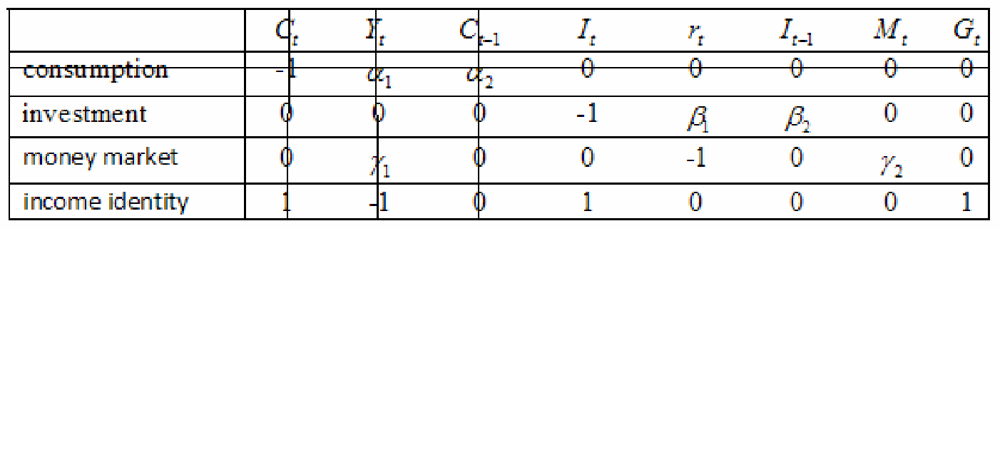

#  Simultaneous Equations Models (SEM)

Objective of the unit:\

- Define the structural form of a SEM and explain its usefulness.\
- Explain why the least squares estimation is not appropriate for SEM.\
- Explain the difference between exogenous and endogenous variables.\
- Define identification problem in a simultaneous equations models.\
- Define the reduced form of a SEM and explain its usefulness.\
- Explain why it is acceptable to estimate reduced-form equations by least squares.\
- Describe the instrumental variable estimation procedure for estimating an equation in a simultaneous equations model, and explain how it resolves the estimation problem for least squares\
- Describe the two-stage least squares estimation procedure for estimating an equation in a simultaneous equations model, and explain how it resolves the estimation problem for least squares\

##  Introduction to SEM


In the previous lessons, we were concerned exclusively with single-equation models, i.e., models in which there was a single dependent variable Y and one or more explanatory variables, the X’s. In such models the emphasis was on estimating and/or predicting the average value of Y conditional upon the fixed values of the X variables. The cause-and-effect relationship, if any, in such models therefore ran from the X’s to the Y(i.e., unidirectional). However, there are situations where there is a two-way flow of influence among economic variables. This occurs if Y is determined by the X’s, and some of the X’s are, in turn, determined by Y. In short, there is a two-way, or simultaneous, relationship between Y and (some of) the X’s, which makes the distinction between dependent and explanatory variables of dubious value.\

Simultaneous equations models also differ from most of the econometric models we have considered so far, because they consist of a set of equations. For example, price and quantity are determined by the interaction of two equations, one for supply and the other
for demand. Simultaneous equations models, which contain more than one dependent variable and more than one equation, require special statistical treatment. The least squares estimation
procedure is not appropriate in these models, and we must develop new ways to obtain reliable estimates of economic parameters.\


$\underline{Example:}$ At the macro level, aggregate consumption expenditure depends on aggregate 
disposable income; aggregate disposable income depends upon the national income and taxes 
imposed by the government; national income depends on aggregate consumption expenditure 
of the economy.\

Disregarding these sequences of relationship, if we estimate a single equation of, say, 
aggregate consumption on disposable income, then the estimates will be biased and 
inconsistent.\

Example: A simple model of the market for a given commodity may involve a supply and 
demand function:
  \begin{align*}
Q_t&=\alpha_1+\alpha_2P_t+\alpha_3P_t+U_{1t}~~~(demand)~~~~~~~~~~~~~~~~~~.......(4.1a)\\
Q_t&=\beta_1+\beta_2P_t+U_{2t}~~~~~~~~~~~~~~~~(supply)~~~~~~~~~~~~~~~~~~~~~~.......(4.1b)
\end{align*}
where Q is the equilibrium quantity exchanged on the market, P is equilibrium price, Y is 
income of consumers, and $u_{1t}$ and $u_{2t}$ are the disturbance terms. We also have $EU_{1t}^2=\alpha^2_1$ ,$EU_{2t}^2=\alpha^2_2$ and $EU_{1t}U_{2t}=\alpha_{12}$.\

Suppose we are interested in the effect of P on Q. Can we toss out the second equation and estimate the first equation alone using OLS? 
  
  1. The equilibrium price and quantity are determined in the market by the intersection of
supply and demand curves. Therefore, we can not determine equilibrium price by solving
the demand equation independently.\
2. A shift in the demand function produces a change in both equilibrium price and quantity if
the supply curve has an upward slope.\


Equations (4.1a,4.1b) are called the $\textbf{structural form}$ of the model understudy. These equations can be 
solved for the 'endogenous' variables to give:
  \begin{align*}
Q_t&=\left( \frac{\alpha_2\beta_1-\alpha_1\beta_2}{\alpha_2-\beta_2}\right)-\left(\frac{\alpha_3\beta_2}{\alpha_2-\beta_2} \right)Y_t+\left( \frac{{-\beta_2U_{1t}}+{\alpha_2U_{2t}}}{\alpha_2-\beta_2}\right)~~~~~~~~~~~~.........(4.2a)\\
P_t&=\left( \frac{-\alpha_1+\beta_1}{\alpha_2-\beta_2}\right)-\left(\frac{\alpha_3}{\alpha_2-\beta_2} \right)Y_t+\left( \frac{{-U_{1t}}+{U_{2t}}}{\alpha_2-\beta_2}\right)~~~~~~~~~~~~...........(4.2b)
\end{align*}
The solution given by equations (4.2a) and (4.2b) is called the $\textbf{reduced form}$ of the model. The 
reduced form equations show explicitly how the "endogenous" variables are  $\textbf{jointly 
  dependent}$ on the "predetermined" variables and the disturbances of the system.\
Now from equation (4.2b) we have:
  \begin{align*}
E(P_tU_{1t})&=\left( \frac{-\alpha_1+\beta_1}{\alpha_2-\beta_2}\right)E(U_{1t})-\left(\frac{\alpha_3}{\alpha_2-\beta_2} \right)Y_tE(U_{1t})+\left( \frac{{-E(U_{1t}^2)}+{E(U_{1t}U_{2t})}}{\alpha_2-\beta_2}\right)\\
&=\left( \frac{-\alpha_1+\beta_1}{\alpha_2-\beta_2}\right)(0)-\left(\frac{\alpha_3}{\alpha_2-\beta_2} \right)Y_t(0)+\left( \frac{{-\sigma_1^2}+{\sigma_{12}}}{\alpha_2-\beta_2}\right)\\
&=\left( \frac{{-\sigma_1^2}+{\sigma_{12}}}{\alpha_2-\beta_2}\right)\neq0
\end{align*}
Similarly, it can be shown that:
  \begin{align*}
E(P_tU_{2t})=\left( \frac{{-\sigma_{12}}+{\sigma_2^2}}{\alpha_2-\beta_2}\right)\neq0
\end{align*}
Thus, in the demand equation (4.1a): $Q_t=\alpha_1+\alpha_2P_t+\alpha_3Y_t+U_{1t}$, the variable $P_t$ that 
appears as an independent or 'exogenous' variable is correlated with the disturbance term $u_{1t}$, 
and consequently, estimation of the demand equation using OLS leads to $\textbf{ biased}$ and 
$\textbf{inconsistent estimators}$ of the parameters (refer to Unit 9 for details). This is referred to as  simultaneity bias.\


he solution is to bring the supply function into the picture and estimate the supply and 
demand functions simultaneously. Such models are known as $\textbf{ simultaneous equations 
  models}$.\
$\underline{Example:}$ Wage-price model
\begin{align*}
W_t&=\alpha_0+\alpha_1U_t+\alpha_2P_t+U_{1t}~~~~~~~~~~~(wage~ equation).............(4.3a)\\
P_t&=\beta_0+\beta_1W_t+\beta_2R_t+\beta_3M_t+U_{2t}~~~~(price~ equation)~~~~~........(4.3b)
\end{align*}
where W is rate of change in money wage, U is unemployment rate (in percentage), P is rate of 
change in prices, R is rate of change in cost of capital, and M is money supply. Here the price 
variable P enters into the wage equation (4.3a) and the wage variable W enters into the price 
equation (4.3b). Thus, these two variables are jointly dependent to each other, and estimation of 
the two equations individually by OLS yields biased and inconsistent estimators.\

$\underline{Note:}$
  1. $\textbf{Endogenous variables}$ are variables that are jointly determined by the economic model.
(or are determined by the exogenous variables).\
2. $\textbf{Exogenous variables}$ are determined outside of the model and independently of the
endogenous variables.\
3. $\textbf{Predetermined variables}$ are exogenous variables, lagged exogenous variables and lagged
endogenous variables. Predetermined variables are non-stochastic and hence independent
of the disturbance terms.\

###  Structural form and reduced form of simultaneous equations model (SEM)

Consider the simple Keynesian model of income determination:\
$C_t=\beta_0+\beta_1P_t+u_t~~~0<\beta_1<1~~~~~~~~~~~~~~~~~~~~~~(Consumption ~function)........(4.4a)$\
$Y_t=C_t+I_t ~~~~~~~~~~~~~~~~~~~~~~~~~~~~~~~~~~~~~~~~~~~~~~~~~~~~(Income~ identity)............(4.4b)$\
where C is consumption expenditure, Y is income, I is investment (assumed to be exogenous).
The above model is said to be the structural form of the SEM, and the parameters $\beta_0$ and $\beta_1$
  are said to be structural parameters. Substituting (4.4a) in place of C in (4.4b) we get:\
$Y_t=\beta_0+\beta_1Y_t+I_t+u_t$\
$\Rightarrow Y_t=\frac{\beta_0}{1-\beta_1}+\frac{1}{1-\beta_1}I_t+\frac{1}{1-\beta_1}u_t$\
$\Rightarrow Y_t=\pi_0+\pi_1I_t+w_t~~~~~~~~~~~~~~~~~~~~...........................................(4.5)$\

Note that equation (4.5) is expressed solely as a function of the exogenous variable $I_t$ and the disturbance term. It is referred to as the reduced form of the SEM, and the parameters $\pi_0$ and $\pi_1$ are said to be reduced form parameters. Note that the exogenous variable $I_t$ is not	correlated with the disturbance term, and hence, we can apply OLS to the reduced form	equation to obtain consistent estimators of $\pi_0$ and $\pi_1$.\


In general, the structural form of a simultaneous system of equations can be described as:\
\begin{align*}
\beta_{11}Y_{1t}+\beta_{12}Y_{2t}+...+\beta_{1G}Y_{Gt}+\gamma_{11}X_{1t}+\gamma_{12}X_{2t}+...+\gamma_{1k}X_{kt}=u_{1t}\\
\beta_{21}Y_{1t}+\beta_{22}Y_{2t}+...+\beta_{2G}Y_{Gt}+\gamma_{21}X_{1t}+\gamma_{22}X_{2t}+...+\gamma_{2k}X_{kt}=u_{2t}\\
\vdots~~~~~~~~~~~~\vdots~~~~~~~~~~~~\vdots~~~~~~~~~~~~\vdots~~~~~~~~~~~~\vdots~~~~~~~~~~~~\vdots~~~~~~~~~~~~\vdots~~~~~~~~~~~~\\
  \beta_{G1}Y_{1t}+\beta_{G2}Y_{2t}+...+\beta_{GG}Y_{Gt}+\gamma_{G1}X_{1t}+\gamma_{G2}X_{2t}+...+\gamma_{Gk}X_{kt}=u_{Gt}
  \end{align*}

where the Y’s are endogenous variables, X’s are predetermined variables, and the u’s are	stochastic disturbances.\
  

- The $\beta$'s and $\gamma$'s are the structural coefficients\
- There are G endogenous and K predetermined variables in the system.\
- Not all endogenous and predetermined variables will appear in every equation (that is, some of $\beta$'s and $\gamma$'s will be zero).\
- In each equation, one of the  $\beta$'s is taken to be unity, that is, one of the endogenous variables serves as the ‘dependent’ variable when the equation is written out as a standard regression equation.\
 	- Some of the equations may be identities, that is, their coefficients are known and they
contain no stochastic disturbance.\
 
The above model in matrix form is:\

$\begin{bmatrix}
\beta_{11}&\beta_{12}&.&.&.&\beta_{1G}\\
\beta_{21}&\beta_{22}&.&.&.&\beta_{2G}\\
.&.&.&.&.&.\\
.&.&.&.&.&.\\
.&.&.&.&.&.\\
\beta_{G1}&\beta_{G2}&.&.&.&\beta_{GG}
\end{bmatrix}
\begin{bmatrix}
Y_{1t}\\
Y_{2t}\\
.&\\
.&\\
.&\\
Y_{Gt}
\end{bmatrix}+ \begin{bmatrix}
\gamma_{11}&\gamma_{12}&.&.&.&\gamma_{1k}\\
\gamma_{21}&\gamma_{22}&.&.&.&\gamma_{2k}\\
.&.&.&.&.&.\\
.&.&.&.&.&.\\
.&.&.&.&.&.\\
\gamma_{G1}&\gamma_{G2}&.&.&.&\gamma_{Gk}
\end{bmatrix}
\begin{bmatrix}
X_{1t}\\
X_{2t}\\
.&\\
.&\\
.&\\
X_{kt}
\end{bmatrix}
=\begin{bmatrix}
u_{1t}\\
u_{2t}\\
.&\\
.&\\
.&\\
u_{Gt}
\end{bmatrix}$\
\
$~~~~\Rightarrow BY_t~~~~~~~~~~~~~~~~~~~~~~~~~~~~~~~~~~~~~~+~~~~~~~~~~~~~~~~~~~~~~~~~~~~~~~~~\varGamma X_t~~~=~~~U_t$\
\
$~~~~\Rightarrow -B^{-1}\varGamma X_t+B^{-1} U_t$.....................(4.6)\

The reduced form of the system is obtained by expressing the Y’s solely as a function of the predetermined variables X’s and the disturbance terms:\

$Y_{1t}=\pi_{11}X_{1t}+\pi_{12}X_{2t}+....\pi_{1k}X_{kt}+v_{1t}$\
$Y_{2t}=\pi_{21}X_{1t}+\pi_{22}X_{2t}+....\pi_{2k}X_{kt}+v_{2t}$\
$\vdots~~~~~~~~~~~~\vdots~~~~~~~~~~~~\vdots~~~~~~~~~~~~\vdots$\
$Y_{Gt}=\pi_{G1}X_{1t}+\pi_{G2}X_{2t}+....\pi_{Gk}X_{kt}+v_{Gt}$\
\
The above model in matrix form is:\


\
$\underbrace{\begin{bmatrix}
Y_{1t}\\Y_{2t}\\
\vdots\\
Y_{Gt}
\end{bmatrix}}$	=
$\underbrace{
\begin{bmatrix}
\pi_{11}&\pi_{12}&\cdots &\pi_{1k} \\
\pi_{21}&\pi_{22}&\cdots &\pi_{2k} \\
\vdots &\vdots & \ddots & \vdots\\
\pi_{G1}&\pi_{G2}&\cdots &\pi_{Gk}
\end{bmatrix}}$
$\underbrace{\begin{bmatrix}
X_{1t}\\X_{2t}\\
\vdots\\
X_{Gt}
\end{bmatrix}}$
+
$\underbrace{\begin{bmatrix}
v_{1t}\\v_{2t}\\
\vdots\\
v_{Gt}
\end{bmatrix}}$\
\
=$Y_t~~~~~~~~~~~~~~~~~=\prod~~~~~~~~~~~~~~~~X_t~~~~~~~~~~V_t$\
$\Rightarrow Y_t=\prod X_t+V_t$..............................(4.7)\
\


Comparing (4.6) and (4.7), the relationship between the structural and reduced form parameters is:\
$\prod=-B^{-1}\varGamma$ and $V_t=B^{-1}U_t$\
Example: Suppose we have the following system of equations:\
$q_t=a_1+b_2p_t+c_1y_t+d_1R_t+U_{1t} ~~~~~~~~(demand ~function)$\
$q_t=a_2+b_2p_t+U_{2t}~~~~~~~~~~~~~~~~~~~~~~~~~~(supply ~function)$\
where q is equilibrium quantity exchanged on the market, p is equilibrium price, y is income of consumers, R is the amount of rainfall (Note: rainfall affects demand, i.e., if there is rain, people do not go shopping) and $u_1$ and $u_2$ are the error terms. This structural form model can be re-written as:\
$q_t-b_1-p_t-a_1-c_1y_t-d_1R_t=u_{1t}$\
$q_t-b_2-p_t-a_2-(0)y_t-(0)R_t=u_{2t}$\
\
$\Rightarrow$
 	$\begin{bmatrix}
 	1&-b_1\\1&-b_2
 	\end{bmatrix}
 	\begin{bmatrix}
 	q_t\\p_t
 	\end{bmatrix}
 	+
 	\begin{bmatrix}
 	-a_1&-c_1&-d_1\\
 	-a_2&0&0
 	\end{bmatrix}
 	\begin{bmatrix}
 	1\\y_t\\R_t
 	\end{bmatrix}
 			=
 			\begin{bmatrix}
 			u_{1t}\\
 			u_{2t}
 			\end{bmatrix}$\
 $\Rightarrow \begin{bmatrix}
 q_t\\p_t
 \end{bmatrix}=-
 \begin{bmatrix}
 1&-b_1\\1&-b_2
 \end{bmatrix}^{-1}
 \begin{bmatrix}
 -a_1&-c_1&-d_1\\
 -a_2&0&0
 \end{bmatrix}
 \begin{bmatrix}
 1\\y_t\\R_t
 \end{bmatrix}+
 \begin{bmatrix}
 1&-b_1\\1&-b_2
 \end{bmatrix}^{-1}
 \begin{bmatrix}
 u_{1t}\\u_{2t}
 \end{bmatrix}$.............(4.1.a)\
 \
 
 The reduced form equations can be written as:\
$q_t=\pi_1+\pi_2y_t+\pi_3R_t+v_{1t}$\
$p_t=\pi_4+\pi_5y_t+\pi_6R_t+v_{1t}$\
$\Rightarrow \begin{bmatrix}
q_t\\p_t
\end{bmatrix}$
=$\begin{bmatrix}
\pi_1&\pi_2&\pi_3\\
\pi_4&pi_5&\pi_6\\
\end{bmatrix}$
$\begin{bmatrix}
1\\y_t\\R_t
\end{bmatrix}$
+
$\begin{bmatrix}
v_{1t}\\v_{2t}
\end{bmatrix}$..................(4.1.b)\
\
Comparing (4.1.a) and (4.1.b), we can see that:\
$\begin{bmatrix}
\pi_1&\pi_2&\pi_3\\
\pi_4&pi_5&\pi_6\\
\end{bmatrix}$
=
-$\begin{bmatrix}
1&-b_1\\1&-b_2
\end{bmatrix}^{-1}$
$\begin{bmatrix}
-a_1&-c_1&-d_1\\
-a_2&0&0
\end{bmatrix}$

      =
$\frac{1}{b_2-b_1}
\begin{bmatrix}
-b_2&b_1\\-1&1
\end{bmatrix}$
$\begin{bmatrix}
-a_1&-c_1&-d_1\\
-a_2&0&0
\end{bmatrix}$\
=$\frac{1}{b_2-b_1}
\begin{bmatrix}
a_1b_2-b_1a_2&c_1b_2&d_1b_2\\
a_1-a_2&c_1&d_1
\end{bmatrix}$\

Thus,
\begin{align*}
\pi_1=\frac{a_1b_2-b_1a_2}{b_2-b_1},\pi_2=\frac{c_1b_2}{b_2-b_1},\\
\pi_3=\frac{d_1b_2}{b_2-b_1},\pi_4=\frac{a_1-a_2}{b_2-b_1},\\
\pi_5=\frac{c_1}{b_2-b_1},and \\ \pi_6=\frac{d_1}{b_2-b_1}
\end{align*}
Note that since the reduced form of the system is obtained by expressing the endogenous variables solely as a function of the predetermined variables, OLS yields consistent	estimators of the reduced form parameters. Thus, the OLS estimators $\hat{\pi}_1,\hat{\pi}_2,\hat{\pi}_3,\hat{\pi}_4,\hat{\pi}_5,\hat{\pi}_6$ from equation (4.1.b) above are unbiased and consistent.\

## The identification problem
 
Consider the supply and demand equations in the example above. We stated that the parameters of the reduced form model (that is, the $\pi$’s) can be estimated using OLS consistently.\ 

\textbf{	Question: }Can we always recover the parameters of the structural equations (that is,a1,b1,c1,a2,b2) uniquely from the $\pi$’s? In other words, can we always estimate the structural coefficients via the reduced form coefficients?\ 
This leads us to the concept of identification. Identification is a problem of model formulation rather than of model estimation or appraisal. We say a model is identified if it is in a unique statistical form, enabling unique estimators of its parameters to be subsequently made from sample data.\
 			
**Example**\
In the supply and demand equations in the example above, we can see that:\
$\pi_2=\frac{c_1b_2}{b_2-b_1}$ and $pi_5=\frac{c_1}{b_2-b_1}$ $\Rightarrow b_2=\frac{\pi_2}{\pi_5}$\
$\pi_3=\frac{d_1b_2}{b_2-b_1}$ and $\pi_6=\frac{d_1}{b_2-b_1}$\ $\Rightarrow b_2=\frac{\pi_3}{\pi_6}$\
		That is, the slope of the supply equation
$q_t=a_2+b_2p_t+u_{2t}$ \textbf{can not be uniquely
		estimate.} Thus, the model is not identified. This is what we call an \textbf{identification problem.}\
		\
		
\underline{Note: (Status of identification)}\
In econometric theory, three possible situations of identifiability can arise: equation under
consideration is exactly identified, over identified or under identified.\
1) If there is a one to one correspondence between the reduced form and structural form parameters, then we have exact identification, that is, there is a unique solution for the structural parameters in terms of the reduced form parameters.\
2) If the number of reduced form parameters exceeds the number of structural parameters, then we have over identification (no unique solution). Here there is more than sufficient information regarding the equation under consideration.\
3) If the number of reduced form parameters is less than the number of structural parameters, then we have under identification (no solution). Here there is no sufficient information regarding the equation under consideration.\


## Conditions for identification

###  The order condition for identification

Let G be the total number of endogenous variables in the system and let k be the total number of variables (both endogenous and predetermined) missing from the equation under consideration. Then if:\
a) k = G-1, the equation is exactly identified.\
b) $k > G-1$, the equation is over identified.\
c) $k < G-1$, the equation is under identified\
This is known as the order condition for identification. It is a necessary but not sufficient condition for the identification status of an equation.\
 	
**Example**\

Wage-price model\
- $W_t=\alpha_0+\alpha_1U_t+\alpha_2P_t+u_{1t}~~~~~~~~~~~~~~~~(wage~ equation)$\
- $P_t=\beta_0+\beta_1W_t+\beta_2R_t+\beta_3M_t+u_{2t}~~~~~~(price ~equation)$\
Here U, R and M are predetermined while W and P are endogenous variables. Thus G = 2.\
a) Consider the wage equation. The variables R and M are missing from this equation.
Thus, k = 2. The equation is over identified since $k = 2 > 1 = G – 1$.\
b) Consider the price equation. The variable U is missing from this equation. Thus, k=1.
The equation is exactly identified since k = 1 = G – 1.\


**Example**\

The following represents a highly simplified model of the economy:\
$C_t=\alpha_0+\alpha_1Y_t+\alpha_2C_{t-1}+u_{1t}~~~~~~~~~~~~~ (consumption)$\
$I_t=\beta_0+\beta_1r_t+\beta_2I_{t-1}+u_{2t}~~~~~~~~~~~~~~~~~(investment)$\
$r_t=\gamma_0+\gamma_1Y_t+\gamma_2M_t+u_{3t}~~~~~~~~~~~~~~~~~~ (money~ market)$\
$Y_t=C_t+I_t+G_t~~~~~~~~~~~~~~~~~~~~~~~~~~~~~~~~~(income~ identity)$\
 where C = consumption, Y = income, I = investment, r = rate of interest, M = money supply
 and G = government expenditure. The variables $C_t , I_t , Y_t , r_t$ are endogenous while the
 remaining are predetermined variables. Thus, G = 4.\
 a) Consider the consumption equation. The variables $I_{t-1},I_t,M_t,r_t,G_t$ are missing from this
 equation. Thus, k = 5. The equation is over identified since $k = 5 > G – 1 = 3.$\
 b) Consider the investment equation. The variables $C_{t-1},C_t,M_t,Y_t,G_t$ are missing from this
 equation. Thus, k = 5. The equation is over identified since $k = 5 > G – 1 = 3.$\

###  The rank condition for identification

 The rank condition states that: in a system of G equations any particular equation is (exactly or
 over) identified if and only if it is possible to construct at least one non-zero determinant of
 order (G-1) from the coefficients of the variables excluded from that particular equation but
 contained in the other equations of the system.\
 
**Example**\

Consider the simplified model of the economy above:\
 	$C_t=\alpha_0+\alpha_1Y_t+\alpha_2C_{t-1}+u_{1t}~~~~~~~~~~~~~ (consumption)$\
 $I_t=\beta_0+\beta_1r_t+\beta_2I_{t-1}+u_{2t}~~~~~~~~~~~~~~~~~(investment)$\
 $r_t=\gamma_0+\gamma_1Y_t+\gamma_2M_t+u_{3t}~~~~~~~~~~~~~~~~~~ (money ~market)$\
 $Y_t=C_t+I_t+G_t~~~~~~~~~~~~~~~~~~~~~~~~~~~~~~~~~(income ~identity)$\

This model may be re-written as:\
 $-C_t+\alpha_0+\alpha_1Y_t+\alpha_2C_{t-1}+0I_t+0r_t+0I_{t-1}+0M_t+0G_t+u_{1t}=0$\
  $0C_t+\beta_0+0Y_t+0C_{t-1}-I_t+\beta_1r_t+\beta_2I_{t-1}+0M_t+0G_t+u_{2t}=0$\
  $0C_t+\gamma_0+\gamma_1Y_t+0C_{t-1}+0I_t-r_t+0I_{t-1}+\gamma_2M_t+0G_t+u_{3t}=0$\
  $C_t+0-Y_t+0C_{t-1}+I_t+0r_t+0I_{t-1}+0M_t+G_t+0=0$\
Note that the coefficient of a variable excluded from an equation is equal to zero. Ignoring the
  random disturbances and the constants, a table of the parameters of the model is as follows:\
 \begin{tabular}{|c|c|c|c|c|c|c|c|c|}
  	\hline
  	& $C_t$ & $Y_t$&$C_{t-1}$ & $I_t$ & $r_t$ & $I_{t-1}$ & $M_t$ & $G_t$   \\
  	\hline
  	consumption& -1 &$\alpha_1$&$\alpha_2$& 0& 0 &0& 0& 0\\
  	\hline
investment& 0 &  0 &  0&   -1& $\beta_1$&$\beta_2$&0&0\\
  	\hline
  	money market &0  &$\gamma_1$ & 0 & 0 & -1 & 0 & $\gamma_2$ & 0\\
  	\hline
  	income identity&  1 & -1&  0&  1&  0&  0&  0&  1\\
  	\hline
  \end{tabular}\
  
  
  
Now suppose we want to check the identification status of the consumption function.\
a) We eliminate the row corresponding to the consumption function.\
b) We eliminate the columns in which the consumption function has non-zero coefficients.\
The two steps are shown below:\

```{r, out.width='95%',	fig.align='center',echo=FALSE}

```
Note that by doing steps (a) and (b) above, we are left with the coefficients of variables not included in the consumption function, but contained in the other equations of the system.\
After eliminating the relevant row and columns, we get the following table (matrix) of parameters:\
$$\begin{tabular}{|c|c|c|c|c|}
  		\hline
  	$I_t$ 	& $r_t$ &$I_{t-1}$& $M_t$& $G_t$ \\
  		\hline
  		-1&$\beta_1$&$\beta_2$&0&0\\
  		\hline
  		0 &-1& 0&
  		$\gamma_2$& 0\\
  		\hline
  		1& 0& 0& 0& 1\\
  		\hline
  	\end{tabular}~~~~~~~~~..........(*)$$
  	
Since the system has G = 4 equations, form the determinants of order (G-1) = 3 and examine their value.\
- If at least one of these determinants is non-zero, then the consumption equation is (exactly or over) identified.\
- If all determinants of order 3 are zero, then the consumption equation is under identified.\
For example;\
  	$\Delta_1=\left|\begin{matrix}
  	-1&\beta_1&\beta_2\\
  	0&-1&0\\
  	1&0&0
  	\end{matrix}\right|$=-
  	$\left|\begin{matrix}
  	-1&0\\0&0
  	\end{matrix}\right|$-$\beta_1$
  	$\left|\begin{matrix}
  	1&0\\0&0
  	\end{matrix}\right|$+
  	$\beta_2$ $\left|\begin{matrix}
  	0&-1\\1&0
  	\end{matrix}\right|$=
  	-1(0)+$\beta_1$(0)+$\beta_2$(1)=$\beta_2\neq0$\
  	or\
  	$\Delta_2=\left|
  	\begin{matrix}
  	\beta_2&0&0\\
  	0&\gamma_2&0\\
  	0&0&1
  	\end{matrix}\right|$=$\beta_2(\gamma_2)\neq0$\
  	Thus, we can form at least one non-zero determinant of order 3, and hence, the consumption
  	equation is exactly or over identified.\
  	
 
 
To see whether the consumption equation is exactly or over identified, we can use the order
  	condition. Since we have four endogenous variables ($C_t, I_t, Y_t, r_t), G = 4$. As can be seen
  	from Table (*) above, the variables $I_{t-1}, I_t, M_t, r_t, G_t$are missing from the consumption
  	equation, meaning k = 5. Thus, the equation is over identified since $k = 5 > G-1 = 3.$\

## Estimation of simultaneous equations models: ILS, 2SLS

### Indirect least squares (ILS) method

In this method, we first obtain the estimates of the reduced form parameters by applying OLS to the reduced form equations and then indirectly get the estimates of the parameters of the structural model. This method is applied to exactly identified equations.\
\underline{Steps:}\
a) Obtain the reduced form equations (that is, express the endogenous variables in terms of predetermined variables).\
b) Apply OLS to the reduced form equations individually. OLS will yield consistent estimates of the reduced form parameters (since each equation involves only non-stochastic (predetermined) variables that appear as ‘independent’ variables).\
c) Obtain (or recover back) the estimates of the original structural coefficients using the estimates in step (2).\

**Example**\

Consider the following model for demand and supply of pork:\
  	$Q_t=a_1+a_2P_t+a_3Y_t+u_{1t}~~~~~~~~~~~~~~~(demand~ function).......................(4.8a)$\
  	$Q_t=a_2+a_3P_t+a_3Z_t+u_{2t}~~~~~~~~~~~~~~~(supply~ function).......................(4.8b)$\
where
  	$Q_t$ is consumption of pork (pounds per capita), Pt is real price of pork (cents per
  	pound), $Y_t$ is disposable personal income (dollars per capita) and $Z_t$ is ‘predetermined
  	elements in pork production’.\
  

Here P and Q are endogenous variables while Y and Z are predetermined variables. It can easily be shown that both equations are exactly identified. Thus, we can apply ILS to estimate the parameters. We first express P and Q in terms of the predetermined variables and disturbances as:\
$Q_t=
  	\left(\frac{b_2a_1-b_1a_2}{b_2-b_1}\right)+\left(\frac{c_1b_2}{b_2-b_1}\right)Y_t-\left(\frac{c_2b_1}{b_2-b_1}\right)Z_t+\left(\frac{b_2u_{1t}-b_1u_{2t}}{b_2-b_1}\right)...............(4.9a)$\
$P_t=
  	\left(\frac{a_1-a_2}{b_2-b_1}\right)+\left(\frac{c_1}{b_2-b_1}\right)Y_t-\left(\frac{c_2}{b_2-b_1}\right)Z_t+\left(\frac{u_{1t}-u_{2t}}{b_2-b_1}\right)........................(4.9b)$\
We can re-write equations (4.9a) and (4.9b) as:\
  	$q_t=\pi_1+\pi_2Y_t+\pi_3Z_t+\epsilon_{1t}$\
  	$p_t=\pi_4+\pi_5Y_t+\pi_6Z_t+\epsilon_{1t}$\
  	$\frac{\pi_2}{\pi_5}=\frac{c_1b_2/b_2-b_1}{c_1b_2-b_1}=b_2\Rightarrow \hat{b}_2=\frac{\hat{\pi}_2}{\hat{\pi}_5}$\
  	$\frac{\pi_3}{\pi_6}=\frac{c_2b_1/b_2-b_1}{c_2/b_2-b_1}=b_1\Rightarrow \hat{b}_1=\frac{\hat{\pi}_3}{\hat{\pi}_6}$\
  	$\pi_5=\frac{c_1}{b_2-b_1}~~~~~~~~~~\Rightarrow c_1=\pi_5(b_2-b_1)~~~~~~~~~~~\Rightarrow \hat{c}_1=\hat{\pi}_5(\hat{b}_2-\hat{b}_1)$\
Similarly, it can be shown that $\hat{c}_2=\hat{\pi}_6(\hat{b}_2-\hat{b}_1),\hat{a}_1=\hat{\pi}_1-\hat{b}_1\hat{\pi}_4$ and $\hat{a}_2=\hat{\pi}_1-\hat{b}_2\hat{\pi}_4$\
  	\
###  Instrumental variable (IV) method

Suppose we have the model (in deviation form): \
\begin{align*}
y_i=\beta x_i+\mathcal{E}_i
\end{align*}
where $x_i$ is correlated with $\mathcal{E}_i$ . We can not estimate $\beta$ by OLS as it will yield an inconsistent estimator of  $\beta$(refer to errors var variables for details).
What we do is search for an instrumental variable (IV) $z_i$ that is uncorrelated with $\mathcal{E}_i$  but correlated with $x_i$; that is,$cov(z_i,\mathcal{E}_i)=0$ and $cov(z_i,x_i)\ne0$. The sample counterpart of $cov(z_i,\mathcal{E}_i)=0$ is:\
$$\dfrac{1}{n}\sum{z_i\mathcal{E}_i}=0\Longrightarrow \dfrac{1}{n}\sum{z_i(y_i-\beta x_i)}=0$$
$$~~~~~~~~~~~~~~~~~~~~~~~~~~~~~~~~~~~\Longrightarrow \dfrac{1}{n}\sum{z_iy_i}=\hat{\beta}(\dfrac{1}{n}\sum{z_ix_i})$$
$$~~~~~~~~~~~~~~~~~~~~~~~~~~~~~~~~~~~~\Longrightarrow \hat{\beta}=\dfrac{\dfrac{1}{n}\sum{z_iy_i}}{\dfrac{1}{n}\sum{z_ix_i}}=\dfrac{\sum{z_iy_i}}{\sum{z_ix_i}}$$
$\hat{\beta}$ can be expressed as:\
$$\hat{\beta}=\dfrac{\sum{z_iy_i}}{\sum{z_ix_i}}=\dfrac{\sum{z_i(\beta x_i+\mathcal{E}_i)}}{\sum{z_ix_i}}=\beta+\dfrac{\sum{z_i\mathcal{E}_i}}{\sum{z_ix_i}}$$
Now we have,\
$$plim (\sum{z_i\mathcal{E}_i}/n)=cov(z_i,\mathcal{E}_i)=0$$
$$plim (\sum{z_ix_i}/n)=cov(z_i,x_i)\ne0$$
Thus,\

$$plim(\hat{\beta})=\beta+plim(\dfrac{\sum z_i\mathcal{E}_i}{\sum z_ix_i})=\beta+\dfrac{plim(\sum z_i\mathcal{E}_i/n)}{plim(\sum z_ix_i/n)}=\beta+\dfrac{0}{\ne0}=\beta$$

that is, the IV estimator $\hat{\beta}$ is a consistent estimator of $\beta$. \
Consider the following simultaneous equations model:\
$$y_1=a_1+b_1y_2+c_1z_1+c_2z_2+u_1$$
$$y_2=a_2+b_2y_1+c_3z_3+u_2~~~~~~~$$
where $y_1$ and $y_2$ are endogenous while $z_1$, $z_2$ and $z_3$ are predetermined. 

Consider the estimation of the first equation:\
- Since $z_1$ and $z_2$ are predetermined, they are not correlated with $u_1$, that is,$cov(z_1,u_1)=0$ and $cov(z_2,u_1)=0$\
- $y_2$ is not independent of $u_2$, that is,$cov(y_2,u_1)\ne0$\


Thus, OLS method of estimation can not be applied. To find consistent estimators, we look for 
avariable that is correlated with $y_2$ but not correlated with $u_1$ . Fortunately we have $z_3$ that 
satisfies these two conditions, that is, $cov(y_2, z_3 )\neq0$ and $cov(z_3,u_1)=0$. Thus, $z_3$ can 
serve as an IV for $y_2.$\

The procedure for estimation of the first equation is as follows: \ 

a) Regress $y_2$ on $z_1$ , $z_2$ and $z_3$; that is, using OLS estimate the model:\
\begin{align*}
y_2=a_{10}+a_{11}z_1+a_{12}z_2+a_{13}z_3+v_1.
\end{align*}
b) Obtain $\hat{y_2}$ where $\hat{y_2}=\hat{a_{10}}+\hat{a_{11}}z_1+\hat{a_{12}}z_2+\hat{a_{13}}z_3$.\
c) Regress $y_2$ on $\hat{y_2}$, $z_1$ and $z_2$; that is, estimate the model:
\begin{align*}
y_1=a_1+b_1\hat{y_2}+c_1z_1+c_2z_2+u_1
\end{align*}
Note that since $z_1$ , $z_2$ and $z_3$ are predetermined variables, and hence, not correlated with $u_1$, 
we have:
\begin{align*}
cov(\hat{y_2},u_1)=cov(\hat{a_{10}}+\hat{a_{11}}z_1+\hat{a_{12}}z_2+\hat{a_{13}}z_3,u_3)=0
\end{align*}
Thus, the OLS estimation using the above procedure yields consistent estimators.\
Consider the second equation.\ 
   - Since $z_3$ is predetermined, it is not correlated with $u_2$, that is, $Cov(z_3,u_2)=0.$ \
   - $y_1$ is not independent of $u_2$, that is, $Cov (y_1,u_2)\neq0$\

Again OLS can not be applied to estimate the parameters. To find consistent estimators, we 
look for a variable that is correlated with $y_1$ but not correlated with $u_2$. Here we have two 
choices, namely, $z_1$and $z_2$ that can serve as instruments.\

$\underline{Note:}$ We have more than enough instrumental variables since the second equation is over 
identified. \
In order to estimate the second equation: \
a) Regress $y_1$ on $z_1$ and $z_3$ ( if $z_1$ is considered as an IV for $y_1$)  or regress $y_1$ on $z_2$ and $z_3$ (if $z_2$ is considered as an IV for $y_1$) using OLS and obtain $\hat{y_1}$. \
b) Regress $y_2$ on $\hat{y_1}$ and $z_3$; that is, estimate the model:\

Note that the solution is not unique, that is, depending on whether $z_1$ is considered as an IV 
for $y_1$ or $z_2$ is considered as an IV for $y_1$ , we may get different results.\

**Example**\
Using a data on some characteristics of the wine industry in Australia , which is saved as "wine.csv". 
```{r,echo=TRUE}
wine<-read.csv("wine.csv",header = T,sep = ",")
wine_var<-wine[1,] # To look the variables for short codes
names(wine)=c("year","consumption","storage_costs","price_wine","price_beer","advertising","income")
# Converting to log
year<-wine$year; wine=wine[,-1];wine=log(wine);wine<-cbind(year,wine)
  
```

It is assumed that a reasonable demand-supply model for the industry would be (where all 
variables are in logs):
\begin{align*}
Q_1&=a_0+a_1PW_t+a_2PB_t+a_3Y_t+a_4A_t+u_t~~~~~~~~~~~~~~~.........(demand)\\
Q_1&=b_0+b_1PW_t+b_2S_t+v_t~~~~~~~~~~~~~~~~~~~~~~~~~~~~~~~~~~~~~~~.........(supply)
\end{align*}
where Q is real per capita consumption of wine, PW is the price of wine relative to CPI, PB is the price of beer relative to CPI, Y is real per capita disposable income, A is real per capita advertising expenditure, and S is index of storage costs. Here Q and PW are the two endogenous variables while the rest are exogenous variables.\
Apply instrumental variables method of estimation?

**solution**\

**Using Instrumental variables method of Estimation**\

To estimate the demand function we have only one instrumental variable (IV) S. But for the estimation of the supply we have available three IVs: PB, Y and A. \

**I) Estimation of the supply function**\
The supply equation is **over-identified**. Thus, we have three possible IV's for price of wine (PW): \
a) price of beer (PB),\
b) advertising expense (A),\
c) income (Y).\


**(a) Now let's take price of beer as IV to estimate the supply function:**\

First we regress price_wine(PW) on price_beer(PB) and storage_costs(S), and obtain the predicted values of PW (IV pb for prcwine). At last, we estimate the supply function by regressing consumption (Q) on S and (IV pb for prcwine).\
The results are as follows:\


```{r,echo=TRUE}
rm(list = ls())
wine<-read.csv("wine.csv",header = T,sep = ",")
wine_var<-wine[1,] # To look the variables for short codes
names(wine)=c("year","consumption","storage_costs","price_wine","price_beer","advertising","income")
year<-wine$year; wine=wine[,-1];wine=log(wine);wine<-cbind(year,wine)

# regress price_wine(PW) on price_beer(PB) and storage_costs(S)
prcwine<-lm(price_wine~storage_costs+price_beer,data=wine)
#obtain the predicted values of price_wine(PW)
pred_prcwine_4_pb<-fitted(prcwine)
# estimate the supply function by regressing consumption(Q) on pred_prcwine and storage_costs
fit_supply<-lm(consumption~pred_prcwine_4_pb+storage_costs,data=wine)
summary(fit_supply)
  
```

as shown above the Instrumental variable price of beer for price of wine is not significant.


**(b) Now let's take advertising expense as IV to estimate the supply function:**\

First we regress price of wine (PW) on advertising expense (A) and storage cost (S), and 
obtain the predicted values of PW (IV ad for prcwine). At last, we estimate the supply function by regression consumption (Q) on S and (IV ad for prcwine).\
The results are as follows:
  
```{r,echo=TRUE}
rm(list = ls())
wine<-read.csv("wine.csv",header = T,sep = ",")
wine_var<-wine[1,] # To look the variables for short codes
names(wine)=c("year","consumption","storage_costs","price_wine","price_beer","advertising","income")
year<-wine$year; wine=wine[,-1];wine=log(wine);wine<-cbind(year,wine)

prcwine_adv<-lm(price_wine~advertising+storage_costs,data=wine)
# the predicted values of price_wine(PW) is
pred_prcwine_4_adv<-fitted(prcwine_adv)
#Then estimate the supply function by regressing consumption(Q) on storage_costs and 
fit_supply_adv<-lm(consumption~pred_prcwine_4_adv+storage_costs,data=wine)
summary(fit_supply_adv)

```


**(c) Now let's take income as IV to estimate the supply function:**\

First we regress price of wine (PW) on income (Y) and storage cost (S), get the predicted 
values of PW (IV inc for prcwine), and then estimate the supply function by regressing 
consumption (Q) on S and (IV inc for prcwine).

```{r,echo=TRUE}
rm(list = ls())
wine<-read.csv("wine.csv",header = T,sep = ",")
wine_var<-wine[1,] # To look the variables for short codes
names(wine)=c("year","consumption","storage_costs","price_wine","price_beer","advertising","income")
year<-wine$year; wine=wine[,-1];wine=log(wine);wine<-cbind(year,wine)

prcwine_inc<-lm(price_wine~income+storage_costs,data=wine)
# the predicted values of price_wine(PW) is
pred_prcwine_4_inc<-fitted(prcwine_inc)
 #Then estimate the supply function by regressing consumption(Q) on storage_costs and 
fit_supply_inc<-lm(consumption~storage_costs+pred_prcwine_4_inc,data=wine)
  summary(fit_supply_inc)
  
```


By comparing the estimated models using the three IV's, it seems that income is the best IV as 
the resulting estimated model has the highest coefficient of determination ($R^2$= `r summary(fit_supply_inc)$r.squared`). Since 
all variables are in logs, the coefficients are  elasticities. Thus, quantity supplied is responsive to both price and storage costs (both p-values $<$ 0.001). In particular, the price elasticity of supply for wine is about `r round(summary(fit_supply_inc)$coef[3],2)`.\


**II) Estimation of the demand function**\

The demand equation is **exactly-identified**. Thus, we just have one available IV: storage costs. 
First we regress price of wine (PW) on price of beer (PB), income (Y), advertising expense (A) 
and storage cost (S), get the predicted values of PW (Predicted price of wine), and then 
estimate the demand function by regressing consumption (Q) on (Predicted price of wine), PB, Y and A.\
The results are as follows:
  
  ```{r,echo=TRUE}
rm(list = ls())
wine<-read.csv("wine.csv",header = T,sep = ",")
wine_var<-wine[1,] # To look the variables for short codes
names(wine)=c("year","consumption","storage_costs","price_wine","price_beer","advertising","income")
year<-wine$year; wine=wine[,-1];wine=log(wine);wine<-cbind(year,wine)

prcwine_stors<-lm(price_wine~price_beer+income+advertising+storage_costs,data=wine)
# the predicted values of price_wine(PW) is
predicted_PW<-fitted(prcwine_stors)
#Then to estimate the demand function by regressing consumption(Q) 
fit_dem<-lm(consumption~predicted_PW+price_beer+income+advertising,data=wine)
summary(fit_dem)

```


We observe that the coefficient of determination is `r round(summary(fit_dem)$r.squared,4)*100`$\%$ and the F-statistic is significant. 
However, most of the regression coefficients are insignificant. Furthermore, all the coefficients except that of income (Y) have the wrong signs. This is probably due to multicollinearity 
(MC) and check it using vif function from 'car' package.

```{r,echo=TRUE}
#install.packages("car")
library(car)
vif(fit_dem)
```

This shows that the variance inflation factor (VIF) for income and 
advertising expense are large (far greater than 10). Thus, we have to drop one of them. From 
practical point of view, it seems wise to drop advertising expense and re-estimate the model. 
The results are:
  ```{r,echo=TRUE}
#library(car)
fit_dem_adv_drop<-lm(consumption~predicted_PW+price_beer+income,data=wine)
vif(fit_dem_adv_drop)
```

The problem of MC is now solved as the VIF's are greatly reduced (all less than 10). 

```{r,echo=TRUE}
summary(fit_dem_adv_drop)
```

However, the coefficients of both price of wine and price of beer have wrong signs. In 
particular, the coefficient of price of wine not only has the wrong sign but is also significant. 
This is difficult to interpret. For the other variables, the conclusion we arrive at is that the 
demand for wine is not responsive to the price of beer, but is responsive to income. The 
income elasticity of demand for wine is about `r round(summary(fit_dem_adv_drop)$coef[4],2)`.\


###  Two-stage least squares (2-SLS) method

The main difference between the IV and 2-SLS methods is that in the former case the 
$\hat{y_i}$ are 
used as instruments, while in the latter case the $\hat{y_i}$ are used as regressors. Both methods yield 
the same result if the equation under consideration is exactly identified. The 2-SLS procedure 
is generally applicable for estimation of over-identified equations as it provides unique
estimators.\

$\underline{Steps:}$\
a) Estimate the reduced form equations by OLS and obtain the predicted
$\hat{y_i}$.\
b) Replace the right hand side endogenous variables in the structural equations by the
corresponding
$\hat{y_i}$ and estimate them by OLS.\ 

Consider the above simultaneous equations model:
\begin{align*}
y_1=a_1+b_1y_2+c_1z_1+c_2z_2+u_1..............(a)\\
y_2=a_2+b_2y_+c_3z_3+u_2.......................(b)
\end{align*}
where $y_1$ and $y_2$ are endogenous while $z_1$ , $z_2$ and $z_3$ are predetermined.\
Since $cov(y_2,u_1)\neq0$ and $Cov(y_1,u_2)\neq0$, we can not apply OLS. Since equation (a) is 
exactly identified, the 2-SLS procedure is the same as the IV method. The 2-SLS procedure of 
estimation of equation (b) (which is over-identified) is:\ 
. We first estimate the reduced form equations by OLS; that is, we regress $y_1$ on $z_1$ , $z_2$ and $z_3$ using OLS and obtain $\hat{y_1 }$ .\
. We then replace $y_1$ by $\hat{y_1 }$ and estimate equation (b) by OLS, that is, we apply OLS to:
\begin{align*}
y_2=b_2\hat{y_1}+c_3z_3+u_2
\end{align*}
$\underline{Note}$\
a) Unlike ILS, 2-SLS provides only one estimate per parameter for over-identified models.\
b) In case of exactly identified equations, both ILS and 2-SLS produce the same parameter
estimates.\


**Example**\
for the previous data ,'wine.csv', apply two stages least squares (2-SLS) method of estimation to the supply-demand function of wine.  where the demand-supply model of  the industry is (where all 
variables are in logs):
\begin{align*}
Q_1&=a_0+a_1PW_t+a_2PB_t+a_3Y_t+a_4A_t+u_t~~~~~~~~~~~~~~~.........(demand)\\
Q_1&=b_0+b_1PW_t+b_2S_t+v_t~~~~~~~~~~~~~~~~~~~~~~~~~~~~~~~~~~~~~~~.........(supply)
\end{align*}
where Q is real per capita consumption of wine, PW is the price of wine relative to CPI, PB is the price of beer relative to CPI, Y is real per capita disposable income, A is real per capita advertising expenditure, and S is index of storage costs. Here Q and PW are the two endogenous variables while the rest are exogenous variables.\
Apply 2-SLS method of estimation?

```{r,echo=TRUE}
rm(list = ls())
wine<-read.csv("wine.csv",header = T,sep = ",")
wine_var<-wine[1,] # To look the variables for short codes
names(wine)=c("year","consumption","storage_costs","price_wine","price_beer","advertising","income")
# Converting to log
year<-wine$year; wine=wine[,-1];wine=log(wine);wine<-cbind(year,wine)
wine_var # Look the variable
  
```


**solution**\

**Estimation using two stages least squares (2-SLS)**\

In this method, we first find the reduced form equations by regressing each endogenous 
variable on all exogenous variables. Then we replace all the endogenous variables in each 
equation by their predicted values from the reduced forms and estimate each equation by OLS. 
Note that the IV estimator and the 2-SLS estimator are the same if the equation under consideration is exactly identified. In our case we have seen that the demand equation is 
exactly identified. Thus, the IV and 2-SLS estimators of the parameters are the same.\

**(I)Estimate supply function**\
To estimate the supply function: We first regress the price of wine (PW) on all exogenous 
variables PB, Y, A and S, and get the predicted values (PW 2sls). We then estimate the supply 
function by regressing consumption (Q) on S and PW 2sls.\
The results are shown below:

```{r,echo=TRUE}
# regress the price_wine on price_beer, income,advertising, and storage_costs.
 pw2sls<-lm(price_wine~price_beer+income+advertising+storage_costs,data=wine)
# predicted value of price wine .
pred_prcwine<-fitted(pw2sls)
 #Estimate the supply function by regressing consumption (Q) on pred_prcwine and 
fit_sup<-lm(consumption~pred_prcwine+storage_costs,data=wine)
summary(fit_sup)
```

We can see from the above table that the coefficients of both price of wine and storage cost are 
significant. The price elasticity of supply is about `r round(summary(fit_sup)$coef[2],2)`.\

**(II) Estimate demand function**\

To estimate the demand equation, we have to regress the consumption on all exogenous variables of the equation, i.e.,price of wine(but use pred_prcwine )(PW), price of beer(PB), income(Y) and advertising(A).

```{r,echo=TRUE}
fit_dem<-lm(consumption~pred_prcwine+price_beer+income+advertising,data=wine)
summary(fit_dem)
## check for MC problem
vif(fit_dem)
```

As shown above there is multicollinearity problem. So, let's drop advertising as we did in the previous. 

```{r,echo=TRUE}
fit_dem_drop_ad<-lm(consumption~pred_prcwine+price_beer+income,data=wine)
summary(fit_dem_drop_ad)
## check MC problem
vif(fit_dem_drop_ad)
```

Since demand equation is **exactly identified**, the 2SLS estimators of the parameters are the same  with IV estimators that we have done in the previous.


